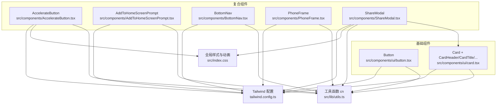
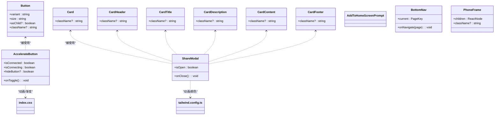
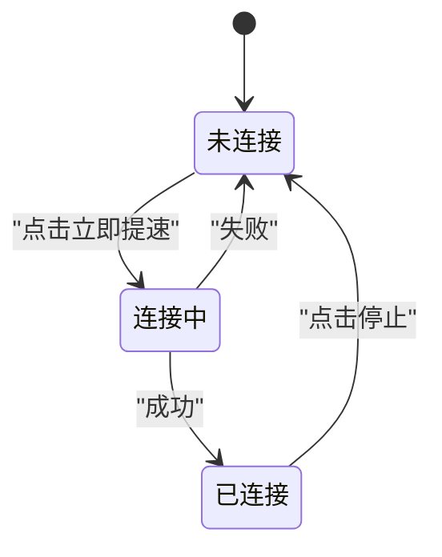
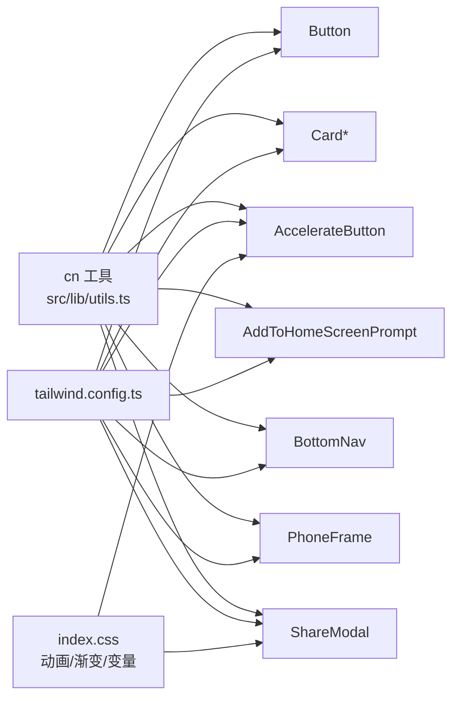

# UI组件系统

<cite>
**本文引用的文件**
- [src/components/ui/button.tsx](file://src/components/ui/button.tsx)
- [src/components/ui/card.tsx](file://src/components/ui/card.tsx)
- [src/components/AccelerateButton.tsx](file://src/components/AccelerateButton.tsx)
- [src/components/AddToHomeScreenPrompt.tsx](file://src/components/AddToHomeScreenPrompt.tsx)
- [src/components/BottomNav.tsx](file://src/components/BottomNav.tsx)
- [src/components/PhoneFrame.tsx](file://src/components/PhoneFrame.tsx)
- [src/components/ShareModal.tsx](file://src/components/ShareModal.tsx)
- [src/lib/utils.ts](file://src/lib/utils.ts)
- [tailwind.config.ts](file://tailwind.config.ts)
- [src/index.css](file://src/index.css)
</cite>

## 目录
1. [简介](#简介)
2. [项目结构](#项目结构)
3. [核心组件](#核心组件)
4. [架构总览](#架构总览)
5. [详细组件分析](#详细组件分析)
6. [依赖关系分析](#依赖关系分析)
7. [性能与可访问性](#性能与可访问性)
8. [主题与样式定制](#主题与样式定制)
9. [使用示例与组合模式](#使用示例与组合模式)
10. [故障排查](#故障排查)
11. [结论](#结论)

## 简介
本文件为飞鱼加速器前端 UI 组件系统的权威文档，覆盖基础组件与复合组件的视觉外观、行为与交互模式；记录 props、事件、插槽（children）与自定义选项；提供响应式设计与无障碍建议；说明状态、动画与过渡；给出样式与主题扩展方式；并总结跨浏览器兼容性与性能优化要点。

## 项目结构
UI 组件位于 src/components 下，分为两类：
- 基础组件（ui）：Button、Card 及其子块，遵循 shadcn/ui 风格，通过 class-variance-authority 管理变体。
- 复合组件（业务级）：AccelerateButton、AddToHomeScreenPrompt、BottomNav、PhoneFrame、ShareModal，封装复杂交互与动效。

图表来源
- [src/components/ui/button.tsx:1-55](file://src/components/ui/button.tsx#L1-L55)
- [src/components/ui/card.tsx:1-80](file://src/components/ui/card.tsx#L1-L80)
- [src/components/AccelerateButton.tsx:1-182](file://src/components/AccelerateButton.tsx#L1-L182)
- [src/components/AddToHomeScreenPrompt.tsx:1-104](file://src/components/AddToHomeScreenPrompt.tsx#L1-L104)
- [src/components/BottomNav.tsx:1-57](file://src/components/BottomNav.tsx#L1-L57)
- [src/components/PhoneFrame.tsx:1-87](file://src/components/PhoneFrame.tsx#L1-L87)
- [src/components/ShareModal.tsx:1-199](file://src/components/ShareModal.tsx#L1-L199)
- [src/lib/utils.ts:1-7](file://src/lib/utils.ts#L1-L7)
- [tailwind.config.ts:1-131](file://tailwind.config.ts#L1-L131)
- [src/index.css:1-246](file://src/index.css#L1-L246)

章节来源
- [src/components/ui/button.tsx:1-55](file://src/components/ui/button.tsx#L1-L55)
- [src/components/ui/card.tsx:1-80](file://src/components/ui/card.tsx#L1-L80)
- [src/components/AccelerateButton.tsx:1-182](file://src/components/AccelerateButton.tsx#L1-L182)
- [src/components/AddToHomeScreenPrompt.tsx:1-104](file://src/components/AddToHomeScreenPrompt.tsx#L1-L104)
- [src/components/BottomNav.tsx:1-57](file://src/components/BottomNav.tsx#L1-L57)
- [src/components/PhoneFrame.tsx:1-87](file://src/components/PhoneFrame.tsx#L1-L87)
- [src/components/ShareModal.tsx:1-199](file://src/components/ShareModal.tsx#L1-L199)
- [src/lib/utils.ts:1-7](file://src/lib/utils.ts#L1-L7)
- [tailwind.config.ts:1-131](file://tailwind.config.ts#L1-L131)
- [src/index.css:1-246](file://src/index.css#L1-L246)

## 核心组件
本节聚焦基础组件 Button 与 Card 的设计与用法。

### Button 组件
- 设计目标：统一按钮外观与交互，支持多尺寸与多变体，具备焦点环与禁用态。
- 关键特性：
  - 变体 variant：default、destructive、outline、secondary、ghost、link、ocean、glass、gradient
  - 尺寸 size：default、sm、lg、xl、icon
  - 类名合并：通过 cn 将默认类、变体类与外部 className 合并
  - 透传原生属性：作为 HTML button 渲染，支持 ref、事件等
- 无障碍：
  - 使用 focus-visible 提供键盘导航可见焦点环
  - disabled 时 pointer-events 与透明度变化，避免误触
- 动画与过渡：
  - transition-all duration-200
  - active:scale-[0.98] 点击反馈
  - glow-primary 光晕效果（由全局样式定义）

章节来源
- [src/components/ui/button.tsx:1-55](file://src/components/ui/button.tsx#L1-L55)
- [src/index.css:117-123](file://src/index.css#L117-L123)

### Card 组件族
- 组成：Card、CardHeader、CardTitle、CardDescription、CardContent、CardFooter
- 设计目标：卡片容器与其语义化子区域，便于组合页面内容区块
- 关键特性：
  - 圆角、边框、阴影、背景色通过 Tailwind 与 CSS 变量控制
  - 各子块提供合理内边距与排版层级
- 无障碍：
  - CardTitle 使用 h3 语义标签，利于屏幕阅读器识别标题层级

章节来源
- [src/components/ui/card.tsx:1-80](file://src/components/ui/card.tsx#L1-L80)

## 架构总览
复合组件基于基础组件与工具函数构建，结合 Tailwind 与全局 CSS 实现主题与动效。

图表来源
- [src/components/ui/button.tsx:1-55](file://src/components/ui/button.tsx#L1-L55)
- [src/components/ui/card.tsx:1-80](file://src/components/ui/card.tsx#L1-L80)
- [src/components/AccelerateButton.tsx:1-182](file://src/components/AccelerateButton.tsx#L1-L182)
- [src/components/AddToHomeScreenPrompt.tsx:1-104](file://src/components/AddToHomeScreenPrompt.tsx#L1-L104)
- [src/components/BottomNav.tsx:1-57](file://src/components/BottomNav.tsx#L1-L57)
- [src/components/PhoneFrame.tsx:1-87](file://src/components/PhoneFrame.tsx#L1-L87)
- [src/components/ShareModal.tsx:1-199](file://src/components/ShareModal.tsx#L1-L199)
- [tailwind.config.ts:1-131](file://tailwind.config.ts#L1-L131)
- [src/index.css:1-246](file://src/index.css#L1-L246)

## 详细组件分析

### AccelerateButton（加速按钮）
- 功能概述：可视化“连接/断开”状态的交互式按钮，包含仪表盘刻度、火箭图形、火焰闪烁与速度线等动效。
- Props
  - isConnected: boolean — 是否已连接
  - isConnecting: boolean — 是否正在连接
  - onToggle: () => void — 切换连接的回调
  - hideButton: boolean — 是否隐藏下方大按钮
- 视觉与交互
  - 未连接：半透明辅助线条，无火焰
  - 连接中：外圈旋转指示器，背景脉冲
  - 已连接：绿色发光弧线、火焰闪烁、速度线动画
  - 点击区域：SVG 容器与底部大按钮均可触发 onToggle
- 状态机

图表来源
- [src/components/AccelerateButton.tsx:1-182](file://src/components/AccelerateButton.tsx#L1-L182)

章节来源
- [src/components/AccelerateButton.tsx:1-182](file://src/components/AccelerateButton.tsx#L1-L182)
- [src/index.css:194-229](file://src/index.css#L194-L229)

### AddToHomeScreenPrompt（添加到主屏提示）
- 功能概述：在移动端首次进入且非 PWA 模式下，引导用户将应用添加到主屏幕。
- 显示条件
  - 触摸设备或 maxTouchPoints > 0
  - 屏幕宽度 ≤ 768px
  - 非 standalone 模式
  - 会话未关闭过（sessionStorage 标记）
- 交互
  - 右上角关闭按钮与底部“我知道了”按钮均会关闭并写入 sessionStorage
- 平台差异
  - iOS 与 Android 步骤文案不同

章节来源
- [src/components/AddToHomeScreenPrompt.tsx:1-104](file://src/components/AddToHomeScreenPrompt.tsx#L1-L104)

### BottomNav（底部导航）
- 功能概述：固定于底部的三栏导航，图标与文字高亮当前页。
- Props
  - current: PageKey — 当前激活项 key
  - onNavigate: (page: PageKey) => void — 切换回调
- 交互
  - 点击项更新 current 并调用 onNavigate
  - 激活态图标带发光 drop-shadow

章节来源
- [src/components/BottomNav.tsx:1-57](file://src/components/BottomNav.tsx#L1-L57)

### PhoneFrame（手机外壳）
- 功能概述：桌面端以手机外形展示内容；移动端全屏适配并提供悬浮全屏切换按钮。
- 行为
  - 检测触摸与小屏，动态选择布局
  - 监听 fullscreenchange，提供全屏切换
- 插槽
  - children: ReactNode — 需要包裹的内容

章节来源
- [src/components/PhoneFrame.tsx:1-87](file://src/components/PhoneFrame.tsx#L1-L87)

### ShareModal（分享弹窗）
- 功能概述：底部弹出式分享面板，含规则说明、步骤、邀请链接复制等。
- Props
  - isOpen: boolean — 是否打开
  - onClose: () => void — 关闭回调
- 交互
  - 点击遮罩或右上角关闭按钮关闭
  - 复制链接到剪贴板，并短暂显示“已复制”状态
- 组合
  - 使用 Card 与 CardContent 组织信息区块

章节来源
- [src/components/ShareModal.tsx:1-199](file://src/components/ShareModal.tsx#L1-L199)
- [src/components/ui/card.tsx:1-80](file://src/components/ui/card.tsx#L1-L80)

## 依赖关系分析
- 工具函数
  - cn：合并多个类名，优先处理冲突，确保 Tailwind 类正确生成
- 样式与主题
  - Tailwind 配置：定义颜色、圆角、动画与 keyframes
  - 全局样式：CSS 变量、渐变、毛玻璃、动画关键帧
- 组件耦合
  - 复合组件依赖基础组件与工具函数
  - 复合组件大量使用 Tailwind 原子类与全局样式类

图表来源
- [src/lib/utils.ts:1-7](file://src/lib/utils.ts#L1-L7)
- [tailwind.config.ts:1-131](file://tailwind.config.ts#L1-L131)
- [src/index.css:1-246](file://src/index.css#L1-L246)
- [src/components/ui/button.tsx:1-55](file://src/components/ui/button.tsx#L1-L55)
- [src/components/ui/card.tsx:1-80](file://src/components/ui/card.tsx#L1-L80)
- [src/components/AccelerateButton.tsx:1-182](file://src/components/AccelerateButton.tsx#L1-L182)
- [src/components/AddToHomeScreenPrompt.tsx:1-104](file://src/components/AddToHomeScreenPrompt.tsx#L1-L104)
- [src/components/BottomNav.tsx:1-57](file://src/components/BottomNav.tsx#L1-L57)
- [src/components/PhoneFrame.tsx:1-87](file://src/components/PhoneFrame.tsx#L1-L87)
- [src/components/ShareModal.tsx:1-199](file://src/components/ShareModal.tsx#L1-L199)

章节来源
- [src/lib/utils.ts:1-7](file://src/lib/utils.ts#L1-L7)
- [tailwind.config.ts:1-131](file://tailwind.config.ts#L1-L131)
- [src/index.css:1-246](file://src/index.css#L1-L246)

## 性能与可访问性

### 性能优化建议
- 减少重排重绘
  - 对频繁变化的属性使用 transform 与 opacity（如缩放、淡入淡出），避免直接修改布局相关属性
  - 长列表或复杂 SVG 场景考虑按需渲染与懒加载
- 动画与滤镜
  - 谨慎使用 blur、drop-shadow、backdrop-filter，尤其在低端设备上可能引起卡顿
  - 将复杂动画拆分为短时长与低频率，必要时提供降级方案
- 资源与构建
  - 图片与图标使用矢量或合适分辨率，避免过大资源
  - 利用 Vite 与 Tailwind 的按需生成能力，减小产物体积

[本节为通用指导，不直接分析具体文件]

### 无障碍访问（a11y）建议
- 键盘可达与焦点可见
  - 所有可交互元素需支持 Tab 导航与 Enter/Space 触发
  - 使用 focus-visible 提供清晰焦点环（Button 已内置）
- 语义化标签
  - 标题使用 h1-h6，按钮使用 button，模态框使用 role="dialog" 与 aria-modal
- 文本替代与描述
  - 图标按钮需提供 aria-label
  - 表单控件需关联 label 或 aria-describedby
- 对比度与可读性
  - 确保前景与背景对比度满足 WCAG AA 标准
- 状态同步
  - 动态状态变化应通过 aria-live 或角色变更通知屏幕阅读器

[本节为通用指导，不直接分析具体文件]

## 主题与样式定制

### 设计 Token 与颜色
- 通过 CSS 变量集中定义主题色，包括 primary、accent、status、ocean 系列等
- Tailwind 配置将这些变量映射到 color 命名空间，组件通过 Tailwind 类引用

章节来源
- [src/index.css:6-89](file://src/index.css#L6-L89)
- [tailwind.config.ts:18-64](file://tailwind.config.ts#L18-L64)

### 动画与过渡
- 全局 keyframes 与 animation 在 tailwind.config.ts 中声明，并在 index.css 中补充自定义动画
- 常用动画：火箭发射、火焰闪烁、速度线、脉冲发光、滑入等

章节来源
- [tailwind.config.ts:71-124](file://tailwind.config.ts#L71-L124)
- [src/index.css:194-229](file://src/index.css#L194-L229)

### 样式扩展点
- 组件层：通过 className 传入覆盖默认样式
- 主题层：调整 CSS 变量即可全局换肤
- 工具层：cn 保证类名优先级与去重

章节来源
- [src/lib/utils.ts:1-7](file://src/lib/utils.ts#L1-L7)
- [src/components/ui/button.tsx:35-55](file://src/components/ui/button.tsx#L35-L55)
- [src/components/ui/card.tsx:4-16](file://src/components/ui/card.tsx#L4-L16)

## 使用示例与组合模式

### 基础组件使用
- Button
  - 通过 variant 与 size 快速切换外观
  - 通过 className 追加额外样式
  - 透传 onClick、disabled 等原生属性
- Card 族
  - 使用 Card 作为容器，配合 CardHeader/CardTitle/CardDescription/CardContent/CardFooter 组织内容

章节来源
- [src/components/ui/button.tsx:1-55](file://src/components/ui/button.tsx#L1-L55)
- [src/components/ui/card.tsx:1-80](file://src/components/ui/card.tsx#L1-L80)

### 复合组件使用
- AccelerateButton
  - 父组件维护 isConnected/isConnecting 状态，并将 onToggle 注入
  - 根据状态驱动 SVG 与动画
- ShareModal
  - 父组件控制 isOpen/onClose
  - 内部使用 Card 族呈现规则与步骤
- BottomNav
  - 父组件维护 current 与 onNavigate
- PhoneFrame
  - 将页面内容作为 children 传入，自动适配移动端全屏

章节来源
- [src/components/AccelerateButton.tsx:1-182](file://src/components/AccelerateButton.tsx#L1-L182)
- [src/components/ShareModal.tsx:1-199](file://src/components/ShareModal.tsx#L1-L199)
- [src/components/BottomNav.tsx:1-57](file://src/components/BottomNav.tsx#L1-L57)
- [src/components/PhoneFrame.tsx:1-87](file://src/components/PhoneFrame.tsx#L1-L87)

### 组合模式与集成
- 组合原则
  - 基础组件负责单一职责与样式变体
  - 复合组件组合基础组件与业务逻辑，暴露简洁 API
- 与其他 UI 元素的集成
  - 与路由/导航：BottomNav 通过 onNavigate 与上层路由集成
  - 与系统能力：AddToHomeScreenPrompt 检测 PWA 与设备能力
  - 与剪贴板：ShareModal 使用 navigator.clipboard

章节来源
- [src/components/BottomNav.tsx:1-57](file://src/components/BottomNav.tsx#L1-L57)
- [src/components/AddToHomeScreenPrompt.tsx:1-104](file://src/components/AddToHomeScreenPrompt.tsx#L1-L104)
- [src/components/ShareModal.tsx:1-199](file://src/components/ShareModal.tsx#L1-L199)

## 故障排查
- 按钮点击无效
  - 检查是否被其他元素遮挡（z-index）
  - 确认 disabled 状态与 pointer-events
- 动画不生效
  - 确认 Tailwind 插件与 keyframes 已引入
  - 检查浏览器是否支持 backdrop-filter/blur
- 全屏切换异常
  - 某些 WebView 不支持 document.fullscreenElement，需降级处理
- 复制到剪贴板失败
  - 在非安全上下文（http）或旧版浏览器可能受限，需捕获错误并提示

章节来源
- [src/components/PhoneFrame.tsx:25-38](file://src/components/PhoneFrame.tsx#L25-L38)
- [src/components/ShareModal.tsx:16-20](file://src/components/ShareModal.tsx#L16-L20)

## 结论
本 UI 组件系统以基础组件为核心，通过 class-variance-authority 与 Tailwind 实现高度可配置的视觉体系；复合组件封装业务交互与动效，形成清晰的组合边界。建议在后续迭代中持续完善无障碍属性、性能监控与跨端兼容性测试，并通过 CSS 变量与 Tailwind 配置保持主题一致性。