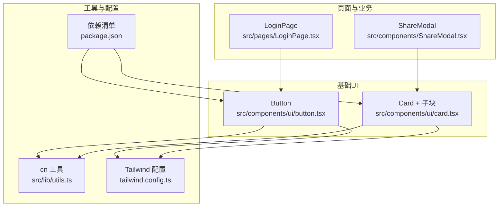
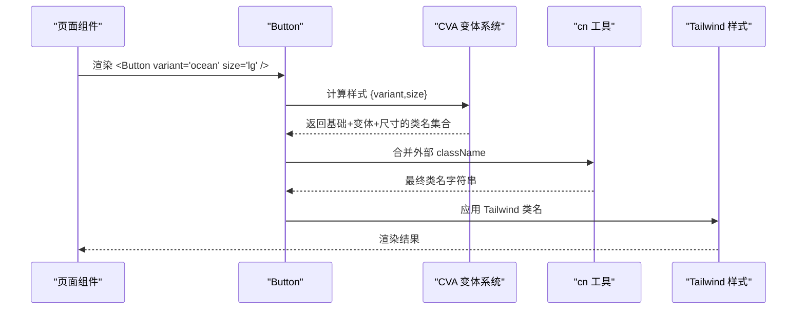
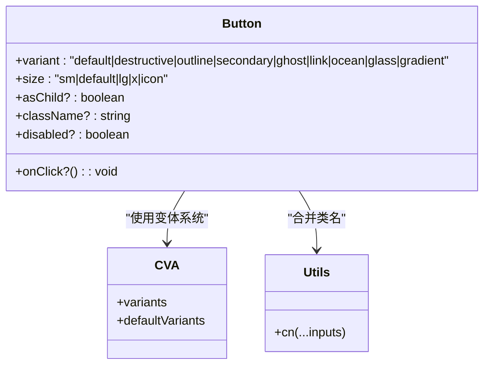
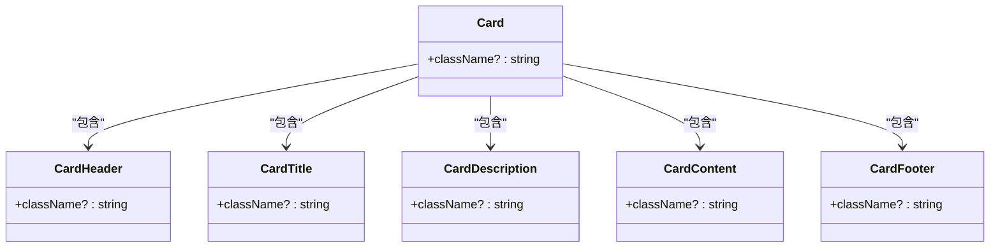
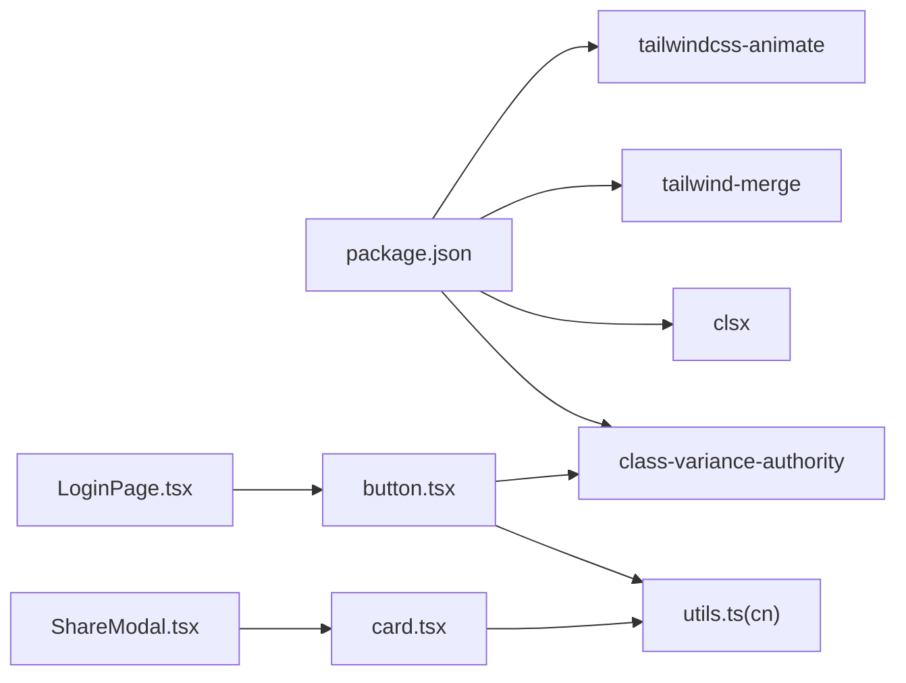

# 基础UI组件

<cite>
**本文引用的文件**   
- [src/components/ui/button.tsx](file://src/components/ui/button.tsx)
- [src/components/ui/card.tsx](file://src/components/ui/card.tsx)
- [tailwind.config.ts](file://tailwind.config.ts)
- [src/lib/utils.ts](file://src/lib/utils.ts)
- [package.json](file://package.json)
- [src/pages/LoginPage.tsx](file://src/pages/LoginPage.tsx)
- [src/components/ShareModal.tsx](file://src/components/ShareModal.tsx)
</cite>

## 目录
1. [简介](#简介)
2. [项目结构](#项目结构)
3. [核心组件](#核心组件)
4. [架构总览](#架构总览)
5. [详细组件分析](#详细组件分析)
6. [依赖关系分析](#依赖关系分析)
7. [性能与可访问性](#性能与可访问性)
8. [故障排查指南](#故障排查指南)
9. [结论](#结论)
10. [附录：Props 接口与使用示例](#附录props-接口与使用示例)

## 简介
本文件为飞鱼加速器基础 UI 组件的权威文档，聚焦 Button 与 Card 两个核心组件。内容涵盖实现细节、变体与尺寸规格、样式覆盖方法、事件处理、组合使用模式、响应式设计与无障碍最佳实践，并解释 class-variance-authority（CVA）的使用方式以及与 TailwindCSS 的集成模式。

## 项目结构
本项目采用基于功能的组件组织方式，基础 UI 组件位于 src/components/ui 下，页面级组件通过相对路径引用这些基础组件。Tailwind 配置集中管理主题色、圆角、动画等设计令牌；工具函数用于合并类名。

图表来源
- [src/components/ui/button.tsx:1-55](file://src/components/ui/button.tsx#L1-L55)
- [src/components/ui/card.tsx:1-80](file://src/components/ui/card.tsx#L1-L80)
- [tailwind.config.ts:1-131](file://tailwind.config.ts#L1-L131)
- [src/lib/utils.ts:1-7](file://src/lib/utils.ts#L1-L7)
- [package.json:1-31](file://package.json#L1-L31)
- [src/pages/LoginPage.tsx:1-215](file://src/pages/LoginPage.tsx#L1-L215)
- [src/components/ShareModal.tsx:1-199](file://src/components/ShareModal.tsx#L1-L199)

章节来源
- [src/components/ui/button.tsx:1-55](file://src/components/ui/button.tsx#L1-L55)
- [src/components/ui/card.tsx:1-80](file://src/components/ui/card.tsx#L1-L80)
- [tailwind.config.ts:1-131](file://tailwind.config.ts#L1-L131)
- [src/lib/utils.ts:1-7](file://src/lib/utils.ts#L1-L7)
- [package.json:1-31](file://package.json#L1-L31)

## 核心组件
- Button：基于 class-variance-authority 的变体与尺寸系统，支持多种视觉风格与交互状态，提供完整的 HTML button 能力扩展。
- Card：模块化卡片容器，包含 Header、Title、Description、Content、Footer 五个语义化子块，便于组合与复用。

章节来源
- [src/components/ui/button.tsx:1-55](file://src/components/ui/button.tsx#L1-L55)
- [src/components/ui/card.tsx:1-80](file://src/components/ui/card.tsx#L1-L80)

## 架构总览
Button 与 Card 均遵循“基础样式 + 可选覆盖”的设计原则：
- 基础样式由 Tailwind 原子类与设计令牌（CSS 变量）驱动。
- 变体与尺寸通过 CVA 声明式定义，运行时根据 props 选择对应样式集合。
- 外部传入 className 通过 cn 工具进行智能合并，避免冲突并保持优先级可控。

图表来源
- [src/components/ui/button.tsx:5-33](file://src/components/ui/button.tsx#L5-L33)
- [src/components/ui/button.tsx:41-51](file://src/components/ui/button.tsx#L41-L51)
- [src/lib/utils.ts:4-6](file://src/lib/utils.ts#L4-L6)
- [tailwind.config.ts:18-64](file://tailwind.config.ts#L18-L64)

## 详细组件分析

### Button 组件
- 设计理念
  - 通过 CVA 将“外观变体”和“尺寸规格”解耦，形成正交的组合空间。
  - 默认提供 focus-visible 环、禁用态、点击缩放等通用交互反馈。
  - 通过 cn 工具允许外部覆盖任意样式片段。

- 变体（variant）
  - default：主按钮，强调主色与前景色，带发光效果。
  - destructive：危险操作，使用破坏色系。
  - outline：描边轮廓风格，透明背景。
  - secondary：次要按钮，使用次级色。
  - ghost：幽灵按钮，仅悬停高亮。
  - link：链接风格，下划线与悬停下划线。
  - ocean：海洋主题，使用 ocean-surface 与发光。
  - glass：玻璃拟态，半透明背景与模糊效果。
  - gradient：渐变背景，从 ocean-surface 到 accent。

- 尺寸（size）
  - sm：紧凑小尺寸，适合行内或密集布局。
  - default：标准尺寸，默认值。
  - lg：大号按钮，适合主行动点。
  - xl：超大按钮，适合首屏关键操作。
  - icon：方形图标按钮，宽高一致。

- 交互与可访问性
  - 焦点可见：focus-visible 外发光环，提升键盘导航体验。
  - 禁用态：pointer-events-none 与 opacity 降低，明确不可用。
  - 点击反馈：active:scale 微缩，增强触觉感。
  - 作为原生 button 渲染，天然具备语义与键盘行为。

- 自定义与覆盖
  - 通过 className 追加或覆盖任意 Tailwind 类。
  - 可通过 CSS 变量调整颜色、圆角、阴影等全局主题。
  - 如需新增变体或尺寸，可在 CVA 配置中扩展 variants 与 defaultVariants。

- 使用示例（来自页面）
  - LoginPage 中使用 ocean 变体与 lg 尺寸，作为登录主按钮。
  - 结合 disabled 控制可用性与文案切换。

章节来源
- [src/components/ui/button.tsx:5-33](file://src/components/ui/button.tsx#L5-L33)
- [src/components/ui/button.tsx:35-54](file://src/components/ui/button.tsx#L35-L54)
- [src/pages/LoginPage.tsx:162-170](file://src/pages/LoginPage.tsx#L162-L170)

#### Button 类图

图表来源
- [src/components/ui/button.tsx:5-33](file://src/components/ui/button.tsx#L5-L33)
- [src/components/ui/button.tsx:35-54](file://src/components/ui/button.tsx#L35-L54)
- [src/lib/utils.ts:4-6](file://src/lib/utils.ts#L4-L6)

### Card 组件
- 结构与子块
  - Card：卡片容器，圆角、边框、背景与阴影。
  - CardHeader：头部区域，垂直间距与内边距。
  - CardTitle：标题，字号与字重突出。
  - CardDescription：描述文本，弱化色与较小字号。
  - CardContent：主体内容区，顶部留白与内边距。
  - CardFooter：底部操作区，水平对齐与内边距。

- 样式与主题
  - 所有子块均通过 cn 合并外部 className，便于局部覆盖。
  - 颜色与字体大小基于 Tailwind 设计令牌，支持暗色模式与主题定制。

- 组合模式
  - 典型用法：Card > CardHeader > (CardTitle + CardDescription) + CardContent + CardFooter。
  - 在 ShareModal 中，Card 与 CardContent 被广泛用于规则说明与示例展示。

- 可访问性建议
  - 使用语义化标签（h3/p/div），确保屏幕阅读器正确识别层级。
  - 为可交互元素（如 Footer 中的按钮）提供 aria-* 属性与键盘可达性。

章节来源
- [src/components/ui/card.tsx:4-17](file://src/components/ui/card.tsx#L4-L17)
- [src/components/ui/card.tsx:19-29](file://src/components/ui/card.tsx#L19-L29)
- [src/components/ui/card.tsx:31-44](file://src/components/ui/card.tsx#L31-L44)
- [src/components/ui/card.tsx:46-56](file://src/components/ui/card.tsx#L46-L56)
- [src/components/ui/card.tsx:58-65](file://src/components/ui/card.tsx#L58-L65)
- [src/components/ui/card.tsx:67-77](file://src/components/ui/card.tsx#L67-L77)
- [src/components/ShareModal.tsx:70-84](file://src/components/ShareModal.tsx#L70-L84)
- [src/components/ShareModal.tsx:135-153](file://src/components/ShareModal.tsx#L135-L153)

#### Card 类图

图表来源
- [src/components/ui/card.tsx:4-77](file://src/components/ui/card.tsx#L4-L77)

## 依赖关系分析
- 包依赖
  - class-variance-authority：声明式变体系统。
  - clsx + tailwind-merge：安全合并类名，避免冲突。
  - tailwindcss-animate：动画与过渡插件。
  - lucide-react：图标库（在页面中使用）。

- 模块依赖
  - Button 依赖 CVA 与 cn 工具。
  - Card 依赖 cn 工具。
  - 页面与业务组件依赖 Button/Card 进行组合。

图表来源
- [package.json:11-19](file://package.json#L11-L19)
- [src/components/ui/button.tsx:1-4](file://src/components/ui/button.tsx#L1-L4)
- [src/components/ui/card.tsx:1-3](file://src/components/ui/card.tsx#L1-L3)
- [src/pages/LoginPage.tsx:1-3](file://src/pages/LoginPage.tsx#L1-L3)
- [src/components/ShareModal.tsx:1-3](file://src/components/ShareModal.tsx#L1-L3)

章节来源
- [package.json:11-19](file://package.json#L11-L19)
- [src/components/ui/button.tsx:1-4](file://src/components/ui/button.tsx#L1-L4)
- [src/components/ui/card.tsx:1-3](file://src/components/ui/card.tsx#L1-L3)

## 性能与可访问性
- 性能
  - CVA 在构建期生成类名映射，运行期仅做对象查找与字符串拼接，开销极低。
  - cn 工具使用 tailwind-merge 去重与排序，避免重复类名导致的样式抖动。
  - 动画与过渡通过 Tailwind 插件启用，注意在低端设备上减少复杂动画数量。

- 可访问性
  - Button 使用原生 button 元素，具备默认键盘行为与语义。
  - focus-visible 外发光环满足键盘导航可见性要求。
  - 禁用态同时设置 pointer-events 与透明度，提示不可交互。
  - Card 子块使用语义化标签，利于屏幕阅读器解析。

[本节为通用指导，不直接分析具体文件]

## 故障排查指南
- 样式未生效
  - 检查是否引入 cn 工具并正确合并 className。
  - 确认 Tailwind 配置 content 路径包含组件所在目录。
  - 若使用自定义变体或尺寸，确保已在 CVA 配置中声明。

- 主题色不生效
  - 检查 CSS 变量是否已定义（例如 --primary、--ocean-surface 等）。
  - 确认 darkMode 策略与根节点 class 是否正确。

- 动画无效
  - 确认 tailwindcss-animate 插件已加载。
  - 检查 keyframes 与 animation 名称是否匹配。

章节来源
- [tailwind.config.ts:5-8](file://tailwind.config.ts#L5-L8)
- [tailwind.config.ts:18-64](file://tailwind.config.ts#L18-L64)
- [tailwind.config.ts:71-124](file://tailwind.config.ts#L71-L124)
- [src/lib/utils.ts:4-6](file://src/lib/utils.ts#L4-L6)

## 结论
Button 与 Card 以最小 API 暴露最大灵活性：通过 CVA 与 Tailwind 设计令牌实现一致的视觉语言，借助 cn 工具保证样式覆盖的安全性与可维护性。建议在项目中统一使用这两个基础组件，并通过主题变量与变体扩展来保持整体一致性。

[本节为总结，不直接分析具体文件]

## 附录：Props 接口与使用示例

### Button Props 定义
- 继承自 React.ButtonHTMLAttributes<HTMLButtonElement>，额外提供：
  - variant：default | destructive | outline | secondary | ghost | link | ocean | glass | gradient
  - size：sm | default | lg | xl | icon
  - asChild：boolean（保留字段，当前实现未使用）
- 常用事件与属性
  - onClick：点击回调
  - disabled：禁用态
  - className：外部样式覆盖

章节来源
- [src/components/ui/button.tsx:35-39](file://src/components/ui/button.tsx#L35-L39)
- [src/components/ui/button.tsx:41-51](file://src/components/ui/button.tsx#L41-L51)

### Card 子块 Props 定义
- Card / CardHeader / CardTitle / CardDescription / CardContent / CardFooter
  - 均继承各自 HTML 元素的 Attributes，并提供 className 用于覆盖。
  - 推荐使用语义化标签与合理的嵌套顺序。

章节来源
- [src/components/ui/card.tsx:4-17](file://src/components/ui/card.tsx#L4-L17)
- [src/components/ui/card.tsx:19-29](file://src/components/ui/card.tsx#L19-L29)
- [src/components/ui/card.tsx:31-44](file://src/components/ui/card.tsx#L31-L44)
- [src/components/ui/card.tsx:46-56](file://src/components/ui/card.tsx#L46-L56)
- [src/components/ui/card.tsx:58-65](file://src/components/ui/card.tsx#L58-L65)
- [src/components/ui/card.tsx:67-77](file://src/components/ui/card.tsx#L67-L77)

### 使用示例（来自仓库）
- Button 在登录页中的应用
  - 使用 ocean 变体与 lg 尺寸，作为主要登录入口。
  - 结合 disabled 与动态文案，体现不同登录流程。

章节来源
- [src/pages/LoginPage.tsx:162-170](file://src/pages/LoginPage.tsx#L162-L170)

- Card 在分享弹窗中的应用
  - 使用 Card 与 CardContent 组合展示规则与示例。
  - 通过外层容器与背景渐变营造层次与氛围。

章节来源
- [src/components/ShareModal.tsx:70-84](file://src/components/ShareModal.tsx#L70-L84)
- [src/components/ShareModal.tsx:135-153](file://src/components/ShareModal.tsx#L135-L153)

### class-variance-authority 使用方式
- 在组件中通过 cva 声明 variants 与 defaultVariants。
- 在渲染时调用 buttonVariants({ variant, size, className }) 获取最终类名。
- 通过 cn 合并外部传入的 className，确保覆盖优先级。

章节来源
- [src/components/ui/button.tsx:5-33](file://src/components/ui/button.tsx#L5-L33)
- [src/components/ui/button.tsx:41-51](file://src/components/ui/button.tsx#L41-L51)
- [src/lib/utils.ts:4-6](file://src/lib/utils.ts#L4-L6)

### TailwindCSS 集成模式
- 主题色与圆角通过 CSS 变量注入，便于多主题与暗色模式。
- 自定义颜色族（如 ocean、status）在 theme.extend.colors 中扩展。
- 动画与过渡通过 tailwindcss-animate 插件启用，并在 theme.extend.animation 中注册。

章节来源
- [tailwind.config.ts:18-64](file://tailwind.config.ts#L18-L64)
- [tailwind.config.ts:65-70](file://tailwind.config.ts#L65-L70)
- [tailwind.config.ts:71-124](file://tailwind.config.ts#L71-L124)
- [tailwind.config.ts:127-128](file://tailwind.config.ts#L127-L128)