# 组件架构设计

<cite>
**本文引用的文件**   
- [src/main.tsx](file://src/main.tsx)
- [src/App.tsx](file://src/App.tsx)
- [src/components/PhoneFrame.tsx](file://src/components/PhoneFrame.tsx)
- [src/components/BottomNav.tsx](file://src/components/BottomNav.tsx)
- [src/components/AccelerateButton.tsx](file://src/components/AccelerateButton.tsx)
- [src/components/AddToHomeScreenPrompt.tsx](file://src/components/AddToHomeScreenPrompt.tsx)
- [src/components/ui/button.tsx](file://src/components/ui/button.tsx)
- [src/components/ui/card.tsx](file://src/components/ui/card.tsx)
- [src/pages/SplashPage.tsx](file://src/pages/SplashPage.tsx)
- [src/pages/LoginPage.tsx](file://src/pages/LoginPage.tsx)
- [src/pages/HomePage.tsx](file://src/pages/HomePage.tsx)
- [src/lib/utils.ts](file://src/lib/utils.ts)
- [src/index.css](file://src/index.css)
- [tailwind.config.ts](file://tailwind.config.ts)
- [package.json](file://package.json)
</cite>

## 目录
1. [简介](#简介)
2. [项目结构](#项目结构)
3. [核心组件](#核心组件)
4. [架构总览](#架构总览)
5. [详细组件分析](#详细组件分析)
6. [依赖关系分析](#依赖关系分析)
7. [性能考虑](#性能考虑)
8. [故障排查指南](#故障排查指南)
9. [结论](#结论)
10. [附录](#附录)

## 简介
本文件面向飞鱼加速器的前端组件架构，系统化阐述基于 React 函数的组件范式、Props 向下传递与事件向上冒泡的数据流模式、组合优于继承的设计原则、集中式状态管理策略与优化方法。同时给出命名规范、文件组织、代码风格、测试与调试建议，以及与 TailwindCSS 主题系统的集成方式和扩展点说明。

## 项目结构
本项目采用“页面 + 通用 UI 组件 + 业务组件”的分层组织方式：
- src/main.tsx：应用入口，挂载根组件
- src/App.tsx：顶层路由与全局状态容器，负责页面切换与跨页面共享状态
- src/pages/*：页面级组件（如 SplashPage、LoginPage、HomePage）
- src/components/*：可复用 UI 与业务组件（如 PhoneFrame、BottomNav、AccelerateButton、AddToHomeScreenPrompt）
- src/components/ui/*：基础 UI 原子组件（Button、Card 等）
- src/lib/*：工具函数（如 cn 合并类名）
- tailwind.config.ts / src/index.css：主题与样式系统
- package.json：依赖与脚本

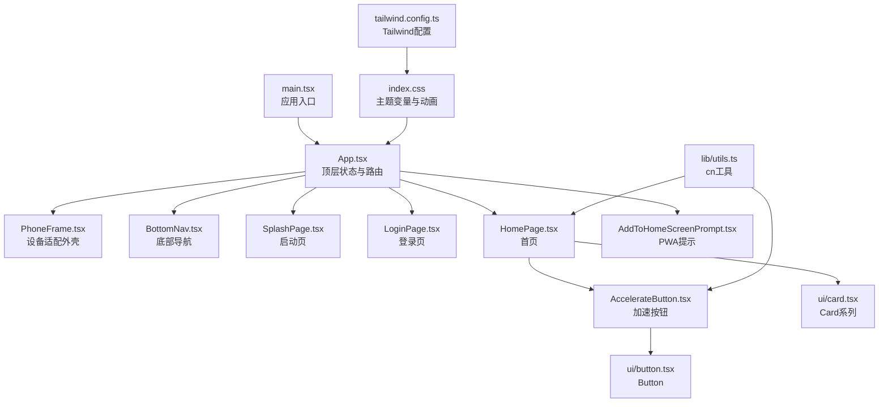

图示来源
- [src/main.tsx:1-11](file://src/main.tsx#L1-L11)
- [src/App.tsx:1-468](file://src/App.tsx#L1-L468)
- [src/components/PhoneFrame.tsx:1-87](file://src/components/PhoneFrame.tsx#L1-L87)
- [src/components/BottomNav.tsx:1-57](file://src/components/BottomNav.tsx#L1-L57)
- [src/pages/SplashPage.tsx:1-68](file://src/pages/SplashPage.tsx#L1-L68)
- [src/pages/LoginPage.tsx:1-215](file://src/pages/LoginPage.tsx#L1-L215)
- [src/pages/HomePage.tsx:1-187](file://src/pages/HomePage.tsx#L1-L187)
- [src/components/AccelerateButton.tsx:1-182](file://src/components/AccelerateButton.tsx#L1-L182)
- [src/components/AddToHomeScreenPrompt.tsx:1-104](file://src/components/AddToHomeScreenPrompt.tsx#L1-L104)
- [src/components/ui/button.tsx:1-55](file://src/components/ui/button.tsx#L1-L55)
- [src/components/ui/card.tsx:1-80](file://src/components/ui/card.tsx#L1-L80)
- [src/lib/utils.ts:1-7](file://src/lib/utils.ts#L1-L7)
- [src/index.css:1-246](file://src/index.css#L1-L246)
- [tailwind.config.ts:1-131](file://tailwind.config.ts#L1-L131)

章节来源
- [src/main.tsx:1-11](file://src/main.tsx#L1-L11)
- [src/App.tsx:1-468](file://src/App.tsx#L1-L468)
- [tailwind.config.ts:1-131](file://tailwind.config.ts#L1-L131)
- [src/index.css:1-246](file://src/index.css#L1-L246)
- [package.json:1-31](file://package.json#L1-L31)

## 核心组件
- App：集中式状态容器，维护应用阶段（stage）、登录态、当前页面、连接状态、模式与线路选择、积分与会员时长等；通过回调将状态变更向上传递到子页面，实现“Props 向下、事件向上”的单向数据流。
- PhoneFrame：设备适配外壳，在移动端启用全屏能力并提供悬浮控制按钮；在桌面端提供手机外框模拟。
- BottomNav：底部导航，驱动 HomePage 内三个主标签页切换。
- AccelerateButton：可视化加速开关，封装 SVG 仪表盘与火焰动画，暴露 onToggle 事件。
- AddToHomeScreenPrompt：PWA 安装引导弹窗，依据设备与环境条件显示。
- ui/Button、ui/Card：基础 UI 原子组件，使用 class-variance-authority 和 cn 工具进行变体与类名合并。
- lib/utils.cn：clsx + tailwind-merge 的类名合并工具，确保变体与外部 className 安全合并。

章节来源
- [src/App.tsx:1-468](file://src/App.tsx#L1-L468)
- [src/components/PhoneFrame.tsx:1-87](file://src/components/PhoneFrame.tsx#L1-L87)
- [src/components/BottomNav.tsx:1-57](file://src/components/BottomNav.tsx#L1-L57)
- [src/components/AccelerateButton.tsx:1-182](file://src/components/AccelerateButton.tsx#L1-L182)
- [src/components/AddToHomeScreenPrompt.tsx:1-104](file://src/components/AddToHomeScreenPrompt.tsx#L1-L104)
- [src/components/ui/button.tsx:1-55](file://src/components/ui/button.tsx#L1-L55)
- [src/components/ui/card.tsx:1-80](file://src/components/ui/card.tsx#L1-L80)
- [src/lib/utils.ts:1-7](file://src/lib/utils.ts#L1-L7)

## 架构总览
整体遵循“单一数据源 + 单向数据流”的 React 最佳实践：
- 顶层 App 持有所有跨页面共享的状态与处理函数
- 页面组件仅接收 props 与回调，不直接修改父级状态
- 基础 UI 组件保持无状态或最小状态，专注展示与交互细节
- 样式系统通过 CSS 变量 + Tailwind 扩展，统一主题与动效

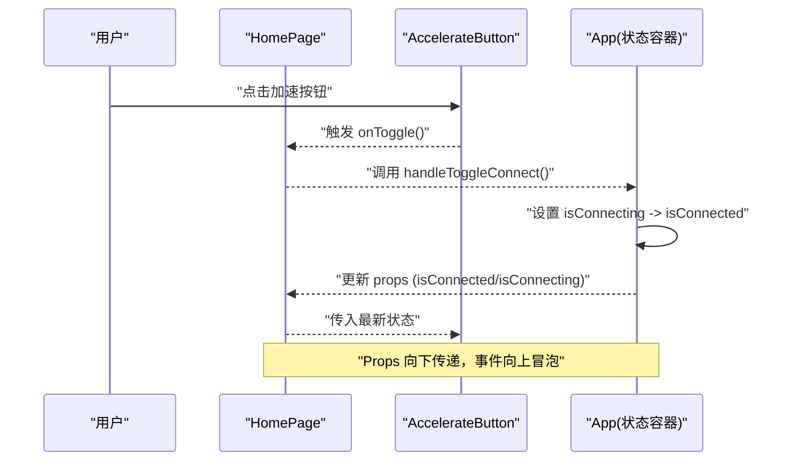

图示来源
- [src/pages/HomePage.tsx:1-187](file://src/pages/HomePage.tsx#L1-L187)
- [src/components/AccelerateButton.tsx:1-182](file://src/components/AccelerateButton.tsx#L1-L182)
- [src/App.tsx:128-139](file://src/App.tsx#L128-L139)

## 详细组件分析

### App 组件（顶层状态与路由）
- 职责
  - 维护应用阶段 stage、登录态、当前页面、连接状态、模式与线路、选中应用列表、积分与会员时长、协议类型与返回目标、任务提交 ID、连接计时器、邀请奖励领取标记等
  - 提供统一的回调函数（如 handleLogin、handleToggleConnect、handleEarnPoints、handleExchangeMember 等），用于状态变更与副作用
  - 根据 stage 渲染对应页面，并在 main 阶段按 currentPage 渲染 Home/Tasks/Profile
- 数据流
  - 所有页面通过 props 获取状态，通过回调通知 App 更新
  - 使用 useCallback 包裹回调，避免不必要的重渲染
- 计时器
  - 使用 useRef 保存 setInterval 引用，在 useEffect 中根据 isConnected 启停，清理时清除定时器

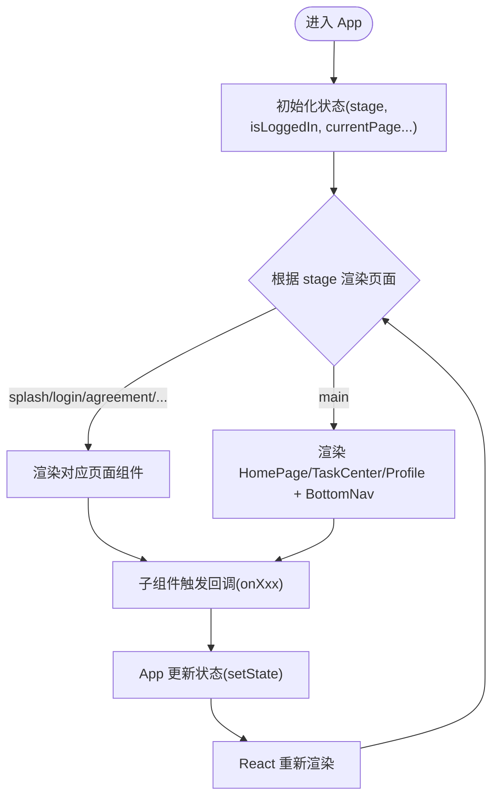

图示来源
- [src/App.tsx:27-468](file://src/App.tsx#L27-L468)

章节来源
- [src/App.tsx:27-468](file://src/App.tsx#L27-L468)

### PhoneFrame（设备适配外壳）
- 职责
  - 检测移动端并切换布局；在移动端提供全屏切换按钮；在桌面端提供手机外框模拟
- 关键点
  - 使用 resize 监听与 fullscreenchange 事件同步状态
  - 通过 useCallback 缓存全屏切换逻辑

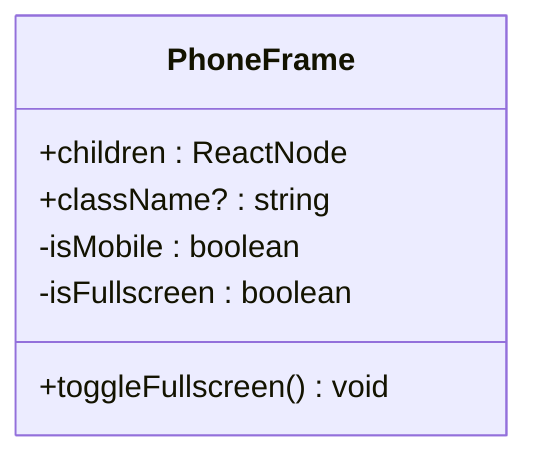

图示来源
- [src/components/PhoneFrame.tsx:1-87](file://src/components/PhoneFrame.tsx#L1-L87)

章节来源
- [src/components/PhoneFrame.tsx:1-87](file://src/components/PhoneFrame.tsx#L1-L87)

### BottomNav（底部导航）
- 职责
  - 定义 PageKey 类型与导航项数组，渲染图标与标签，响应点击并通过 onNavigate 上报
- 关键点
  - 使用 cn 动态拼接激活态样式
  - 图标来自 lucide-react，支持 strokeWidth 变化以强调激活态

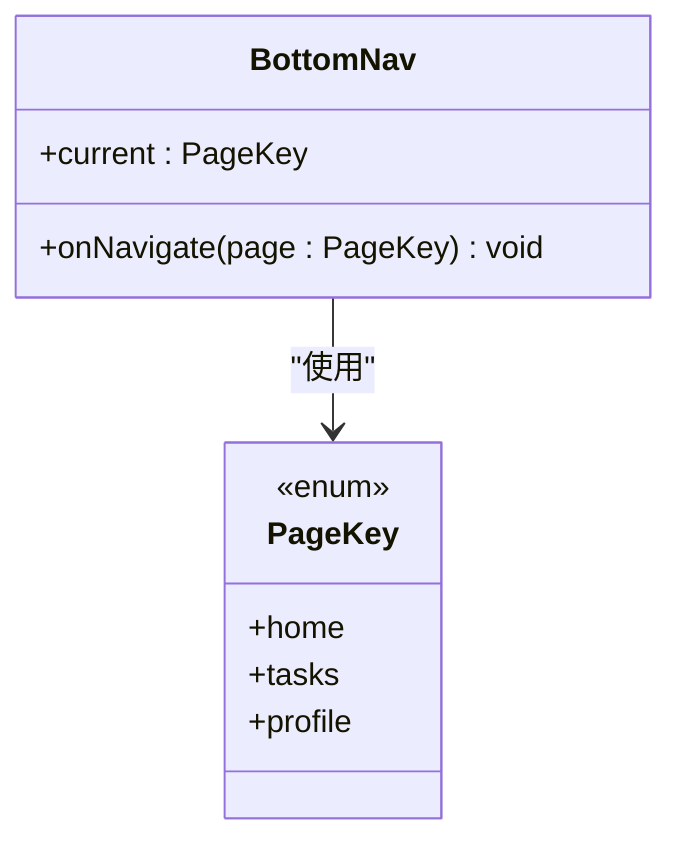

图示来源
- [src/components/BottomNav.tsx:1-57](file://src/components/BottomNav.tsx#L1-L57)

章节来源
- [src/components/BottomNav.tsx:1-57](file://src/components/BottomNav.tsx#L1-L57)

### AccelerateButton（加速按钮）
- 职责
  - 渲染 SVG 仪表盘、刻度、火箭与火焰动画，提供 onToggle 事件
- 关键点
  - 根据 isConnected/isConnecting 切换视觉状态与动画
  - 使用 cn 合并外部 className，便于上层定制

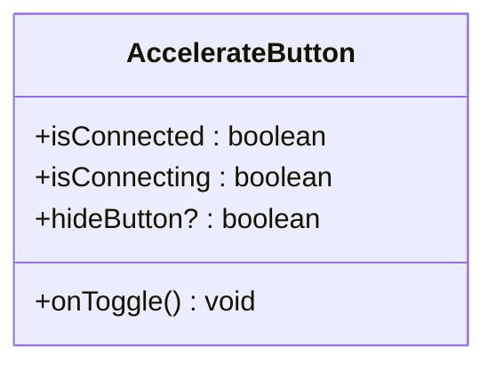

图示来源
- [src/components/AccelerateButton.tsx:1-182](file://src/components/AccelerateButton.tsx#L1-L182)

章节来源
- [src/components/AccelerateButton.tsx:1-182](file://src/components/AccelerateButton.tsx#L1-L182)

### AddToHomeScreenPrompt（PWA 安装引导）
- 职责
  - 在非 standalone 模式的移动设备上显示全屏引导，记录已关闭状态至 sessionStorage
- 关键点
  - 使用 matchMedia 与 navigator.standalone 判断 PWA 模式
  - 延迟显示以提升首屏体验

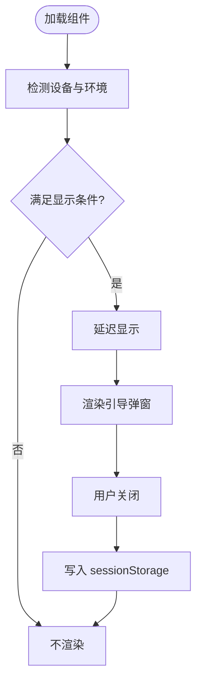

图示来源
- [src/components/AddToHomeScreenPrompt.tsx:1-104](file://src/components/AddToHomeScreenPrompt.tsx#L1-L104)

章节来源
- [src/components/AddToHomeScreenPrompt.tsx:1-104](file://src/components/AddToHomeScreenPrompt.tsx#L1-L104)

### ui/Button（原子按钮）
- 职责
  - 基于 cva 定义 variant/size 变体，结合 cn 合并 className，提供 forwardRef
- 关键点
  - 默认聚焦环、禁用态、缩放反馈等一致体验
  - 支持 ocean/glass/gradient 等业务化变体

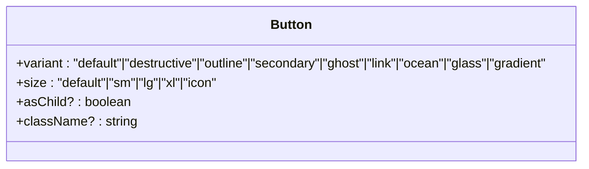

图示来源
- [src/components/ui/button.tsx:1-55](file://src/components/ui/button.tsx#L1-L55)

章节来源
- [src/components/ui/button.tsx:1-55](file://src/components/ui/button.tsx#L1-L55)

### ui/Card（卡片容器）
- 职责
  - 提供 Card、CardHeader、CardTitle、CardDescription、CardContent、CardFooter 组合式组件
- 关键点
  - 全部使用 forwardRef 与 cn 合并，保证可访问性与样式可控

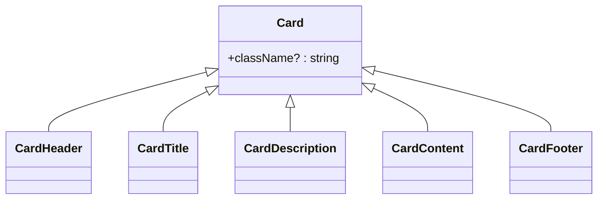

图示来源
- [src/components/ui/card.tsx:1-80](file://src/components/ui/card.tsx#L1-L80)

章节来源
- [src/components/ui/card.tsx:1-80](file://src/components/ui/card.tsx#L1-L80)

### HomePage（首页）
- 职责
  - 聚合加速状态、模式与线路信息，渲染加速按钮与信息卡片，提供分享入口
- 关键点
  - 通过 props 接收状态与回调，不直接修改父级状态
  - 使用 LINE_OPTIONS 映射线路名称

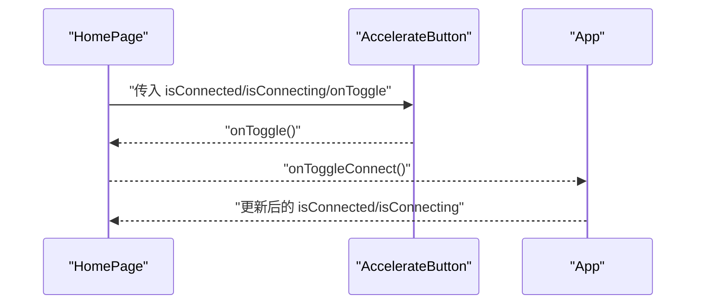

图示来源
- [src/pages/HomePage.tsx:1-187](file://src/pages/HomePage.tsx#L1-L187)
- [src/components/AccelerateButton.tsx:1-182](file://src/components/AccelerateButton.tsx#L1-L182)
- [src/App.tsx:404-453](file://src/App.tsx#L404-L453)

章节来源
- [src/pages/HomePage.tsx:1-187](file://src/pages/HomePage.tsx#L1-L187)

### LoginPage（登录页）
- 职责
  - 支持一键登录与短信验证码登录，包含协议勾选与倒计时
- 关键点
  - 本地校验手机号与验证码长度，控制按钮可用状态
  - 协议弹窗为局部覆盖层，不影响整体路由

章节来源
- [src/pages/LoginPage.tsx:1-215](file://src/pages/LoginPage.tsx#L1-L215)

### SplashPage（启动页）
- 职责
  - 展示品牌信息与粒子背景，定时完成后回调 onFinish
- 关键点
  - 使用 setTimeout 与清理函数保证卸载后不再触发回调

章节来源
- [src/pages/SplashPage.tsx:1-68](file://src/pages/SplashPage.tsx#L1-L68)

## 依赖关系分析
- 运行时依赖
  - react/react-dom：UI 框架
  - class-variance-authority、clsx、tailwind-merge：样式变体与类名合并
  - lucide-react：图标库
  - tailwindcss-animate：动画插件
- 构建与开发
  - vite、typescript、autoprefixer、postcss、@vitejs/plugin-react

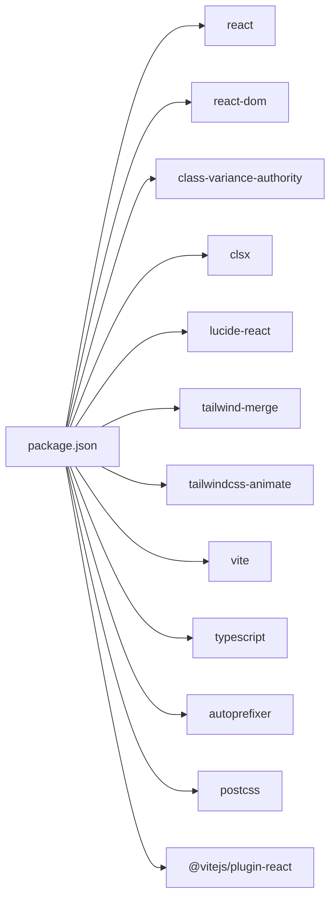

图示来源
- [package.json:1-31](file://package.json#L1-L31)

章节来源
- [package.json:1-31](file://package.json#L1-L31)

## 性能考虑
- 状态提升与最小化重渲染
  - 将跨页面共享状态提升至 App，使用 useCallback 稳定回调引用，减少子组件不必要重渲染
- 计时器与副作用清理
  - 使用 useRef 保存定时器句柄，在 useEffect 中正确清理，避免内存泄漏
- 类名合并
  - 使用 cn 工具合并 clsx 与 tailwind-merge，避免重复与冲突类名
- 动画与 GPU 加速
  - 合理使用 transform/opacity 动画，避免频繁触发重排
- 组件粒度
  - 将复杂交互拆分为小组件（如 AccelerateButton），提高可读性与可测试性

[本节为通用指导，无需具体文件来源]

## 故障排查指南
- 连接状态不同步
  - 检查 App 中的 handleToggleConnect 是否被正确调用，确认 isConnecting 与 isConnected 的时序
- 计时器未清理导致异常
  - 确认 useEffect 的清理函数是否执行，ref 是否正确保存
- 样式冲突或无效
  - 检查 cn 的使用位置，确认 Tailwind 配置与 index.css 变量是否生效
- PWA 提示不出现
  - 检查设备是否为移动端且非 standalone 模式，确认 sessionStorage 是否已被写入

章节来源
- [src/App.tsx:94-107](file://src/App.tsx#L94-L107)
- [src/components/AddToHomeScreenPrompt.tsx:14-31](file://src/components/AddToHomeScreenPrompt.tsx#L14-L31)
- [src/lib/utils.ts:1-7](file://src/lib/utils.ts#L1-L7)
- [tailwind.config.ts:1-131](file://tailwind.config.ts#L1-L131)
- [src/index.css:1-246](file://src/index.css#L1-L246)

## 结论
本项目采用清晰的组件分层与集中式状态管理，严格遵循 Props 向下、事件向上的单向数据流，配合 TailwindCSS 主题系统与原子化 UI 组件，实现了高内聚、低耦合的前端架构。通过合理的性能优化与可观测的调试手段，保障了用户体验与可维护性。

[本节为总结性内容，无需具体文件来源]

## 附录

### 组件命名规范
- 组件文件：大驼峰命名，如 AccelerateButton.tsx、AddToHomeScreenPrompt.tsx
- 导出命名：与文件名一致的大驼峰函数式组件
- 类型与接口：大驼峰，如 ButtonProps、HomePageProps
- 常量与枚举：大驼峰或 UPPER_SNAKE_CASE，如 PageKey、LINE_OPTIONS

### 文件组织结构
- src/components/ui：基础 UI 原子组件
- src/components：业务相关可复用组件
- src/pages：页面级组件
- src/lib：工具函数与公共逻辑
- 根目录：构建与样式配置（tailwind.config.ts、postcss.config.js、tsconfig.*、vite.config.ts）

### 代码风格指南
- 使用 TypeScript 严格类型约束，明确 Props 接口
- 使用 useCallback/useMemo 优化回调与计算结果
- 使用 cn 工具合并类名，避免硬编码样式冲突
- 使用 lucide-react 图标，保持一致的视觉语言
- 使用 Tailwind 语义化类名，必要时在 index.css 中补充自定义组件层

### 测试策略
- 单元测试
  - 对纯函数与工具（如 cn）进行断言
  - 对组件 Props 行为进行快照与交互测试（如点击按钮触发回调）
- 集成测试
  - 验证 App 状态流转（登录、连接、积分变动）是否符合预期
- 视觉回归
  - 对关键页面进行截图对比，确保主题与动画一致性

### 调试技巧
- 使用 React DevTools 查看组件树与状态
- 在关键回调中添加日志输出，观察事件冒泡路径
- 利用浏览器控制台检查 CSS 变量与 Tailwind 生成类
- 针对动画问题，使用 Performance 面板定位重排/重绘热点

### 与 TailwindCSS 主题系统集成与扩展点
- 主题变量
  - 在 index.css 的 :root 中定义颜色、圆角、阴影等 CSS 变量
  - 通过 hsl(var(--xxx)) 在 Tailwind 中使用
- Tailwind 扩展
  - tailwind.config.ts 中 extend.colors 映射主题变量，新增 ocean/status 等语义色
  - 扩展 borderRadius、keyframes、animation，统一动效命名
- 自定义扩展点
  - 在 index.css 的 @layer components 中定义常用复合样式（玻璃卡片、渐变文字、粒子、动画）
  - 在 ui/button.tsx 中通过 cva 新增业务变体（如 ocean/glass/gradient）
  - 在 pages 中复用这些扩展，保持视觉一致性

章节来源
- [src/index.css:1-246](file://src/index.css#L1-L246)
- [tailwind.config.ts:1-131](file://tailwind.config.ts#L1-L131)
- [src/components/ui/button.tsx:1-55](file://src/components/ui/button.tsx#L1-L55)