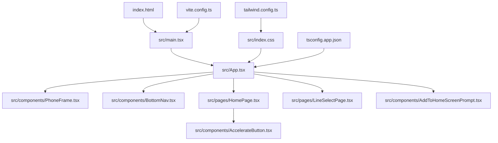
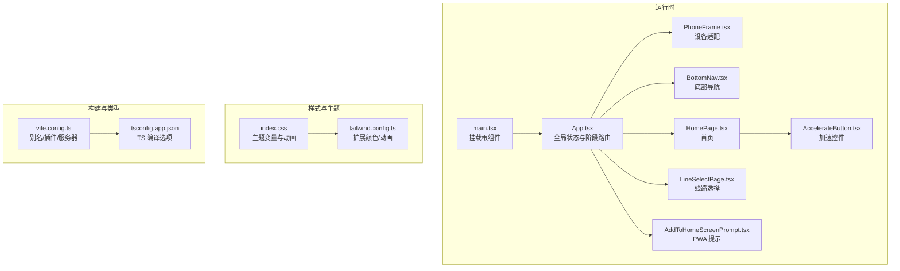
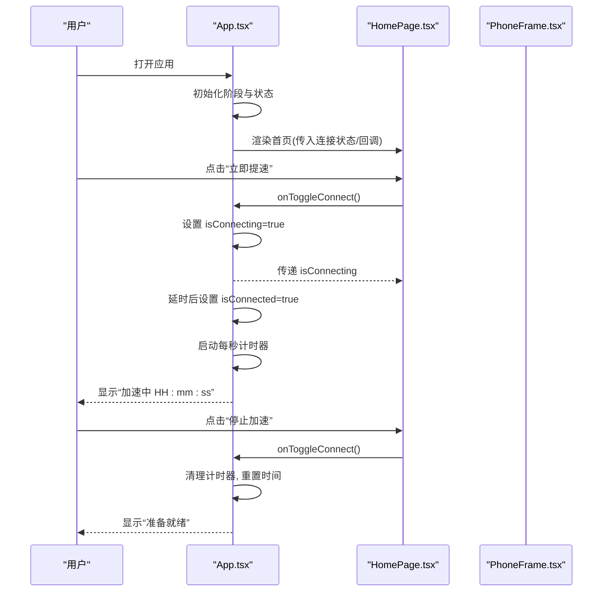
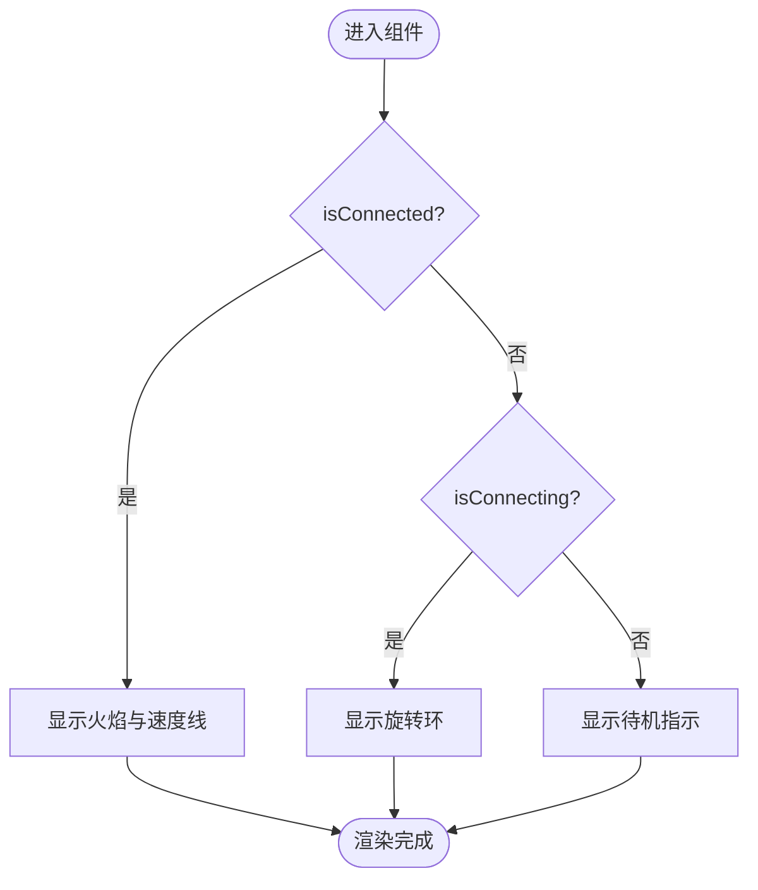
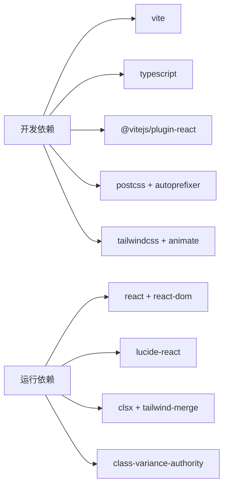

# 开发指南

<cite>
**本文引用的文件**   
- [package.json](file://package.json)
- [tsconfig.json](file://tsconfig.json)
- [tsconfig.app.json](file://tsconfig.app.json)
- [vite.config.ts](file://vite.config.ts)
- [tailwind.config.ts](file://tailwind.config.ts)
- [index.html](file://index.html)
- [src/index.css](file://src/index.css)
- [src/main.tsx](file://src/main.tsx)
- [src/App.tsx](file://src/App.tsx)
- [src/components/PhoneFrame.tsx](file://src/components/PhoneFrame.tsx)
- [src/components/BottomNav.tsx](file://src/components/BottomNav.tsx)
- [src/components/AccelerateButton.tsx](file://src/components/AccelerateButton.tsx)
- [src/pages/HomePage.tsx](file://src/pages/HomePage.tsx)
- [src/pages/LineSelectPage.tsx](file://src/pages/LineSelectPage.tsx)
- [src/lib/utils.ts](file://src/lib/utils.ts)
- [src/lib/appData.ts](file://src/lib/appData.ts)
- [src/components/AddToHomeScreenPrompt.tsx](file://src/components/AddToHomeScreenPrompt.tsx)
- [docs/dev-handoff.html](file://docs/dev-handoff.html)
</cite>

## 目录
1. [简介](#简介)
2. [项目结构](#项目结构)
3. [核心组件](#核心组件)
4. [架构总览](#架构总览)
5. [详细组件分析](#详细组件分析)
6. [依赖分析](#依赖分析)
7. [性能考虑](#性能考虑)
8. [故障排除指南](#故障排除指南)
9. [结论](#结论)
10. [附录](#附录)

## 简介
本指南面向飞鱼加速器的前端开发与协作团队，覆盖开发工作流程、代码规范与最佳实践、TypeScript 配置与类型定义使用模式、工具函数与本地数据存储策略、调试技巧与性能监控方法、代码审查清单与质量保证流程、版本控制与协作工作流，以及常见问题解决方案。目标是帮助新成员快速上手并高效产出高质量代码。

## 项目结构
本项目采用 Vite + React + TypeScript + TailwindCSS 的现代化前端技术栈，页面按功能域拆分至 pages 目录，通用 UI 组件位于 components/ui，业务组件位于 components，共享数据与工具位于 lib。入口为 index.html 与 src/main.tsx，应用根组件为 src/App.tsx。

图表来源
- [index.html:1-23](file://index.html#L1-L23)
- [src/main.tsx:1-11](file://src/main.tsx#L1-L11)
- [src/App.tsx:1-468](file://src/App.tsx#L1-L468)
- [src/components/PhoneFrame.tsx:1-87](file://src/components/PhoneFrame.tsx#L1-L87)
- [src/components/BottomNav.tsx:1-57](file://src/components/BottomNav.tsx#L1-L57)
- [src/pages/HomePage.tsx:1-187](file://src/pages/HomePage.tsx#L1-L187)
- [src/pages/LineSelectPage.tsx:1-114](file://src/pages/LineSelectPage.tsx#L1-L114)
- [src/components/AccelerateButton.tsx:1-182](file://src/components/AccelerateButton.tsx#L1-L182)
- [src/components/AddToHomeScreenPrompt.tsx:1-39](file://src/components/AddToHomeScreenPrompt.tsx#L1-L39)
- [src/index.css:1-246](file://src/index.css#L1-L246)
- [tailwind.config.ts:1-131](file://tailwind.config.ts#L1-L131)
- [vite.config.ts:1-16](file://vite.config.ts#L1-L16)
- [tsconfig.app.json:1-26](file://tsconfig.app.json#L1-L26)

章节来源
- [package.json:1-31](file://package.json#L1-L31)
- [vite.config.ts:1-16](file://vite.config.ts#L1-L16)
- [tsconfig.json:1-7](file://tsconfig.json#L1-L7)
- [tsconfig.app.json:1-26](file://tsconfig.app.json#L1-L26)
- [tailwind.config.ts:1-131](file://tailwind.config.ts#L1-L131)
- [index.html:1-23](file://index.html#L1-L23)
- [src/index.css:1-246](file://src/index.css#L1-L246)
- [src/main.tsx:1-11](file://src/main.tsx#L1-L11)
- [src/App.tsx:1-468](file://src/App.tsx#L1-L468)

## 核心组件
- 应用容器与路由状态：App 管理多阶段（启动页、隐私协议、主界面等）与底部导航切换，集中维护连接状态、会员时长、积分与历史流水等全局状态。
- 手机适配框架：PhoneFrame 根据设备尺寸与全屏能力提供移动端全屏按钮或桌面端仿真外壳。
- 底部导航：BottomNav 提供“加速”“免费会员”“我的”三个 Tab 切换。
- 加速交互：AccelerateButton 提供带仪表盘的可视化加速开关；HomePage 组合该按钮与模式/线路卡片。
- 线路选择：LineSelectPage 提供智能优选与多地节点选择。
- 工具函数：utils.ts 提供 clsx + tailwind-merge 的 cn 合并类名工具。
- 应用图标数据：appData.ts 提供 Mock 应用图标与分类数据，供模式与应用选择页面复用。

章节来源
- [src/App.tsx:1-468](file://src/App.tsx#L1-L468)
- [src/components/PhoneFrame.tsx:1-87](file://src/components/PhoneFrame.tsx#L1-L87)
- [src/components/BottomNav.tsx:1-57](file://src/components/BottomNav.tsx#L1-L57)
- [src/components/AccelerateButton.tsx:1-182](file://src/components/AccelerateButton.tsx#L1-L182)
- [src/pages/HomePage.tsx:1-187](file://src/pages/HomePage.tsx#L1-L187)
- [src/pages/LineSelectPage.tsx:1-114](file://src/pages/LineSelectPage.tsx#L1-L114)
- [src/lib/utils.ts:1-7](file://src/lib/utils.ts#L1-L7)
- [src/lib/appData.ts:1-48](file://src/lib/appData.ts#L1-L48)

## 架构总览
整体采用单页应用架构，Vite 作为构建与开发服务器，React 负责视图渲染，TailwindCSS 提供样式系统，TypeScript 保障类型安全。App 作为状态中心，通过 props 将状态与方法下传给子页面与组件。

图表来源
- [src/main.tsx:1-11](file://src/main.tsx#L1-L11)
- [src/App.tsx:1-468](file://src/App.tsx#L1-L468)
- [src/components/PhoneFrame.tsx:1-87](file://src/components/PhoneFrame.tsx#L1-L87)
- [src/components/BottomNav.tsx:1-57](file://src/components/BottomNav.tsx#L1-L57)
- [src/pages/HomePage.tsx:1-187](file://src/pages/HomePage.tsx#L1-L187)
- [src/pages/LineSelectPage.tsx:1-114](file://src/pages/LineSelectPage.tsx#L1-L114)
- [src/components/AccelerateButton.tsx:1-182](file://src/components/AccelerateButton.tsx#L1-L182)
- [src/components/AddToHomeScreenPrompt.tsx:1-39](file://src/components/AddToHomeScreenPrompt.tsx#L1-L39)
- [src/index.css:1-246](file://src/index.css#L1-L246)
- [tailwind.config.ts:1-131](file://tailwind.config.ts#L1-L131)
- [vite.config.ts:1-16](file://vite.config.ts#L1-L16)
- [tsconfig.app.json:1-26](file://tsconfig.app.json#L1-L26)

## 详细组件分析

### 应用状态与阶段路由（App）
- 职责：管理应用阶段（splash、privacy、main 等）、登录态、当前页面、连接状态、模式与线路、选中应用集合、积分与会员时长、邀请奖励领取标记、计时器等。
- 关键流程：
  - 连接生命周期：点击加速后进入连接中状态，延时模拟成功后置为已连接，同时启用秒级计时器；断开时清理定时器并重置时间。
  - 积分与记录：新增积分时同步更新余额与历史记录列表。
  - 协议弹窗：在首次启动强制展示隐私协议，同意后写入本地存储并进入主界面。
  - 页面导航：通过 stage 与 currentPage 组合渲染不同页面。

图表来源
- [src/App.tsx:94-107](file://src/App.tsx#L94-L107)
- [src/App.tsx:128-139](file://src/App.tsx#L128-L139)
- [src/pages/HomePage.tsx:114-131](file://src/pages/HomePage.tsx#L114-L131)
- [src/components/PhoneFrame.tsx:1-87](file://src/components/PhoneFrame.tsx#L1-L87)

章节来源
- [src/App.tsx:25-210](file://src/App.tsx#L25-L210)
- [src/App.tsx:211-455](file://src/App.tsx#L211-L455)

### 加速按钮与仪表盘（AccelerateButton）
- 职责：以 SVG 仪表盘+火箭动效呈现加速状态，支持隐藏按钮模式（由 HomePage 内嵌）。
- 关键点：
  - 刻度与弧线：基于固定角度生成刻度线，区分主刻度与中心刻度。
  - 状态样式：未连接/连接中/已连接三种状态的发光与动画差异。
  - 火焰与速度线：仅在已连接时显示火焰闪烁与速度线动画。

图表来源
- [src/components/AccelerateButton.tsx:12-25](file://src/components/AccelerateButton.tsx#L12-L25)
- [src/components/AccelerateButton.tsx:92-154](file://src/components/AccelerateButton.tsx#L92-L154)

章节来源
- [src/components/AccelerateButton.tsx:1-182](file://src/components/AccelerateButton.tsx#L1-L182)

### 首页布局与交互（HomePage）
- 职责：聚合加速按钮、模式/线路卡片、分享入口与广告位占位。
- 关键点：
  - 顶部状态徽章：根据连接状态动态显示“加速中/连接中/准备就绪”。
  - 模式与线路卡片：点击跳转对应选择页，并在卡片上展示当前值。
  - 大按钮：与 AccelerateButton 联动，统一触发连接逻辑。

章节来源
- [src/pages/HomePage.tsx:1-187](file://src/pages/HomePage.tsx#L1-L187)

### 线路选择（LineSelectPage）
- 职责：提供智能优选与多地节点选择，高亮当前线路并显示延迟标签。
- 关键点：
  - 数据结构：LINE_OPTIONS 定义可选线路及其元信息。
  - 交互：点击即选中并回调父级更新 currentLine。

章节来源
- [src/pages/LineSelectPage.tsx:1-114](file://src/pages/LineSelectPage.tsx#L1-L114)

### 手机适配与全屏（PhoneFrame）
- 职责：检测触摸与小屏设备，提供全屏悬浮按钮；在非移动设备上渲染手机外壳。
- 关键点：
  - 全屏 API：监听 fullscreenchange 事件，提供进入/退出全屏。
  - 移动端体验：全屏按钮常驻右下角，避免遮挡内容。

章节来源
- [src/components/PhoneFrame.tsx:1-87](file://src/components/PhoneFrame.tsx#L1-L87)

### 底部导航（BottomNav）
- 职责：提供三栏导航（加速/免费会员/我的），高亮当前项并切换页面。
- 关键点：
  - 类型约束：PageKey 限定可导航页面键。
  - 样式：使用 cn 工具合并活跃态与非活跃态样式。

章节来源
- [src/components/BottomNav.tsx:1-57](file://src/components/BottomNav.tsx#L1-L57)

### 工具函数与类型定义
- cn 工具：封装 clsx 与 tailwind-merge，用于条件化合并 Tailwind 类名。
- appData：集中管理应用图标数据，便于多处复用与统一维护。

章节来源
- [src/lib/utils.ts:1-7](file://src/lib/utils.ts#L1-L7)
- [src/lib/appData.ts:1-48](file://src/lib/appData.ts#L1-L48)

### PWA 添加到主屏幕提示（AddToHomeScreenPrompt）
- 职责：在真实移动端且非独立模式下，引导用户将站点添加到主屏幕，会话期内仅提示一次。
- 关键点：
  - 检测：触摸设备、小屏、非 standalone、未关闭过提示。
  - 持久化：sessionStorage 记录关闭状态。

章节来源
- [src/components/AddToHomeScreenPrompt.tsx:1-39](file://src/components/AddToHomeScreenPrompt.tsx#L1-L39)

## 依赖分析
- 运行期依赖：React 与 ReactDOM 提供视图与渲染；lucide-react 提供图标；class-variance-authority、clsx、tailwind-merge 辅助样式与类名合并；tailwindcss-animate 提供动画。
- 开发期依赖：Vite 作为构建与开发服务器；@vitejs/plugin-react 支持 JSX；PostCSS 与 Autoprefixer 处理样式；TailwindCSS 提供原子化样式；TypeScript 提供类型检查。

图表来源
- [package.json:11-29](file://package.json#L11-L29)

章节来源
- [package.json:1-31](file://package.json#L1-L31)

## 性能考虑
- 渲染优化
  - 使用 useCallback 包裹频繁回调，减少子组件不必要的重渲染（如连接切换、积分操作等）。
  - 对长列表（如积分历史）建议后续引入虚拟滚动或分页加载。
- 动画与视觉
  - 大量 SVG 与滤镜可能带来 GPU/CPU 压力，建议在低端设备上降级动画或减少粒子数量。
  - 合理使用 CSS 动画与 transform，避免触发布局抖动。
- 构建与资源
  - 静态资源（图片、manifest）按需加载与缓存；生产环境开启压缩与 Tree-shaking。
  - 使用 Vite 的预构建与分包策略，合理拆分页面模块。
- 网络与状态
  - 连接模拟目前使用 setTimeout，后续接入真实后端时应增加重试、超时与错误边界。
  - 计时器需确保在组件卸载时清理，避免内存泄漏。

[本节为通用指导，不直接分析具体文件]

## 故障排除指南
- 开发环境问题
  - 端口占用：修改 vite 配置中的 server.port（如需）。
  - 别名解析失败：确认 vite.config.ts 与 tsconfig.app.json 的 @ 路径一致。
- 样式问题
  - Tailwind 类未生效：检查 tailwind.config.ts 的 content 是否包含 src/**/*.{ts,tsx}。
  - 自定义颜色/动画无效：确认 index.css 与 tailwind.config.ts 的变量与 keyframes 对齐。
- 类型检查报错
  - 严格模式导致未使用变量/参数报错：遵循 noUnusedLocals/noUnusedParameters 规则修复。
  - 模块导入类型缺失：为第三方库安装对应 @types 包或在 vite-env.d.ts 声明。
- 本地存储相关
  - 隐私协议未跳过：确认 localStorage 写入成功，必要时清除浏览器缓存重试。
  - 多端一致性：参考文档说明，Android WebView 需开启 DomStorage。
- 全屏与 PWA
  - 全屏按钮无响应：检查浏览器权限与全屏 API 兼容性。
  - 添加主屏幕提示不出现：确认处于移动端、非 standalone 且未关闭过提示。

章节来源
- [vite.config.ts:1-16](file://vite.config.ts#L1-L16)
- [tsconfig.app.json:1-26](file://tsconfig.app.json#L1-L26)
- [tailwind.config.ts:1-131](file://tailwind.config.ts#L1-L131)
- [src/index.css:1-246](file://src/index.css#L1-L246)
- [src/components/AddToHomeScreenPrompt.tsx:1-39](file://src/components/AddToHomeScreenPrompt.tsx#L1-L39)
- [docs/dev-handoff.html:645-669](file://docs/dev-handoff.html#L645-L669)

## 结论
本项目以 App 为中心的状态驱动架构清晰，组件职责明确，类型系统与样式体系完善。建议在后续迭代中逐步引入更完善的错误边界、性能埋点与单元测试，提升可维护性与稳定性。

[本节为总结性内容，不直接分析具体文件]

## 附录

### 开发工作流程
- 环境准备
  - Node.js 与包管理器（推荐 npm/yarn/pnpm）。
  - 安装依赖：执行 package.json 中 scripts 对应的命令。
- 本地开发
  - 启动开发服务器：使用 dev 脚本。
  - 预览构建产物：使用 preview 脚本。
- 构建发布
  - 构建：tsc 类型检查通过后进行 Vite 构建。
  - 部署：输出到静态托管平台（如 Vercel）。

章节来源
- [package.json:6-10](file://package.json#L6-L10)

### 代码规范与最佳实践
- 命名与组织
  - 组件文件使用 PascalCase，常量与枚举使用 UPPER_SNAKE_CASE。
  - 页面按功能域划分至 pages，公共组件放入 components，工具与数据放入 lib。
- 类型优先
  - 所有组件 Props 与导出接口显式声明类型；避免 any。
  - 使用联合类型与字面量类型表达有限状态（如 PageKey、LineId）。
- 样式约定
  - 使用 cn 工具合并类名，避免重复与冲突。
  - 主题色与动画通过 Tailwind 扩展与 CSS 变量统一管理。
- 状态管理
  - 局部状态优先，跨页面共享状态集中在 App 或通过上下文/状态库管理。
  - 副作用（定时器、事件监听）需在 useEffect 返回中清理。

章节来源
- [src/lib/utils.ts:1-7](file://src/lib/utils.ts#L1-L7)
- [src/components/BottomNav.tsx:1-57](file://src/components/BottomNav.tsx#L1-L57)
- [src/pages/LineSelectPage.tsx:1-114](file://src/pages/LineSelectPage.tsx#L1-L114)
- [tailwind.config.ts:1-131](file://tailwind.config.ts#L1-L131)
- [src/index.css:1-246](file://src/index.css#L1-L246)

### TypeScript 配置与类型定义使用模式
- 项目引用：顶层 tsconfig.json 引用 tsconfig.app.json，便于模块化编译。
- 编译目标与模块：ES2020 + ESNext，strict 严格模式，noEmit 交由 Vite 处理。
- 路径别名：baseUrl 与 paths 配置 @ 指向 src，配合 vite.config.ts 的 alias。
- 类型增强：vite-env.d.ts 可用于扩展 Vite 环境变量类型。

章节来源
- [tsconfig.json:1-7](file://tsconfig.json#L1-L7)
- [tsconfig.app.json:1-26](file://tsconfig.app.json#L1-L26)
- [vite.config.ts:7-11](file://vite.config.ts#L7-L11)

### 工具函数使用方法
- cn(...inputs): 合并多个类名输入，自动去重与优先级合并，适用于条件样式与组件样式组合。
- 使用示例路径：
  - 组件中使用 cn 合并活跃态与非活跃态样式。
  - 在复杂按钮与卡片中组合多种 Tailwind 类名。

章节来源
- [src/lib/utils.ts:1-7](file://src/lib/utils.ts#L1-L7)
- [src/components/BottomNav.tsx:29-46](file://src/components/BottomNav.tsx#L29-L46)
- [src/pages/HomePage.tsx:116-131](file://src/pages/HomePage.tsx#L116-L131)

### 本地数据存储策略
- 使用场景
  - 隐私协议同意标记：首次启动判断与跳过协议页。
  - PWA 提示：会话期内仅提示一次。
- 注意事项
  - Android WebView 需开启 DomStorage 才能正常使用 localStorage。
  - 敏感数据不建议明文存储在本地，应结合后端鉴权与会话管理。

章节来源
- [src/App.tsx:264-272](file://src/App.tsx#L264-L272)
- [src/components/AddToHomeScreenPrompt.tsx:20-31](file://src/components/AddToHomeScreenPrompt.tsx#L20-L31)
- [docs/dev-handoff.html:660-666](file://docs/dev-handoff.html#L660-L666)

### 调试技巧与性能监控
- 调试技巧
  - 使用浏览器开发者工具的 Network、Performance、Memory 面板定位卡顿与内存泄漏。
  - 在关键回调中添加日志输出，观察状态变化时序。
- 性能监控
  - 首屏渲染：关注 LCP、FID、CLS 指标。
  - 动画性能：避免频繁布局与合成层过多，尽量使用 transform 与 opacity。
  - 构建体积：分析打包产物，移除未使用依赖与资源。

[本节为通用指导，不直接分析具体文件]

### 代码审查清单与质量保证流程
- 代码审查清单
  - 类型完整：Props、返回值、错误分支均有类型标注。
  - 副作用清理：useEffect 返回清理函数，定时器与事件监听正确释放。
  - 样式规范：使用 cn 合并类名，避免硬编码样式。
  - 可访问性：按钮具备语义化标签与键盘可操作。
  - 错误处理：网络请求与异步操作具备错误边界与用户提示。
- 质量保证流程
  - 本地自检：lint 与类型检查通过后再提交。
  - 自动化：CI 集成构建与测试，阻断不合格提交。
  - 回归测试：关键流程（登录、连接、积分）编写用例。

[本节为通用指导，不直接分析具体文件]

### 版本控制与协作开发工作流
- 分支策略
  - main：稳定分支，仅合入经过验证的功能。
  - develop：日常开发分支，特性完成后合并至 develop。
  - feature/*：按功能创建分支，完成后发起 PR。
- 提交规范
  - 使用约定式提交（feat/fix/docs/style/refactor/test/chore）。
  - 提交信息简洁明确，关联任务编号。
- 合并与发布
  - 合并前通过 CI 检查与人工评审。
  - 打 Tag 与变更日志，发布到预览与生产环境。

[本节为通用指导，不直接分析具体文件]

### 常见开发问题与解决方案
- 构建时报错：确认 tsconfig 与 vite 配置一致，路径别名有效。
- 样式不生效：检查 Tailwind content 配置与 CSS 变量注入顺序。
- 本地存储异常：确认浏览器/WebView 支持 DomStorage，必要时清除缓存。
- 全屏不可用：检查浏览器权限与全屏 API 兼容性。

章节来源
- [vite.config.ts:1-16](file://vite.config.ts#L1-L16)
- [tailwind.config.ts:1-131](file://tailwind.config.ts#L1-L131)
- [src/index.css:1-246](file://src/index.css#L1-L246)
- [docs/dev-handoff.html:645-669](file://docs/dev-handoff.html#L645-L669)