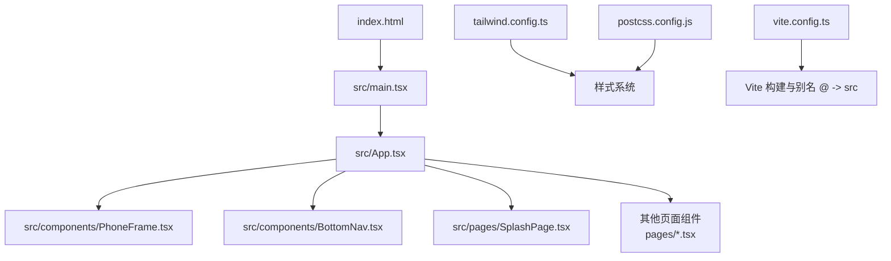
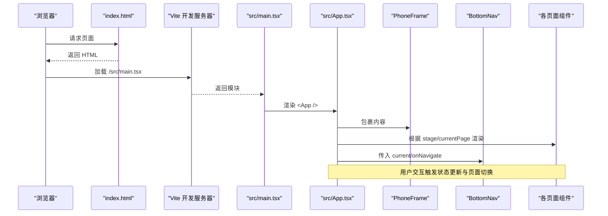
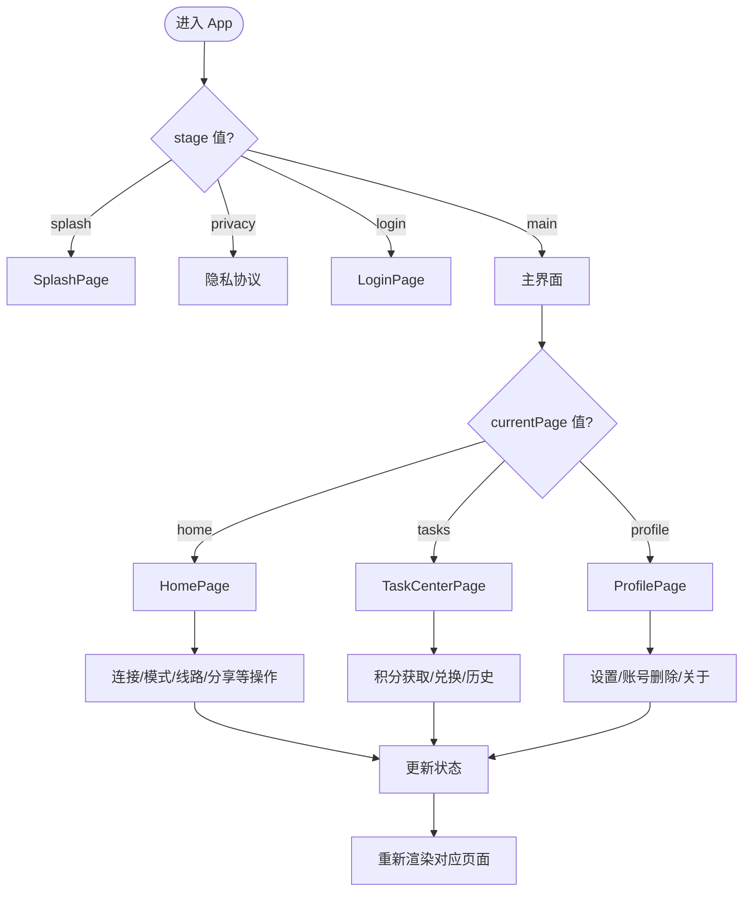
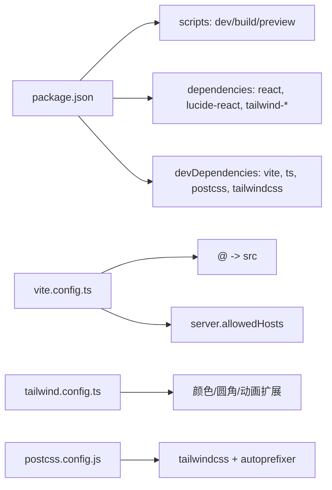

# 快速开始

<cite>
**本文引用的文件**   
- [package.json](file://package.json)
- [vite.config.ts](file://vite.config.ts)
- [index.html](file://index.html)
- [src/main.tsx](file://src/main.tsx)
- [src/App.tsx](file://src/App.tsx)
- [src/components/PhoneFrame.tsx](file://src/components/PhoneFrame.tsx)
- [src/components/BottomNav.tsx](file://src/components/BottomNav.tsx)
- [src/pages/SplashPage.tsx](file://src/pages/SplashPage.tsx)
- [tailwind.config.ts](file://tailwind.config.ts)
- [postcss.config.js](file://postcss.config.js)
</cite>

## 目录
1. [简介](#简介)
2. [项目结构](#项目结构)
3. [核心组件](#核心组件)
4. [架构总览](#架构总览)
5. [详细组件分析](#详细组件分析)
6. [依赖分析](#依赖分析)
7. [性能考虑](#性能考虑)
8. [故障排除指南](#故障排除指南)
9. [结论](#结论)
10. [附录](#附录)

## 简介
本指南面向新手，帮助你在 10 分钟内完成飞鱼加速器的环境搭建、启动开发服务器，并理解基本开发流程。你将学会：
- 安装 Node.js 与依赖
- 启动本地开发服务
- 了解目录结构与配置文件作用
- 新增一个页面组件的最小步骤
- 常用开发与调试命令
- 常见问题的排查方法

## 项目结构
本项目基于 Vite + React + TypeScript + Tailwind CSS 构建，入口为 index.html，应用根组件为 src/App.tsx，通过 src/main.tsx 挂载到 DOM。

图表来源
- [index.html:1-23](file://index.html#L1-L23)
- [src/main.tsx:1-11](file://src/main.tsx#L1-L11)
- [src/App.tsx:1-468](file://src/App.tsx#L1-L468)
- [src/components/PhoneFrame.tsx:1-87](file://src/components/PhoneFrame.tsx#L1-L87)
- [src/components/BottomNav.tsx:1-57](file://src/components/BottomNav.tsx#L1-L57)
- [src/pages/SplashPage.tsx:1-68](file://src/pages/SplashPage.tsx#L1-L68)
- [tailwind.config.ts:1-131](file://tailwind.config.ts#L1-L131)
- [postcss.config.js:1-7](file://postcss.config.js#L1-L7)
- [vite.config.ts:1-16](file://vite.config.ts#L1-L16)

章节来源
- [index.html:1-23](file://index.html#L1-L23)
- [src/main.tsx:1-11](file://src/main.tsx#L1-L11)
- [src/App.tsx:1-468](file://src/App.tsx#L1-L468)
- [vite.config.ts:1-16](file://vite.config.ts#L1-L16)
- [tailwind.config.ts:1-131](file://tailwind.config.ts#L1-L131)
- [postcss.config.js:1-7](file://postcss.config.js#L1-L7)

## 核心组件
- 应用根组件 App：管理全局状态（登录、连接、模式、线路、积分等），根据 stage 渲染不同页面；在 main 阶段根据 currentPage 切换底部三个主页面（加速、免费会员、我的）。
- PhoneFrame：桌面端以手机外框展示，移动端全屏显示并提供全屏切换按钮。
- BottomNav：底部导航，定义 PageKey 类型与导航项，控制当前页签切换。
- SplashPage：启动页，延迟后进入隐私协议或主页。

章节来源
- [src/App.tsx:1-468](file://src/App.tsx#L1-L468)
- [src/components/PhoneFrame.tsx:1-87](file://src/components/PhoneFrame.tsx#L1-L87)
- [src/components/BottomNav.tsx:1-57](file://src/components/BottomNav.tsx#L1-L57)
- [src/pages/SplashPage.tsx:1-68](file://src/pages/SplashPage.tsx#L1-L68)

## 架构总览
整体运行流程：浏览器加载 index.html，Vite 注入模块，main.tsx 创建 React 根节点并渲染 App.tsx。App 内部维护 stage 和 currentPage，动态渲染对应页面组件。Tailwind 提供主题与动画，PostCSS 负责自动前缀。

图表来源
- [index.html:1-23](file://index.html#L1-L23)
- [src/main.tsx:1-11](file://src/main.tsx#L1-L11)
- [src/App.tsx:1-468](file://src/App.tsx#L1-L468)
- [src/components/PhoneFrame.tsx:1-87](file://src/components/PhoneFrame.tsx#L1-L87)
- [src/components/BottomNav.tsx:1-57](file://src/components/BottomNav.tsx#L1-L57)

## 详细组件分析

### 应用路由与状态流（App）
- 使用 stage 控制引导流程（splash、privacy、login、main 等），在 main 阶段再按 currentPage 切换三大主页面。
- 关键状态包括登录态、连接状态、连接时长、模式（全局/应用）、线路、已选应用、积分与会员时长、任务提交等。
- 提供统一的回调函数用于切换 stage、打开设置/分享/任务提交等子流程。

图表来源
- [src/App.tsx:1-468](file://src/App.tsx#L1-L468)

章节来源
- [src/App.tsx:1-468](file://src/App.tsx#L1-L468)

### 启动页（SplashPage）
- 使用定时器在指定时间后调用 onFinish，进入后续流程（如隐私协议或主页）。
- 视觉元素包含 Logo、标题、标签与底部进度条动画。

章节来源
- [src/pages/SplashPage.tsx:1-68](file://src/pages/SplashPage.tsx#L1-L68)

### 手机外框与全屏（PhoneFrame）
- 检测移动端与小屏设备，移动端直接全屏渲染并悬浮全屏切换按钮；桌面端以手机外框居中展示。
- 监听全屏变化事件，提供切换逻辑。

章节来源
- [src/components/PhoneFrame.tsx:1-87](file://src/components/PhoneFrame.tsx#L1-L87)

### 底部导航（BottomNav）
- 定义 PageKey 类型与导航项数组，根据 current 高亮当前项，点击触发 onNavigate 切换。

章节来源
- [src/components/BottomNav.tsx:1-57](file://src/components/BottomNav.tsx#L1-L57)

## 依赖分析
- 运行时依赖：React、ReactDOM、class-variance-authority、clsx、lucide-react、tailwind-merge、tailwindcss-animate。
- 开发依赖：@types/react、@types/react-dom、@vitejs/plugin-react、autoprefixer、postcss、tailwindcss、typescript、vite。
- 脚本命令：dev/build/preview。

图表来源
- [package.json:1-31](file://package.json#L1-L31)
- [vite.config.ts:1-16](file://vite.config.ts#L1-L16)
- [tailwind.config.ts:1-131](file://tailwind.config.ts#L1-L131)
- [postcss.config.js:1-7](file://postcss.config.js#L1-L7)

章节来源
- [package.json:1-31](file://package.json#L1-L31)
- [vite.config.ts:1-16](file://vite.config.ts#L1-L16)
- [tailwind.config.ts:1-131](file://tailwind.config.ts#L1-L131)
- [postcss.config.js:1-7](file://postcss.config.js#L1-L7)

## 性能考虑
- 使用 Vite 作为开发服务器与打包工具，具备热更新能力，提升开发效率。
- Tailwind 按需生成样式，减少冗余 CSS。
- 动画与过渡集中在 tailwind.config.ts 中统一管理，便于复用与维护。
- 建议在大型页面中使用懒加载与代码分割策略（例如动态 import）以降低首屏体积。

## 故障排除指南
- 端口占用
  - 现象：启动时报端口被占用。
  - 处理：修改 vite.config.ts 中的 server.port 配置，或关闭占用该端口的进程后重试。
- 网络访问受限
  - 现象：局域网或外部设备无法访问开发服务器。
  - 处理：已在 vite.config.ts 启用 allowedHosts，确保防火墙放行端口。
- 路径别名不生效
  - 现象：导入 @/xxx 报错。
  - 处理：确认 vite.config.ts 的 resolve.alias 指向 src 目录，且 IDE 已同步配置。
- 样式未生效
  - 现象：Tailwind 类名无效。
  - 处理：检查 postcss.config.js 是否引入 tailwindcss 与 autoprefixer；确认 tailwind.config.ts 的 content 包含 index.html 与 src/**/*.{ts,tsx}。
- 图标不显示
  - 现象：lucide-react 图标空白。
  - 处理：确认已安装 lucide-react 并在组件中正确引用。
- 构建失败
  - 现象：npm run build 报错。
  - 处理：清理 node_modules 与锁文件后重装依赖；检查 TypeScript 版本与插件兼容性。

章节来源
- [vite.config.ts:1-16](file://vite.config.ts#L1-L16)
- [postcss.config.js:1-7](file://postcss.config.js#L1-L7)
- [tailwind.config.ts:1-131](file://tailwind.config.ts#L1-L131)

## 结论
通过以上步骤，你可以在 10 分钟内成功运行飞鱼加速器项目，理解其基础架构与开发流程。建议从阅读 App.tsx 的状态流转入手，逐步熟悉页面组织方式与组件职责，再进行功能迭代。

## 附录

### 环境要求与安装
- Node.js 版本
  - 说明：项目使用现代前端工具链（Vite 6、TypeScript 5、Tailwind 3），建议使用较新的 LTS 版本。若遇到兼容性问题，可尝试升级至最新稳定版。
- 安装依赖
  - 在项目根目录执行包管理器安装命令（npm/yarn/pnpm 均可）。
- 启动开发服务器
  - 执行开发脚本命令，默认会启动本地开发服务并支持热更新。
- 预览生产构建
  - 先执行构建命令，再执行预览命令查看构建产物效果。

章节来源
- [package.json:1-31](file://package.json#L1-L31)

### 目录结构与配置文件说明
- index.html
  - 应用入口，定义根容器与 PWA 相关元信息。
- src/main.tsx
  - 创建 React 根节点并渲染 App 组件。
- src/App.tsx
  - 应用根组件，管理全局状态与页面路由。
- src/components
  - 通用 UI 与布局组件（如 PhoneFrame、BottomNav）。
- src/pages
  - 业务页面组件（如 SplashPage、HomePage 等）。
- vite.config.ts
  - 配置 Vite 插件、路径别名与开发服务器选项。
- tailwind.config.ts
  - 扩展 Tailwind 主题、颜色、圆角、动画与插件。
- postcss.config.js
  - 启用 Tailwind 与 Autoprefixer。

章节来源
- [index.html:1-23](file://index.html#L1-L23)
- [src/main.tsx:1-11](file://src/main.tsx#L1-L11)
- [src/App.tsx:1-468](file://src/App.tsx#L1-L468)
- [vite.config.ts:1-16](file://vite.config.ts#L1-L16)
- [tailwind.config.ts:1-131](file://tailwind.config.ts#L1-L131)
- [postcss.config.js:1-7](file://postcss.config.js#L1-L7)

### 第一个页面示例：添加新页面
目标：新增一个“关于我们”页面，并通过底部导航或现有流程跳转。

步骤概览
- 新建页面组件
  - 在 src/pages 下创建 NewAboutPage.tsx，导出默认组件。
- 注册到 App
  - 在 src/App.tsx 顶部导入新页面组件。
  - 在 App 的 stage 枚举中添加新 stage（如 about-new）。
  - 在 renderContent 的 switch 分支中增加对新 stage 的渲染逻辑，返回新页面组件。
  - 如需从底部导航进入，可在 BottomNav 的 navItems 中新增一项，并在 App 的 currentPage 分支中渲染新页面。
- 触发跳转
  - 在任意位置调用 setStage("about-new") 或 setCurrentPage("new-about") 进行跳转。
- 验证
  - 保存文件后，开发服务器会自动刷新，检查新页面是否正常显示。

章节来源
- [src/App.tsx:1-468](file://src/App.tsx#L1-L468)
- [src/components/BottomNav.tsx:1-57](file://src/components/BottomNav.tsx#L1-L57)

### 常用开发命令
- 启动开发服务器：npm run dev
- 构建生产包：npm run build
- 预览构建结果：npm run preview

章节来源
- [package.json:1-31](file://package.json#L1-L31)

### 调试技巧
- 浏览器开发者工具
  - 使用 Sources 面板定位 React 组件源码，断点调试状态变更。
  - 使用 Network 面板观察资源加载与接口请求（如有）。
- 控制台日志
  - 在关键回调中打印状态变化，辅助定位问题。
- 热更新
  - 利用 Vite 的热更新快速验证 UI 改动，无需手动刷新。

[本节为通用指导，不涉及具体文件]