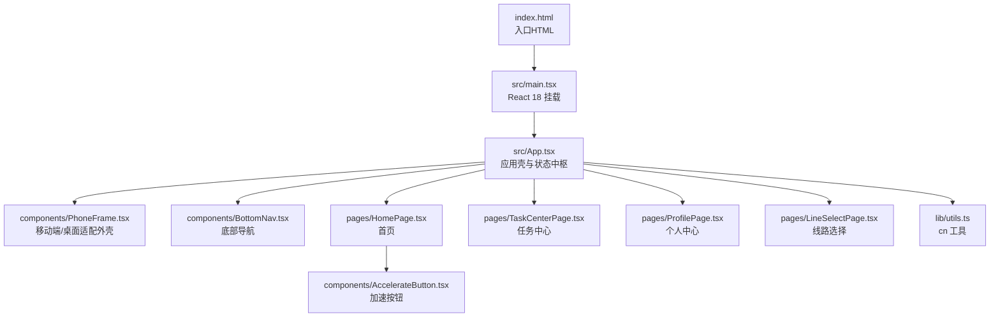
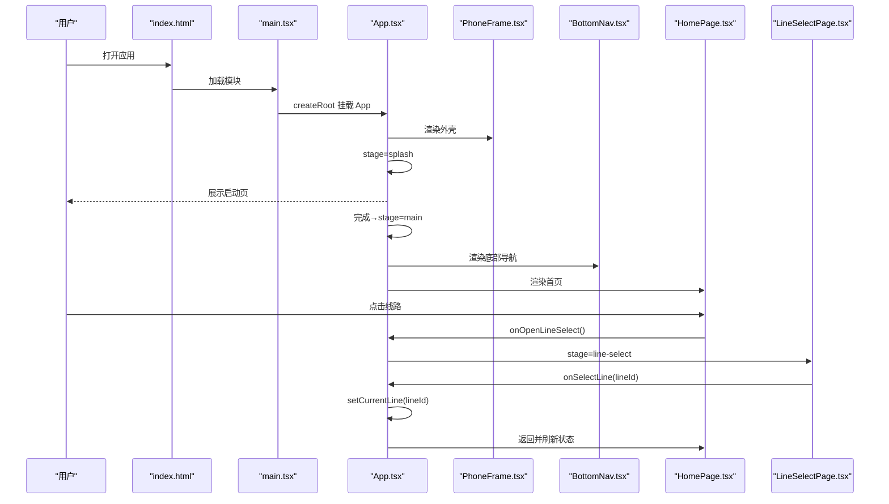
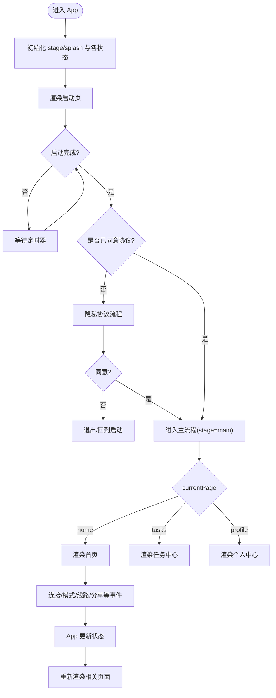
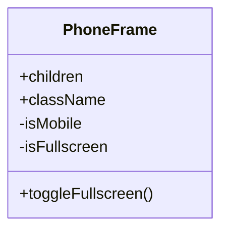
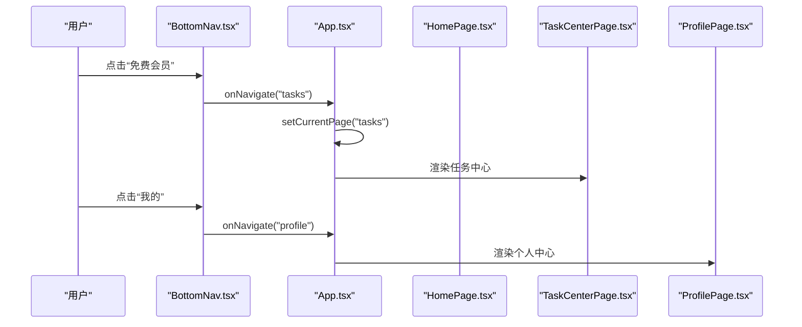
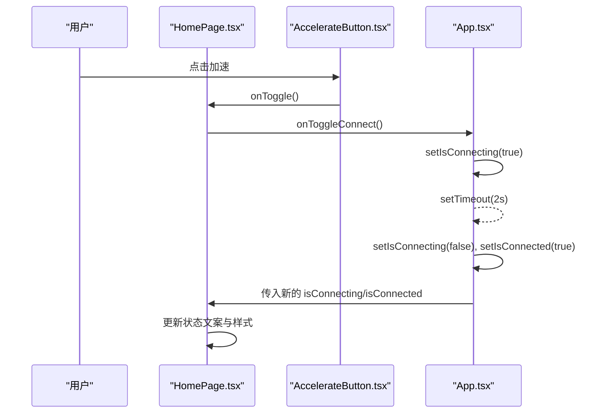
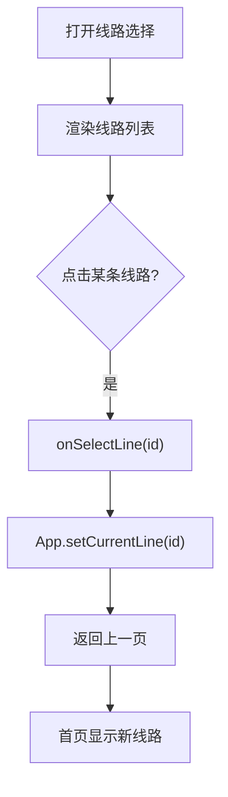
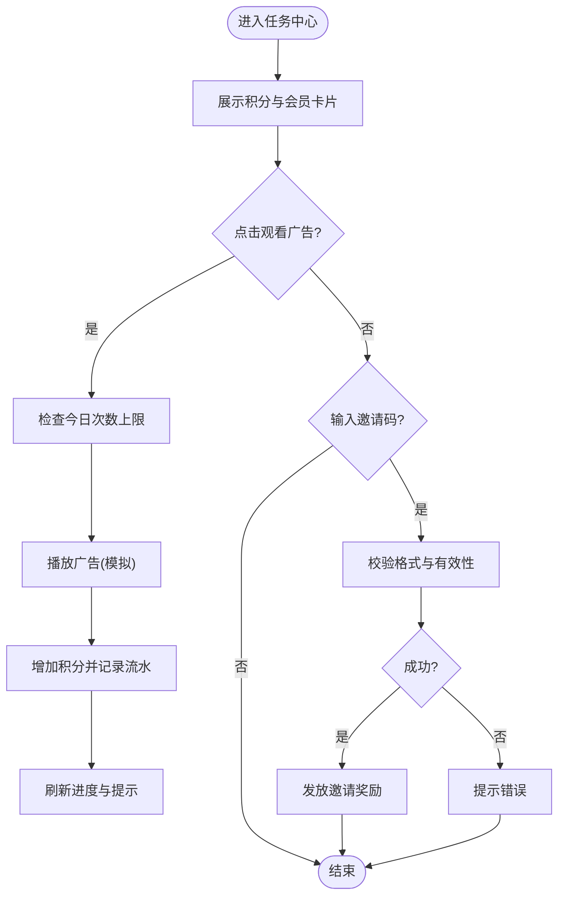
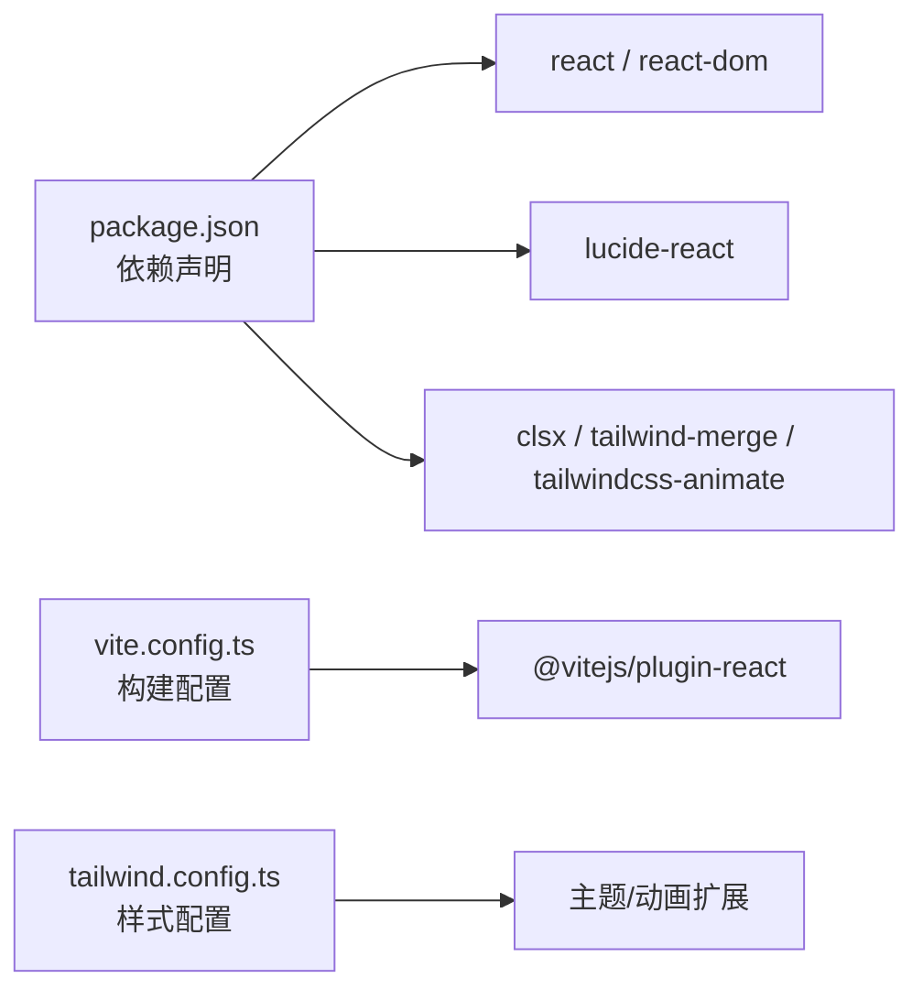

# 整体架构概览

<cite>
**本文引用的文件**   
- [index.html](file://index.html)
- [main.tsx](file://src/main.tsx)
- [App.tsx](file://src/App.tsx)
- [vite.config.ts](file://vite.config.ts)
- [package.json](file://package.json)
- [tailwind.config.ts](file://tailwind.config.ts)
- [PhoneFrame.tsx](file://src/components/PhoneFrame.tsx)
- [BottomNav.tsx](file://src/components/BottomNav.tsx)
- [HomePage.tsx](file://src/pages/HomePage.tsx)
- [LineSelectPage.tsx](file://src/pages/LineSelectPage.tsx)
- [ProfilePage.tsx](file://src/pages/ProfilePage.tsx)
- [TaskCenterPage.tsx](file://src/pages/TaskCenterPage.tsx)
- [AccelerateButton.tsx](file://src/components/AccelerateButton.tsx)
- [utils.ts](file://src/lib/utils.ts)
</cite>

## 目录
1. [简介](#简介)
2. [项目结构](#项目结构)
3. [核心组件](#核心组件)
4. [架构总览](#架构总览)
5. [详细组件分析](#详细组件分析)
6. [依赖关系分析](#依赖关系分析)
7. [性能与体验考量](#性能与体验考量)
8. [故障排查指南](#故障排查指南)
9. [结论](#结论)
10. [附录](#附录)

## 简介
本文件为飞鱼加速器的整体架构概览，面向产品、设计与工程团队，帮助快速理解应用的高层设计、启动流程、生命周期管理、技术栈选择与权衡。应用采用单页应用（SPA）模式与组件化架构，遵循移动端优先的设计理念，通过 React + TypeScript + Vite 构建，结合 Tailwind CSS 实现高效样式开发。当前版本以浏览器端运行，并通过 PWA 能力支持“添加到主屏幕”。

## 项目结构
- 入口与构建
  - index.html：定义页面根节点、PWA manifest 链接、主题色与移动端视口策略，加载 main.tsx。
  - src/main.tsx：React 18 createRoot 挂载 App 组件，启用 StrictMode。
  - vite.config.ts：配置 @ 路径别名、Vite 插件与开发服务器允许主机访问。
  - package.json：声明 React、Tailwind 生态与 Vite 工具链；提供 dev/build/preview 脚本。
- 应用骨架
  - src/App.tsx：集中式状态与路由阶段控制，渲染 PhoneFrame 外壳与底部导航，按 stage 切换页面。
  - src/components/PhoneFrame.tsx：移动端全屏适配与桌面端手机外框预览，提供全屏切换按钮。
  - src/components/BottomNav.tsx：三栏底部导航（加速、免费会员、我的），驱动主页内 Tab 切换。
- 页面与业务
  - pages/*：各功能页面（首页、任务中心、个人中心、线路选择等）。
  - components/ui/*：基础 UI 卡片等可复用组件。
  - lib/*：通用工具函数（如 cn 合并类名）。

**图表来源**
- [index.html:1-23](file://index.html#L1-L23)
- [main.tsx:1-11](file://src/main.tsx#L1-L11)
- [App.tsx:1-468](file://src/App.tsx#L1-L468)
- [PhoneFrame.tsx:1-87](file://src/components/PhoneFrame.tsx#L1-L87)
- [BottomNav.tsx:1-57](file://src/components/BottomNav.tsx#L1-L57)
- [HomePage.tsx:1-187](file://src/pages/HomePage.tsx#L1-L187)
- [TaskCenterPage.tsx:1-521](file://src/pages/TaskCenterPage.tsx#L1-L521)
- [ProfilePage.tsx:1-156](file://src/pages/ProfilePage.tsx#L1-L156)
- [LineSelectPage.tsx:1-114](file://src/pages/LineSelectPage.tsx#L1-L114)
- [AccelerateButton.tsx:1-182](file://src/components/AccelerateButton.tsx#L1-L182)
- [utils.ts:1-7](file://src/lib/utils.ts#L1-L7)

**章节来源**
- [index.html:1-23](file://index.html#L1-L23)
- [main.tsx:1-11](file://src/main.tsx#L1-L11)
- [vite.config.ts:1-16](file://vite.config.ts#L1-L16)
- [package.json:1-31](file://package.json#L1-L31)
- [App.tsx:1-468](file://src/App.tsx#L1-L468)
- [PhoneFrame.tsx:1-87](file://src/components/PhoneFrame.tsx#L1-L87)
- [BottomNav.tsx:1-57](file://src/components/BottomNav.tsx#L1-L57)

## 核心组件
- 应用壳与状态中枢（App.tsx）
  - 使用 useState/useEffect/useRef 维护应用阶段（splash/privacy/main/...）、登录态、连接状态、模式与线路、积分与会员时长、计时器等。
  - 通过 switch(stage) 渲染不同页面或子流程，形成“轻量级路由”的 SPA 行为。
  - 将跨页面共享的状态与方法（如 handleToggleConnect、handleEarnPoints、handleExchangeMember）上提至 App，作为集中式状态管理的雏形。
- 移动端适配外壳（PhoneFrame.tsx）
  - 检测触摸设备与小屏，自动进入移动端布局；在桌面端显示手机外框便于演示。
  - 监听全屏 API，提供悬浮全屏按钮，提升移动端沉浸体验。
- 底部导航（BottomNav.tsx）
  - 固定于页面底部，驱动主页内三个 Tab（home/tasks/profile）切换。
- 首页（HomePage.tsx）
  - 展示连接状态、加速按钮、模式与线路入口、广告位占位等。
  - 通过回调向 App 上报交互事件，由 App 更新状态并驱动其他页面。
- 线路选择（LineSelectPage.tsx）
  - 提供智能优选与多地区线路列表，选中后回写至 App 的 currentLine。
- 个人中心（ProfilePage.tsx）
  - 展示用户信息、分享、设置、帮助中心等入口，未登录时引导登录。
- 任务中心（TaskCenterPage.tsx）
  - 积分获取（看广告、邀请码兑换等）、会员到期时间展示、积分明细与兑换入口。
- 加速按钮（AccelerateButton.tsx）
  - 基于 SVG 的火箭仪表盘动画，三态（准备就绪/连接中/已连接）视觉反馈。
- 工具函数（utils.ts）
  - cn 用于安全合并 Tailwind 类名，避免冲突与冗余。

**章节来源**
- [App.tsx:1-468](file://src/App.tsx#L1-L468)
- [PhoneFrame.tsx:1-87](file://src/components/PhoneFrame.tsx#L1-L87)
- [BottomNav.tsx:1-57](file://src/components/BottomNav.tsx#L1-L57)
- [HomePage.tsx:1-187](file://src/pages/HomePage.tsx#L1-L187)
- [LineSelectPage.tsx:1-114](file://src/pages/LineSelectPage.tsx#L1-L114)
- [ProfilePage.tsx:1-156](file://src/pages/ProfilePage.tsx#L1-L156)
- [TaskCenterPage.tsx:1-521](file://src/pages/TaskCenterPage.tsx#L1-L521)
- [AccelerateButton.tsx:1-182](file://src/components/AccelerateButton.tsx#L1-L182)
- [utils.ts:1-7](file://src/lib/utils.ts#L1-L7)

## 架构总览
- 架构风格
  - SPA 单页应用：通过 App 内部 stage 与 currentPage 控制视图切换，无服务端路由参与。
  - 组件化：UI 拆分为 PhoneFrame、BottomNav、HomePage、TaskCenterPage、ProfilePage 等，职责清晰。
  - 移动端优先：PhoneFrame 根据设备特性自适应；CSS 与交互围绕小屏优化。
- 启动流程与生命周期
  - index.html 加载 main.tsx → React 18 createRoot 挂载 App → App 初始化 stage="splash" → SplashPage 倒计时完成后进入隐私协议或主流程 → 主流程包含登录、模式/线路选择、加速控制、任务与积分等。
- 外部依赖与边界
  - 运行时依赖：React、ReactDOM、Lucide 图标、class-variance-authority、clsx、tailwind-merge、tailwindcss-animate。
  - 构建依赖：Vite、@vitejs/plugin-react、TypeScript、Tailwind 生态。
  - 部署边界：当前为静态站点产物，可通过任意静态托管服务部署；PWA 清单与图标位于 public 目录。
- 技术栈优势与选型理由
  - React + TypeScript：类型安全的组件化开发，利于大型前端工程的可维护性与协作。
  - Vite：极速开发与构建，ESM 原生支持，插件生态完善。
  - Tailwind CSS：原子化样式，配合 tailwind-merge 与 clsx 实现灵活且可控的样式组合。
  - PWA：manifest 与主题色配置，支持“添加到主屏幕”，提升移动端体验。

**图表来源**
- [index.html:1-23](file://index.html#L1-L23)
- [main.tsx:1-11](file://src/main.tsx#L1-L11)
- [App.tsx:1-468](file://src/App.tsx#L1-L468)
- [PhoneFrame.tsx:1-87](file://src/components/PhoneFrame.tsx#L1-L87)
- [BottomNav.tsx:1-57](file://src/components/BottomNav.tsx#L1-L57)
- [HomePage.tsx:1-187](file://src/pages/HomePage.tsx#L1-L187)
- [LineSelectPage.tsx:1-114](file://src/pages/LineSelectPage.tsx#L1-L114)

## 详细组件分析

### 应用壳与状态中枢（App.tsx）
- 职责
  - 统一维护应用阶段、登录态、连接状态、模式/线路、积分与会员时长、计时器、邀请奖励标记等。
  - 提供跨页面共享的回调方法（如 handleToggleConnect、handleEarnPoints、handleExchangeMember）。
  - 根据 stage 渲染对应页面，并在 main 阶段根据 currentPage 渲染 Home/Tasks/Profile。
- 数据流
  - 子组件通过 props 回调向上汇报事件，App 更新 state 后向下传递新 props，触发子组件重渲染。
- 复杂度与优化点
  - 当前所有状态集中于 App，适合小型 SPA；随着规模增长，建议引入集中式状态库（如 Zustand/Redux Toolkit）拆分领域状态，降低耦合。
  - 计时器使用 useRef 保存定时器句柄，在 effect 清理中正确释放，避免内存泄漏。

**图表来源**
- [App.tsx:1-468](file://src/App.tsx#L1-L468)

**章节来源**
- [App.tsx:1-468](file://src/App.tsx#L1-L468)

### 移动端适配外壳（PhoneFrame.tsx）
- 职责
  - 检测设备与窗口尺寸，决定移动端全屏布局或桌面端手机外框预览。
  - 监听全屏变化并提供悬浮按钮切换全屏，增强移动端沉浸感。
- 关键点
  - 使用 touchstart/maxTouchPoints 与 innerWidth 判断移动端。
  - 使用 document.fullscreenElement 与 requestFullscreen/exitFullscreen 控制全屏。

**图表来源**
- [PhoneFrame.tsx:1-87](file://src/components/PhoneFrame.tsx#L1-L87)

**章节来源**
- [PhoneFrame.tsx:1-87](file://src/components/PhoneFrame.tsx#L1-L87)

### 底部导航（BottomNav.tsx）
- 职责
  - 固定底部导航，提供“加速/免费会员/我的”三个入口，驱动主页内 Tab 切换。
- 交互
  - 点击项调用 onNavigate(pageKey)，由 App 更新 currentPage。

**图表来源**
- [BottomNav.tsx:1-57](file://src/components/BottomNav.tsx#L1-L57)
- [App.tsx:1-468](file://src/App.tsx#L1-L468)
- [HomePage.tsx:1-187](file://src/pages/HomePage.tsx#L1-L187)
- [TaskCenterPage.tsx:1-521](file://src/pages/TaskCenterPage.tsx#L1-L521)
- [ProfilePage.tsx:1-156](file://src/pages/ProfilePage.tsx#L1-L156)

**章节来源**
- [BottomNav.tsx:1-57](file://src/components/BottomNav.tsx#L1-L57)

### 首页与加速流程（HomePage.tsx + AccelerateButton.tsx）
- 职责
  - 展示连接状态、加速按钮、模式与线路入口、广告位占位。
  - 加速按钮提供三态视觉反馈与动画。
- 交互流程
  - 点击加速按钮 → App.handleToggleConnect → 模拟连接延迟 → 更新 isConnected/isConnecting → 启动/停止计时器。

**图表来源**
- [HomePage.tsx:1-187](file://src/pages/HomePage.tsx#L1-L187)
- [AccelerateButton.tsx:1-182](file://src/components/AccelerateButton.tsx#L1-L182)
- [App.tsx:1-468](file://src/App.tsx#L1-L468)

**章节来源**
- [HomePage.tsx:1-187](file://src/pages/HomePage.tsx#L1-L187)
- [AccelerateButton.tsx:1-182](file://src/components/AccelerateButton.tsx#L1-L182)
- [App.tsx:1-468](file://src/App.tsx#L1-L468)

### 线路选择（LineSelectPage.tsx）
- 职责
  - 展示可选线路列表，高亮当前线路，点击后回调 App 更新 currentLine。
- 数据结构
  - LineOption 数组包含 id/name/region/ping/tag 等字段。

**图表来源**
- [LineSelectPage.tsx:1-114](file://src/pages/LineSelectPage.tsx#L1-L114)
- [App.tsx:1-468](file://src/App.tsx#L1-L468)

**章节来源**
- [LineSelectPage.tsx:1-114](file://src/pages/LineSelectPage.tsx#L1-L114)

### 任务中心（TaskCenterPage.tsx）
- 职责
  - 展示积分与会员到期时间、观看广告赚积分、邀请码兑换、任务列表等。
- 关键逻辑
  - 观看广告：限制每日次数，完成后增加积分并记录流水。
  - 邀请码兑换：校验格式与有效性，成功后发放积分。
  - 积分明细：点击跳转 PointsHistoryPage（由 App 管理 stage）。

**图表来源**
- [TaskCenterPage.tsx:1-521](file://src/pages/TaskCenterPage.tsx#L1-L521)
- [App.tsx:1-468](file://src/App.tsx#L1-L468)

**章节来源**
- [TaskCenterPage.tsx:1-521](file://src/pages/TaskCenterPage.tsx#L1-L521)

### 个人中心（ProfilePage.tsx）
- 职责
  - 展示用户信息、分享、设置、帮助中心等入口；未登录时引导登录。
- 交互
  - 点击“分享好友”跳转到 SharePage（由 App 管理 stage）。
  - 点击“设置”进入 SettingsPage。

**章节来源**
- [ProfilePage.tsx:1-156](file://src/pages/ProfilePage.tsx#L1-L156)
- [App.tsx:1-468](file://src/App.tsx#L1-L468)

## 依赖关系分析
- 运行时依赖
  - react、react-dom：UI 框架与渲染。
  - lucide-react：图标库。
  - class-variance-authority、clsx、tailwind-merge、tailwindcss-animate：样式与动画辅助。
- 构建与开发依赖
  - vite、@vitejs/plugin-react、typescript、tailwindcss、autoprefixer、postcss。
- 构建配置
  - vite.config.ts：定义 @ 路径别名、启用 React 插件、允许开发服务器访问外部主机。
  - tailwind.config.ts：扩展颜色、圆角、动画与 keyframes，支持 darkMode 与容器居中。

**图表来源**
- [package.json:1-31](file://package.json#L1-L31)
- [vite.config.ts:1-16](file://vite.config.ts#L1-L16)
- [tailwind.config.ts:1-131](file://tailwind.config.ts#L1-L131)

**章节来源**
- [package.json:1-31](file://package.json#L1-L31)
- [vite.config.ts:1-16](file://vite.config.ts#L1-L16)
- [tailwind.config.ts:1-131](file://tailwind.config.ts#L1-L131)

## 性能与体验考量
- 渲染与状态
  - 当前集中式状态在 App 中，适合小规模应用；当页面增多与状态复杂时，建议引入集中式状态库并按领域拆分，减少不必要的重渲染。
- 计时器与资源
  - useEffect 中创建与清理 setInterval，避免内存泄漏；建议在真实后端接入后，考虑使用更稳健的心跳与断线重连机制。
- 样式与动画
  - 大量 SVG 与动画在移动端可能带来一定绘制开销，建议按需懒加载与减少重排重绘。
- PWA 与安装
  - 通过 manifest 与 meta 标签支持添加到主屏幕；AddToHomeScreenPrompt 组件在移动端非 standalone 模式下提示安装，提升留存。

[本节为通用指导，不直接分析具体文件]

## 故障排查指南
- 无法全屏或全屏按钮无效
  - 检查是否在移动端环境以及是否触发了全屏 API 权限限制；确认 PhoneFrame 的全屏事件监听是否正确注册与移除。
- 连接状态异常
  - 检查 handleToggleConnect 的 isConnecting 防抖逻辑与计时器清理；确认 useEffect 的依赖数组与清理函数。
- 样式冲突或未生效
  - 确认 tailwind.config.ts 的 content 路径覆盖到所有 .tsx/.ts 文件；确保 cn 工具正确合并类名。
- 构建失败
  - 检查 vite.config.ts 的 @ 别名与插件配置；确认 TypeScript 与 Tailwind 版本兼容。

**章节来源**
- [PhoneFrame.tsx:1-87](file://src/components/PhoneFrame.tsx#L1-L87)
- [App.tsx:1-468](file://src/App.tsx#L1-L468)
- [tailwind.config.ts:1-131](file://tailwind.config.ts#L1-L131)
- [vite.config.ts:1-16](file://vite.config.ts#L1-L16)

## 结论
本项目采用 SPA + 组件化的移动端优先架构，借助 React + TypeScript + Vite + Tailwind 的组合实现了高效的开发与良好的用户体验。当前状态管理集中在 App 组件，适合快速迭代与原型验证；后续可按领域拆分状态、引入集中式状态库以提升可维护性与可扩展性。部署层面以静态站点为主，结合 PWA 能力可在移动端获得接近原生应用的体验。

[本节为总结性内容，不直接分析具体文件]

## 附录
- 系统边界与外部依赖
  - 系统边界：浏览器端 SPA，不包含服务端逻辑；通过 PWA manifest 与图标资源提供离线与安装能力。
  - 外部依赖：React 生态、图标库、样式与动画工具、构建工具链。
- 部署架构
  - 构建产物为静态资源，可部署至任意静态托管平台（如 Vercel、Netlify、GitHub Pages 等）。
  - PWA 清单与图标放置于 public 目录，确保浏览器可正确加载。

[本节为概念性说明，不直接分析具体文件]