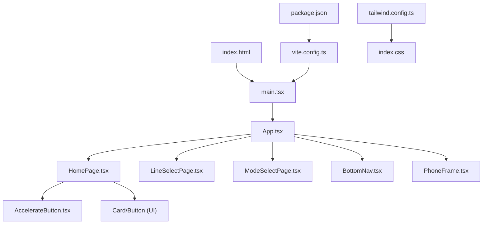
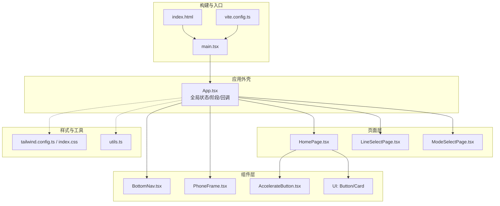
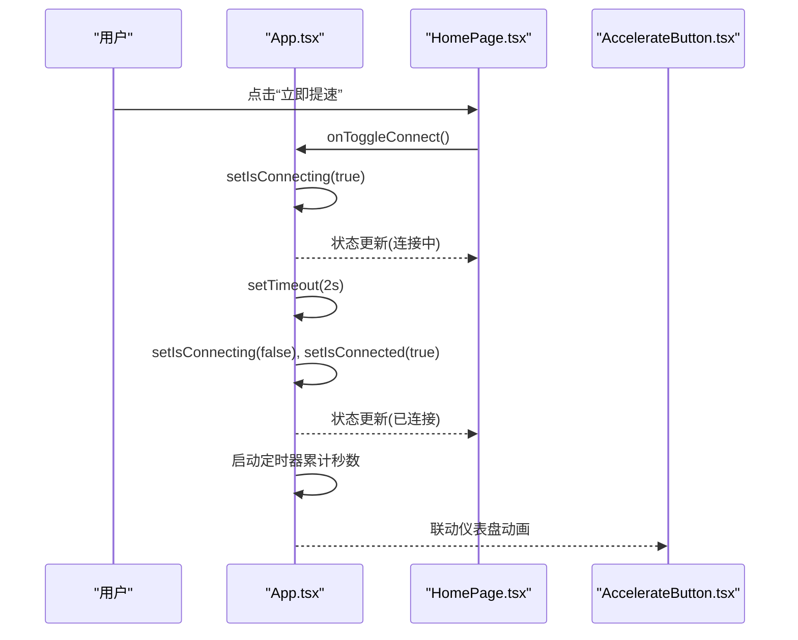
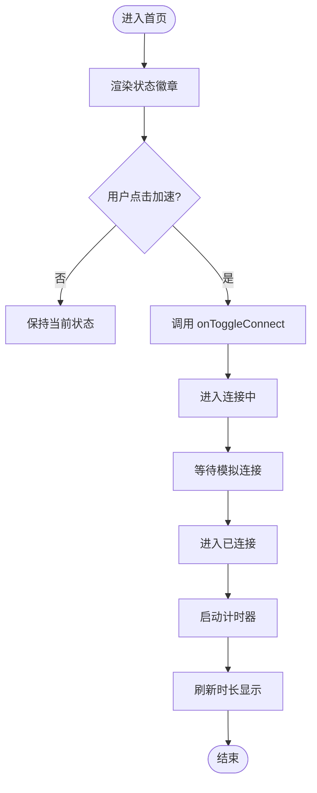
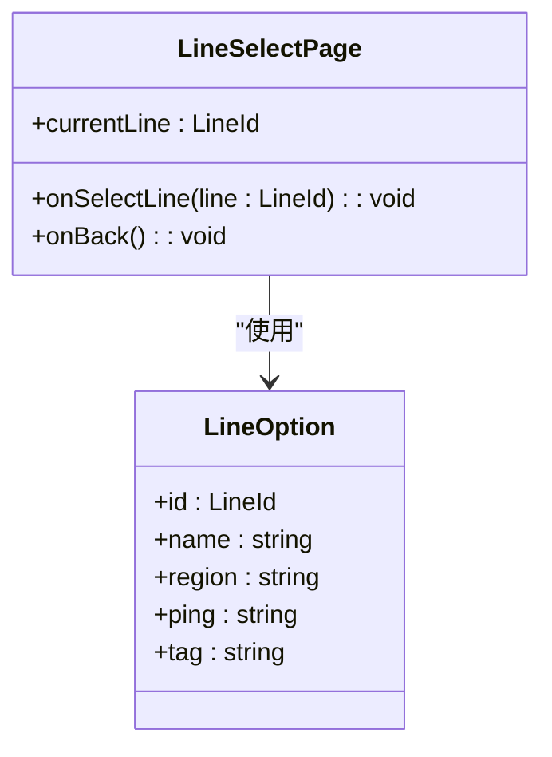
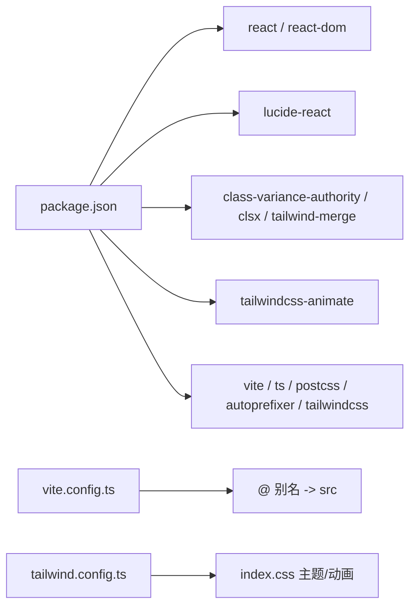
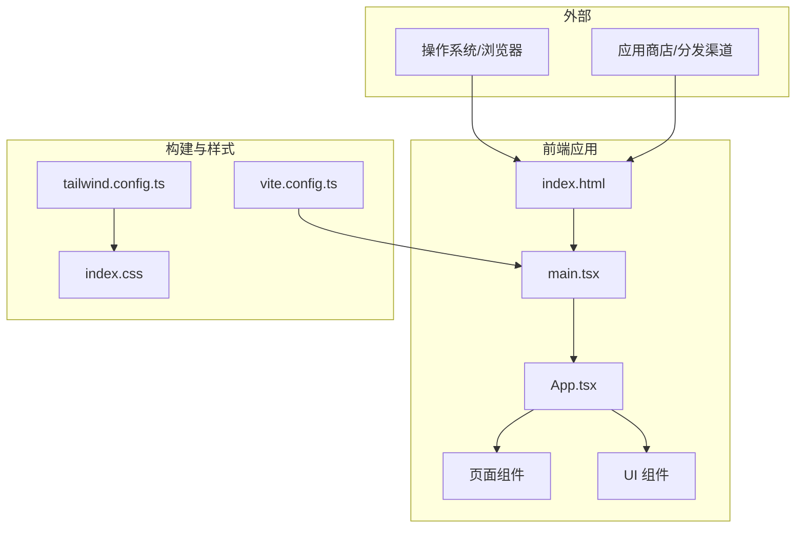
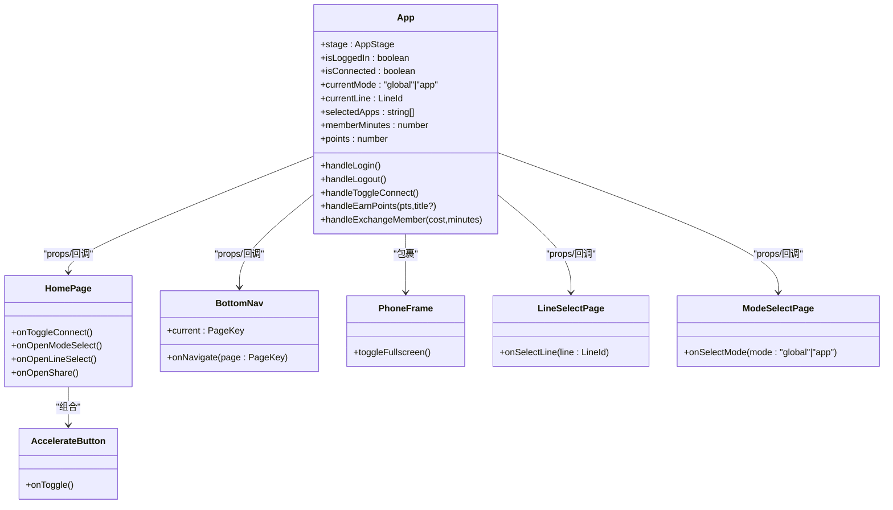

# 架构设计

<cite>
**本文引用的文件**   
- [index.html](file://index.html)
- [main.tsx](file://src/main.tsx)
- [App.tsx](file://src/App.tsx)
- [HomePage.tsx](file://src/pages/HomePage.tsx)
- [LineSelectPage.tsx](file://src/pages/LineSelectPage.tsx)
- [ModeSelectPage.tsx](file://src/pages/ModeSelectPage.tsx)
- [BottomNav.tsx](file://src/components/BottomNav.tsx)
- [PhoneFrame.tsx](file://src/components/PhoneFrame.tsx)
- [AccelerateButton.tsx](file://src/components/AccelerateButton.tsx)
- [appData.ts](file://src/lib/appData.ts)
- [utils.ts](file://src/lib/utils.ts)
- [button.tsx](file://src/components/ui/button.tsx)
- [card.tsx](file://src/components/ui/card.tsx)
- [vite.config.ts](file://vite.config.ts)
- [tailwind.config.ts](file://tailwind.config.ts)
- [index.css](file://src/index.css)
- [package.json](file://package.json)
- [dev-handoff.md](file://docs/dev-handoff.md)
</cite>

## 目录
1. [引言](#引言)
2. [项目结构](#项目结构)
3. [核心组件](#核心组件)
4. [架构总览](#架构总览)
5. [详细组件分析](#详细组件分析)
6. [依赖分析](#依赖分析)
7. [性能考虑](#性能考虑)
8. [故障排查指南](#故障排查指南)
9. [结论](#结论)
10. [附录](#附录)

## 引言
本文件为飞鱼加速器的架构设计文档，聚焦于高层设计、架构模式与系统边界，说明组件交互、数据流与集成模式，并解释技术决策、权衡与约束。文档覆盖基础设施要求、可扩展性考虑与部署拓扑，提供系统上下文图与组件分解图，处理横切关注点（状态管理、路由控制、样式系统），记录技术栈、第三方依赖与版本兼容性，重点阐述集中式状态管理模式、组件化架构与移动端优先的设计理念。

## 项目结构
本项目采用基于 React + Vite 的移动端优先单页应用结构：
- 入口与运行时：index.html 定义 PWA 元信息与根节点；main.tsx 挂载 React 应用；App.tsx 作为顶层容器，负责全局状态与页面阶段切换。
- 页面层：pages 下按功能划分页面组件（如 HomePage、LineSelectPage、ModeSelectPage 等）。
- 组件层：components 提供通用 UI 与业务组件（如 BottomNav、PhoneFrame、AccelerateButton 等）。
- 资源与工具：lib 提供共享数据与工具函数；public 存放静态资源；样式体系由 Tailwind CSS 与自定义 CSS 组成。
- 构建与配置：vite.config.ts 配置别名与开发服务器；tailwind.config.ts 扩展主题、动画与变体；package.json 声明依赖与脚本。

图表来源
- [index.html:1-23](file://index.html#L1-L23)
- [main.tsx:1-11](file://src/main.tsx#L1-L11)
- [App.tsx:1-468](file://src/App.tsx#L1-L468)
- [HomePage.tsx:1-187](file://src/pages/HomePage.tsx#L1-L187)
- [LineSelectPage.tsx:1-114](file://src/pages/LineSelectPage.tsx#L1-L114)
- [ModeSelectPage.tsx:1-120](file://src/pages/ModeSelectPage.tsx#L1-L120)
- [BottomNav.tsx:1-57](file://src/components/BottomNav.tsx#L1-L57)
- [PhoneFrame.tsx:1-87](file://src/components/PhoneFrame.tsx#L1-L87)
- [AccelerateButton.tsx:1-182](file://src/components/AccelerateButton.tsx#L1-L182)
- [vite.config.ts:1-16](file://vite.config.ts#L1-L16)
- [tailwind.config.ts:1-131](file://tailwind.config.ts#L1-L131)
- [index.css:1-246](file://src/index.css#L1-L246)
- [package.json:1-31](file://package.json#L1-L31)

章节来源
- [index.html:1-23](file://index.html#L1-L23)
- [main.tsx:1-11](file://src/main.tsx#L1-L11)
- [App.tsx:1-468](file://src/App.tsx#L1-L468)
- [vite.config.ts:1-16](file://vite.config.ts#L1-L16)
- [tailwind.config.ts:1-131](file://tailwind.config.ts#L1-L131)
- [index.css:1-246](file://src/index.css#L1-L246)
- [package.json:1-31](file://package.json#L1-L31)

## 核心组件
- 应用外壳与状态中枢
  - App.tsx 维护应用阶段（启动、隐私协议、主界面、设置等）与业务状态（登录、连接、模式、线路、积分、会员时长等），通过回调向子组件下发能力，形成“自上而下”的数据流与“自下而上”的事件流。
- 页面与导航
  - HomePage 展示加速状态与操作入口，组合 AccelerateButton 与卡片信息区；BottomNav 提供底部三栏导航（加速、免费会员、我的）。
- 设备适配与全屏体验
  - PhoneFrame 检测移动设备与全屏状态，在桌面端渲染手机外框，在移动端提供全屏按钮以提升沉浸感。
- 加速交互
  - AccelerateButton 以 SVG 火箭仪表盘呈现连接态与动画反馈，支持隐藏按钮模式以便嵌入到不同布局中。
- 数据与工具
  - appData.ts 提供应用图标与分类等共享数据；utils.ts 封装 clsx + tailwind-merge 的类名合并工具；ui/button.tsx 与 ui/card.tsx 提供可复用 UI 基础组件。

章节来源
- [App.tsx:1-468](file://src/App.tsx#L1-L468)
- [HomePage.tsx:1-187](file://src/pages/HomePage.tsx#L1-L187)
- [BottomNav.tsx:1-57](file://src/components/BottomNav.tsx#L1-L57)
- [PhoneFrame.tsx:1-87](file://src/components/PhoneFrame.tsx#L1-L87)
- [AccelerateButton.tsx:1-182](file://src/components/AccelerateButton.tsx#L1-L182)
- [appData.ts:1-48](file://src/lib/appData.ts#L1-L48)
- [utils.ts:1-7](file://src/lib/utils.ts#L1-L7)
- [button.tsx:1-55](file://src/components/ui/button.tsx#L1-L55)
- [card.tsx:1-80](file://src/components/ui/card.tsx#L1-L80)

## 架构总览
系统采用“集中式状态 + 组件化视图”的架构模式：
- 顶层 App 持有全局状态与生命周期逻辑，通过 props 将状态与事件处理器传递给页面与组件。
- 页面组件专注于业务场景的布局与交互，调用上层传入的回调更新状态。
- 样式系统基于 Tailwind CSS 与 CSS 变量，统一主题与动效。
- 构建与运行由 Vite 驱动，支持模块别名与开发服务器增强。

图表来源
- [App.tsx:1-468](file://src/App.tsx#L1-L468)
- [HomePage.tsx:1-187](file://src/pages/HomePage.tsx#L1-L187)
- [LineSelectPage.tsx:1-114](file://src/pages/LineSelectPage.tsx#L1-L114)
- [ModeSelectPage.tsx:1-120](file://src/pages/ModeSelectPage.tsx#L1-L120)
- [BottomNav.tsx:1-57](file://src/components/BottomNav.tsx#L1-L57)
- [PhoneFrame.tsx:1-87](file://src/components/PhoneFrame.tsx#L1-L87)
- [AccelerateButton.tsx:1-182](file://src/components/AccelerateButton.tsx#L1-L182)
- [tailwind.config.ts:1-131](file://tailwind.config.ts#L1-L131)
- [index.css:1-246](file://src/index.css#L1-L246)
- [utils.ts:1-7](file://src/lib/utils.ts#L1-L7)
- [vite.config.ts:1-16](file://vite.config.ts#L1-L16)
- [index.html:1-23](file://index.html#L1-L23)
- [main.tsx:1-11](file://src/main.tsx#L1-L11)

## 详细组件分析

### 应用外壳与集中式状态（App.tsx）
- 职责
  - 管理应用阶段（splash、privacy、main、settings 等）与业务状态（登录、连接、模式、线路、积分、会员时长、邀请奖励等）。
  - 提供统一的回调方法（登录、退出、连接切换、积分获取、兑换会员、打开设置/分享/任务提交等）。
  - 根据 stage 渲染对应页面或全屏流程（隐私协议、设置、账户删除等）。
- 数据流
  - 自上而下的 props 传递：App 将状态与回调注入到 HomePage、各设置/任务相关页面。
  - 自下而上的事件回调：子组件触发回调，App 更新状态并驱动重渲染。
- 关键流程
  - 连接流程：点击加速 -> 进入连接中 -> 模拟延迟后进入已连接 -> 计时器累计连接时长。
  - 积分流程：完成任务/领取奖励 -> 增加积分 -> 追加积分流水记录。
  - 会员兑换：扣除积分 -> 增加会员时长 -> 追加流水记录。
  - 协议流程：首次启动显示隐私提示 -> 同意进入主流程 -> 可从设置查看协议。

图表来源
- [App.tsx:128-139](file://src/App.tsx#L128-L139)
- [App.tsx:94-107](file://src/App.tsx#L94-L107)
- [HomePage.tsx:114-131](file://src/pages/HomePage.tsx#L114-L131)
- [AccelerateButton.tsx:27-182](file://src/components/AccelerateButton.tsx#L27-L182)

章节来源
- [App.tsx:1-468](file://src/App.tsx#L1-L468)

### 首页与加速交互（HomePage.tsx 与 AccelerateButton.tsx）
- 职责
  - HomePage 聚合加速状态、模式与线路选择入口、分享入口与广告位占位。
  - AccelerateButton 以 SVG 仪表盘与火箭动画表达连接态，支持隐藏按钮模式用于内嵌布局。
- 交互要点
  - 状态驱动视觉：未连接/连接中/已连接三种状态的样式与动画差异显著。
  - 时间格式化：App 提供 formatTimer，HomePage 用于显示连接时长。

图表来源
- [HomePage.tsx:1-187](file://src/pages/HomePage.tsx#L1-L187)
- [AccelerateButton.tsx:1-182](file://src/components/AccelerateButton.tsx#L1-L182)
- [App.tsx:109-114](file://src/App.tsx#L109-L114)

章节来源
- [HomePage.tsx:1-187](file://src/pages/HomePage.tsx#L1-L187)
- [AccelerateButton.tsx:1-182](file://src/components/AccelerateButton.tsx#L1-L182)
- [App.tsx:109-114](file://src/App.tsx#L109-L114)

### 线路选择（LineSelectPage.tsx）
- 职责
  - 展示可选线路列表（智能优选、日本、香港、韩国、美国），支持选中高亮与返回。
- 数据模型
  - LineId 类型与 LINE_OPTIONS 常量定义线路选项、区域、延迟与标签。
- 交互
  - 点击卡片触发 onSelectLine，父级 App 更新 currentLine 并回显至首页。

图表来源
- [LineSelectPage.tsx:1-114](file://src/pages/LineSelectPage.tsx#L1-L114)

章节来源
- [LineSelectPage.tsx:1-114](file://src/pages/LineSelectPage.tsx#L1-L114)

### 模式选择（ModeSelectPage.tsx）
- 职责
  - 提供“全局加速”和“应用加速”两种模式的切换，并在应用加速模式下引导选择目标应用。
- 交互
  - 选择模式后，App 更新 currentMode 与 selectedApps，首页相应展示模式与数量。

章节来源
- [ModeSelectPage.tsx:1-120](file://src/pages/ModeSelectPage.tsx#L1-L120)
- [App.tsx:311-320](file://src/App.tsx#L311-L320)

### 底部导航（BottomNav.tsx）
- 职责
  - 提供三个主要 Tab：加速、免费会员、我的，支持当前项高亮与切换。
- 数据流
  - App 维护 currentPage，BottomNav 通过 onNavigate 回调更新。

章节来源
- [BottomNav.tsx:1-57](file://src/components/BottomNav.tsx#L1-L57)
- [App.tsx:404-453](file://src/App.tsx#L404-L453)

### 设备适配与全屏（PhoneFrame.tsx）
- 职责
  - 检测移动设备与小屏，桌面端渲染手机外框；移动端提供悬浮全屏按钮。
- 行为
  - 监听 resize 与 fullscreenchange，动态切换渲染分支。

章节来源
- [PhoneFrame.tsx:1-87](file://src/components/PhoneFrame.tsx#L1-L87)

### 共享数据与工具（appData.ts, utils.ts）
- appData.ts
  - 提供 APP_ICONS 与 MOCK_APPS，供模式选择与应用选择页面复用。
- utils.ts
  - 封装 cn 工具，结合 clsx 与 tailwind-merge 生成稳定类名。

章节来源
- [appData.ts:1-48](file://src/lib/appData.ts#L1-L48)
- [utils.ts:1-7](file://src/lib/utils.ts#L1-L7)

### UI 基础组件（button.tsx, card.tsx）
- button.tsx
  - 基于 class-variance-authority 定义多变体与尺寸，统一焦点环、禁用态与缩放动效。
- card.tsx
  - 提供 Card 及其 Header/Title/Description/Content/Footer 子块，便于页面内容组织。

章节来源
- [button.tsx:1-55](file://src/components/ui/button.tsx#L1-L55)
- [card.tsx:1-80](file://src/components/ui/card.tsx#L1-L80)

## 依赖分析
- 运行时依赖
  - react/react-dom：UI 框架与渲染引擎。
  - lucide-react：图标库。
  - class-variance-authority、clsx、tailwind-merge：样式变体与类名合并。
  - tailwindcss-animate：Tailwind 动画插件。
- 开发依赖
  - vite、@vitejs/plugin-react、typescript、autoprefixer、postcss、tailwindcss。
- 构建与路径
  - vite.config.ts 配置 @ 别名指向 src，提升导入可读性与稳定性。
  - tailwind.config.ts 扩展颜色、圆角、动画与 keyframes，配合 index.css 中的 CSS 变量与组件类。

图表来源
- [package.json:1-31](file://package.json#L1-L31)
- [vite.config.ts:1-16](file://vite.config.ts#L1-L16)
- [tailwind.config.ts:1-131](file://tailwind.config.ts#L1-L131)
- [index.css:1-246](file://src/index.css#L1-L246)

章节来源
- [package.json:1-31](file://package.json#L1-L31)
- [vite.config.ts:1-16](file://vite.config.ts#L1-L16)
- [tailwind.config.ts:1-131](file://tailwind.config.ts#L1-L131)
- [index.css:1-246](file://src/index.css#L1-L246)

## 性能考虑
- 渲染优化
  - 使用 useCallback 包裹回调，减少不必要的重渲染。
  - 将长列表数据（如积分流水）初始化时一次性生成，避免重复计算。
- 动画与 GPU
  - 大量使用 CSS transform 与 opacity 动画，利于合成层优化。
  - SVG 仪表盘仅在需要时绘制，避免过度重绘。
- 网络与本地存储
  - 当前为前端演示，无真实网络请求；后续接入时应引入请求缓存与错误重试策略。
  - 敏感状态建议持久化到 localStorage/sessionStorage，并注意迁移与清理策略。

[本节为通用指导，不直接分析具体文件]

## 故障排查指南
- 常见问题
  - 全屏按钮无效：检查浏览器是否允许全屏 API，确认 PhoneFrame 的全屏事件监听是否正确注册。
  - 样式异常：确认 Tailwind 扫描路径包含 src/**/*.{ts,tsx}，CSS 变量与主题类未被覆盖。
  - 路由跳转异常：检查 App 的 stage 分支与回调是否被正确调用，确保参数传递一致。
- 调试建议
  - 在关键回调处添加日志输出，观察状态变化顺序。
  - 使用浏览器开发者工具的 Performance 面板定位重排重绘热点。
  - 对动画进行逐帧分析，确认是否触发了不必要的布局计算。

章节来源
- [PhoneFrame.tsx:25-38](file://src/components/PhoneFrame.tsx#L25-L38)
- [tailwind.config.ts:5-8](file://tailwind.config.ts#L5-L8)
- [App.tsx:211-455](file://src/App.tsx#L211-L455)

## 结论
飞鱼加速器采用集中式状态管理与组件化架构，结合移动端优先的设备适配与全屏体验，形成了清晰的数据流与交互链路。样式系统通过 Tailwind 与 CSS 变量实现主题与动效的统一，构建工具链简洁高效。未来可在状态持久化、网络层抽象、错误边界与可观测性方面进一步增强，以满足生产环境的高可用与可维护性需求。

[本节为总结性内容，不直接分析具体文件]

## 附录

### 系统上下文图

图表来源
- [index.html:1-23](file://index.html#L1-L23)
- [main.tsx:1-11](file://src/main.tsx#L1-L11)
- [App.tsx:1-468](file://src/App.tsx#L1-L468)
- [vite.config.ts:1-16](file://vite.config.ts#L1-L16)
- [tailwind.config.ts:1-131](file://tailwind.config.ts#L1-L131)
- [index.css:1-246](file://src/index.css#L1-L246)

### 组件分解图

图表来源
- [App.tsx:1-468](file://src/App.tsx#L1-L468)
- [HomePage.tsx:1-187](file://src/pages/HomePage.tsx#L1-L187)
- [BottomNav.tsx:1-57](file://src/components/BottomNav.tsx#L1-L57)
- [PhoneFrame.tsx:1-87](file://src/components/PhoneFrame.tsx#L1-L87)
- [AccelerateButton.tsx:1-182](file://src/components/AccelerateButton.tsx#L1-L182)
- [LineSelectPage.tsx:1-114](file://src/pages/LineSelectPage.tsx#L1-L114)
- [ModeSelectPage.tsx:1-120](file://src/pages/ModeSelectPage.tsx#L1-L120)

### 技术栈与版本兼容性
- 技术栈
  - React 18、Vite 6、TypeScript 5.6、Tailwind CSS 3.4、PostCSS、Autoprefixer。
- 依赖与用途
  - lucide-react：图标；class-variance-authority/clsx/tailwind-merge：样式变体与合并；tailwindcss-animate：动画。
- 兼容性参考
  - 文档 dev-handoff.md 给出多端最低版本与特性对比（H5/Android/iOS），包括 VPN 实现、广告 SDK、分享、升级、通知与 LocalStorage 支持等。

章节来源
- [package.json:1-31](file://package.json#L1-L31)
- [dev-handoff.md:645-669](file://docs/dev-handoff.md#L645-L669)

### 部署拓扑
- 前端静态站点
  - 产物由 Vite 构建，部署至静态托管平台（如 Vercel、Cloudflare Pages、Nginx 等）。
- PWA 支持
  - index.html 配置 manifest、主题色与 iOS 全屏 meta，支持添加到主屏幕与沉浸式体验。
- 域名与 HTTPS
  - 建议使用 HTTPS 以启用 Web Share API 等受限能力。

章节来源
- [index.html:1-23](file://index.html#L1-L23)
- [vite.config.ts:12-15](file://vite.config.ts#L12-L15)