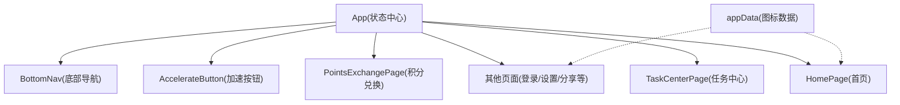
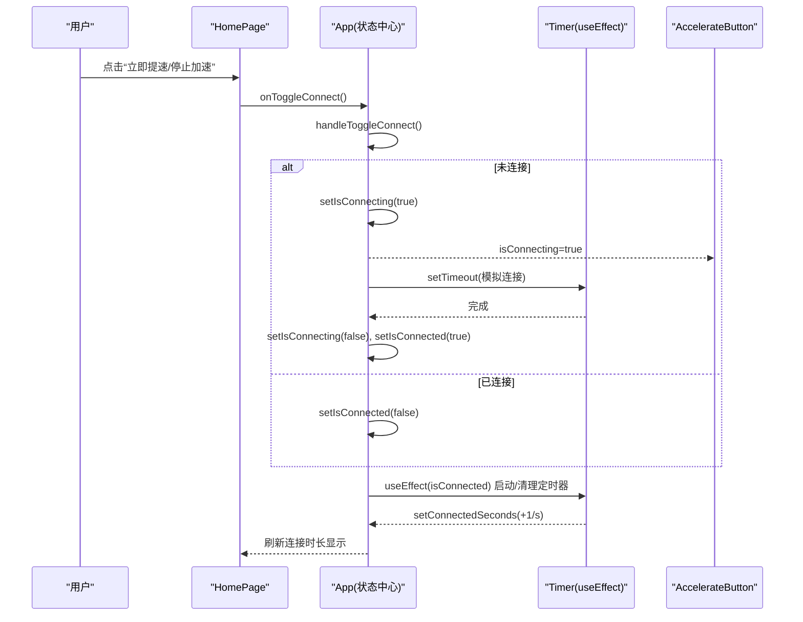
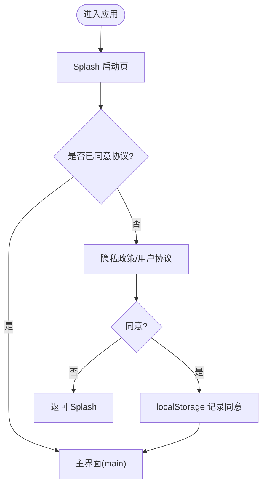
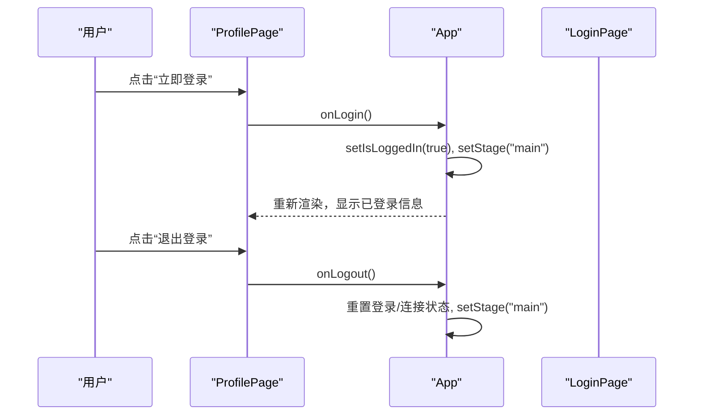
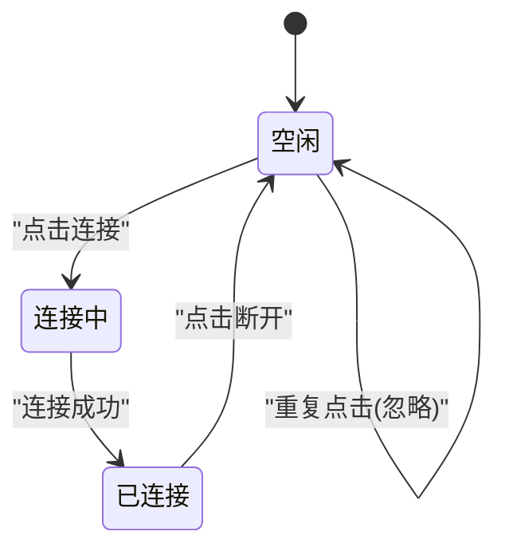
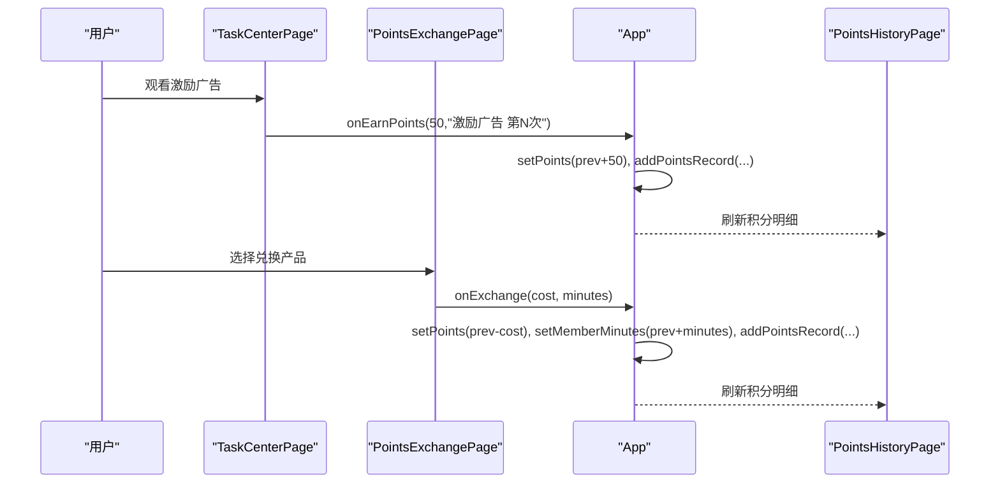
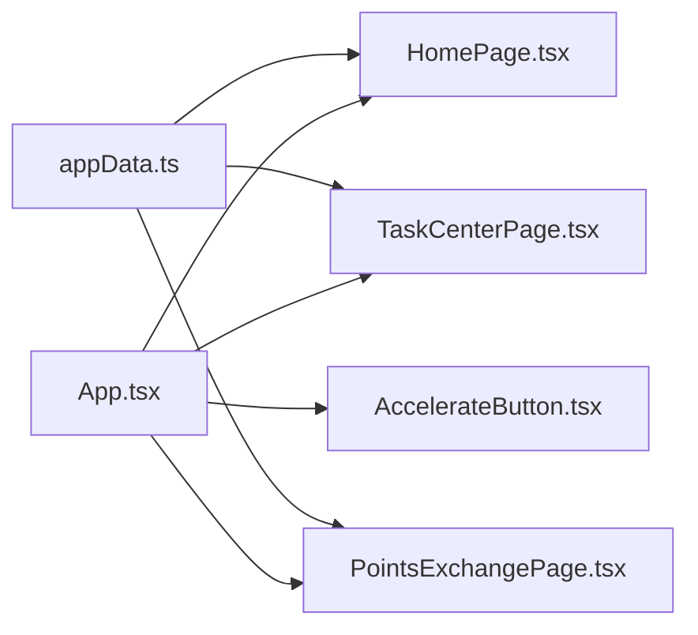

# 状态管理模式

<cite>
**本文引用的文件**
- [src/App.tsx](file://src/App.tsx)
- [src/main.tsx](file://src/main.tsx)
- [src/pages/HomePage.tsx](file://src/pages/HomePage.tsx)
- [src/pages/TaskCenterPage.tsx](file://src/pages/TaskCenterPage.tsx)
- [src/pages/PointsExchangePage.tsx](file://src/pages/PointsExchangePage.tsx)
- [src/components/AccelerateButton.tsx](file://src/components/AccelerateButton.tsx)
- [src/lib/appData.ts](file://src/lib/appData.ts)
</cite>

## 目录
1. [简介](#简介)
2. [项目结构](#项目结构)
3. [核心组件](#核心组件)
4. [架构总览](#架构总览)
5. [详细组件分析](#详细组件分析)
6. [依赖关系分析](#依赖关系分析)
7. [性能考虑](#性能考虑)
8. [故障排查指南](#故障排查指南)
9. [结论](#结论)
10. [附录](#附录)

## 简介
本文件面向飞鱼加速器的“集中式状态管理”方案，聚焦于 App 顶层的状态提升模式与 useState Hook 的使用策略。文档将系统梳理以下方面：
- 状态类型设计：应用阶段（AppStage）、用户认证、连接状态、积分体系等
- 状态更新机制：事件处理函数设计与跨页面同步策略
- 持久化与恢复：基于 localStorage 的协议同意状态保存与恢复
- 状态流转图与常见变更场景示例
- 避免状态不一致问题的实践与性能优化建议

## 项目结构
本项目采用 React + Vite 的单页应用结构。状态管理的重心位于根组件 App 中，通过 props 向下传递状态与回调，子页面仅消费数据并触发回调，形成“自上而下”的数据流与“自下而上”的事件流。

图表来源
- [src/App.tsx:1-468](file://src/App.tsx#L1-L468)
- [src/pages/HomePage.tsx:1-187](file://src/pages/HomePage.tsx#L1-L187)
- [src/pages/TaskCenterPage.tsx:1-521](file://src/pages/TaskCenterPage.tsx#L1-L521)
- [src/pages/PointsExchangePage.tsx:1-158](file://src/pages/PointsExchangePage.tsx#L1-L158)
- [src/components/AccelerateButton.tsx:1-182](file://src/components/AccelerateButton.tsx#L1-L182)
- [src/lib/appData.ts:1-48](file://src/lib/appData.ts#L1-L48)

章节来源
- [src/main.tsx:1-11](file://src/main.tsx#L1-L11)
- [src/App.tsx:1-468](file://src/App.tsx#L1-L468)

## 核心组件
- App 组件：作为全局状态中心，维护应用阶段、认证、连接、会员时长、积分、历史流水、当前模式/线路/选中应用等；提供统一的事件处理函数，并通过 props 向子组件下发状态与回调。
- HomePage：展示连接状态、模式与线路选择入口，调用 App 提供的切换连接与导航回调。
- TaskCenterPage：任务与广告观看获取积分，调用 App 的积分增加回调，并可打开分享、兑换、明细等页面。
- PointsExchangePage：积分兑换会员时长，调用 App 的兑换回调，同时回写积分与会员时长。
- AccelerateButton：纯展示与交互按钮，受控于 App 的连接状态与回调。
- appData：共享的应用图标数据，供多个页面使用。

章节来源
- [src/App.tsx:27-210](file://src/App.tsx#L27-L210)
- [src/pages/HomePage.tsx:1-187](file://src/pages/HomePage.tsx#L1-L187)
- [src/pages/TaskCenterPage.tsx:1-521](file://src/pages/TaskCenterPage.tsx#L1-L521)
- [src/pages/PointsExchangePage.tsx:1-158](file://src/pages/PointsExchangePage.tsx#L1-L158)
- [src/components/AccelerateButton.tsx:1-182](file://src/components/AccelerateButton.tsx#L1-L182)
- [src/lib/appData.ts:1-48](file://src/lib/appData.ts#L1-L48)

## 架构总览
整体采用“单源状态 + 单向数据流”的模式：
- 状态定义在 App 中，使用 useState 管理各类业务状态
- 子组件通过 props 接收状态与回调，不直接修改父级状态
- 事件处理函数封装在 App 中，保证状态更新的原子性与一致性
- 计时器与副作用在 App 中集中管理，确保生命周期可控

图表来源
- [src/App.tsx:94-114](file://src/App.tsx#L94-L114)
- [src/App.tsx:128-139](file://src/App.tsx#L128-L139)
- [src/pages/HomePage.tsx:114-131](file://src/pages/HomePage.tsx#L114-L131)
- [src/components/AccelerateButton.tsx:27-182](file://src/components/AccelerateButton.tsx#L27-L182)

## 详细组件分析

### 应用阶段与路由状态（AppStage）
- 设计要点
  - 使用联合类型 AppStage 表示所有可能的页面阶段，包括 splash、privacy、main、login、settings、mode-select、line-select、share、other-benefits、task-submit、points-exchange、points-history、other-platforms、about、help-center 等
  - 通过 stage 控制渲染分支，实现轻量级的“页面路由”
  - 协议同意流程：splash -> privacy -> agreement -> main，并在隐私同意时写入 localStorage 以记住用户选择
- 关键实现位置
  - 阶段枚举与渲染分支：[src/App.tsx:25-468](file://src/App.tsx#L25-L468)
  - 隐私同意写入 localStorage：[src/App.tsx:264-272](file://src/App.tsx#L264-L272)

图表来源
- [src/App.tsx:212-276](file://src/App.tsx#L212-L276)

章节来源
- [src/App.tsx:25-468](file://src/App.tsx#L25-L468)

### 用户认证状态
- 设计要点
  - isLoggedIn 控制登录态，配合 login/logout 流程
  - 登出时重置连接相关状态，避免脏状态残留
- 关键实现位置
  - 登录/登出处理：[src/App.tsx:116-126](file://src/App.tsx#L116-L126)
  - 账户删除清理：[src/App.tsx:204-209](file://src/App.tsx#L204-L209)

图表来源
- [src/App.tsx:116-126](file://src/App.tsx#L116-L126)
- [src/pages/ProfilePage.tsx:142-150](file://src/pages/ProfilePage.tsx#L142-L150)

章节来源
- [src/App.tsx:116-126](file://src/App.tsx#L116-L126)
- [src/pages/ProfilePage.tsx:1-156](file://src/pages/ProfilePage.tsx#L1-L156)

### 连接状态与计时器
- 设计要点
  - isConnected/isConnecting 双状态表达连接生命周期，防止重复点击
  - useEffect 监听 isConnected，启动/清理 setInterval 累计 connectedSeconds
  - formatTimer 用于格式化 HH:mm:ss
- 关键实现位置
  - 连接切换逻辑：[src/App.tsx:128-139](file://src/App.tsx#L128-L139)
  - 计时器副作用：[src/App.tsx:94-107](file://src/App.tsx#L94-L107)
  - 时间格式化：[src/App.tsx:109-114](file://src/App.tsx#L109-L114)

图表来源
- [src/App.tsx:128-139](file://src/App.tsx#L128-L139)

章节来源
- [src/App.tsx:94-114](file://src/App.tsx#L94-L114)
- [src/pages/HomePage.tsx:66-97](file://src/pages/HomePage.tsx#L66-L97)
- [src/components/AccelerateButton.tsx:27-182](file://src/components/AccelerateButton.tsx#L27-L182)

### 模式与线路选择
- 设计要点
  - currentMode 支持“全局/应用”两种模式
  - selectedApps 为应用加速白名单数组
  - currentLine 为当前选择的线路标识
- 关键实现位置
  - 状态定义与切换：[src/App.tsx:34-36](file://src/App.tsx#L34-L36)
  - 应用选择切换：[src/App.tsx:141-145](file://src/App.tsx#L141-L145)
  - 模式/线路页面渲染：[src/App.tsx:311-329](file://src/App.tsx#L311-L329)

章节来源
- [src/App.tsx:34-36](file://src/App.tsx#L34-L36)
- [src/App.tsx:141-145](file://src/App.tsx#L141-L145)
- [src/App.tsx:311-329](file://src/App.tsx#L311-L329)

### 积分系统与会员时长
- 设计要点
  - points 为当前积分余额
  - memberMinutes 为剩余会员分钟数
  - pointsHistory 为积分流水列表，包含 earn/spend 两类记录
  - addPointsRecord 统一生成流水条目并插入到头部
  - handleEarnPoints/handleExchangeMember 分别负责积分获取与兑换，保持积分与流水一致
- 关键实现位置
  - 初始流水构造与 addPointsRecord：[src/App.tsx:47-91](file://src/App.tsx#L47-L91)
  - 积分获取与兑换：[src/App.tsx:147-156](file://src/App.tsx#L147-L156)
  - 任务中心积分获取：[src/pages/TaskCenterPage.tsx:60-69](file://src/pages/TaskCenterPage.tsx#L60-L69)
  - 兑换页面交互：[src/pages/PointsExchangePage.tsx:31-40](file://src/pages/PointsExchangePage.tsx#L31-L40)

图表来源
- [src/App.tsx:147-156](file://src/App.tsx#L147-L156)
- [src/pages/TaskCenterPage.tsx:60-69](file://src/pages/TaskCenterPage.tsx#L60-L69)
- [src/pages/PointsExchangePage.tsx:31-40](file://src/pages/PointsExchangePage.tsx#L31-L40)

章节来源
- [src/App.tsx:47-91](file://src/App.tsx#L47-L91)
- [src/App.tsx:147-156](file://src/App.tsx#L147-L156)
- [src/pages/TaskCenterPage.tsx:1-521](file://src/pages/TaskCenterPage.tsx#L1-L521)
- [src/pages/PointsExchangePage.tsx:1-158](file://src/pages/PointsExchangePage.tsx#L1-L158)

### 邀请奖励与防重入
- 设计要点
  - hasClaimedInviteReward 标记是否已领取邀请奖励，避免重复发放
  - handleClaimInviteReward 返回布尔值，供调用方判断是否成功
- 关键实现位置
  - 邀请奖励领取：[src/App.tsx:197-202](file://src/App.tsx#L197-L202)
  - 任务中心弹窗提交：[src/pages/TaskCenterPage.tsx:152-175](file://src/pages/TaskCenterPage.tsx#L152-L175)

章节来源
- [src/App.tsx:197-202](file://src/App.tsx#L197-L202)
- [src/pages/TaskCenterPage.tsx:152-175](file://src/pages/TaskCenterPage.tsx#L152-L175)

### 协议与设置相关状态
- 设计要点
  - agreementType/agreementReturnTo 控制协议弹窗内容与返回目标
  - 设置页跳转与账号删除均通过 stage 控制
- 关键实现位置
  - 协议弹窗控制：[src/App.tsx:158-162](file://src/App.tsx#L158-L162)
  - 设置/账号删除：[src/App.tsx:298-309](file://src/App.tsx#L298-L309), [src/App.tsx:204-209](file://src/App.tsx#L204-L209)

章节来源
- [src/App.tsx:158-162](file://src/App.tsx#L158-L162)
- [src/App.tsx:298-309](file://src/App.tsx#L298-L309)
- [src/App.tsx:204-209](file://src/App.tsx#L204-L209)

## 依赖关系分析
- App 对子组件为“强依赖”，通过 props 注入状态与回调
- 子组件之间无直接依赖，全部通过 App 中转，降低耦合度
- appData 为只读数据，被多页面复用，属于共享常量层

图表来源
- [src/App.tsx:1-468](file://src/App.tsx#L1-L468)
- [src/pages/HomePage.tsx:1-187](file://src/pages/HomePage.tsx#L1-L187)
- [src/pages/TaskCenterPage.tsx:1-521](file://src/pages/TaskCenterPage.tsx#L1-L521)
- [src/pages/PointsExchangePage.tsx:1-158](file://src/pages/PointsExchangePage.tsx#L1-L158)
- [src/components/AccelerateButton.tsx:1-182](file://src/components/AccelerateButton.tsx#L1-L182)
- [src/lib/appData.ts:1-48](file://src/lib/appData.ts#L1-L48)

章节来源
- [src/App.tsx:1-468](file://src/App.tsx#L1-L468)
- [src/lib/appData.ts:1-48](file://src/lib/appData.ts#L1-L48)

## 性能考虑
- 使用 useCallback 包裹频繁传递给子组件的回调，减少不必要的函数重建，从而降低子组件因 props 引用变化导致的重复渲染
  - 参考：登录/登出、连接切换、积分获取/兑换、协议弹窗、各页面跳转等回调
  - 参考路径：[src/App.tsx:116-209](file://src/App.tsx#L116-L209)
- 使用函数式 setState 更新派生或累加状态，避免闭包陈旧值问题
  - 参考：connectedSeconds 递增、selectedApps 增删、points 增减、pointsHistory 追加
  - 参考路径：[src/App.tsx:94-107](file://src/App.tsx#L94-L107), [src/App.tsx:141-156](file://src/App.tsx#L141-L156)
- 计时器副作用集中管理，确保组件卸载或状态变化时及时清理，避免内存泄漏
  - 参考路径：[src/App.tsx:94-107](file://src/App.tsx#L94-L107)
- 大列表渲染优化建议（当前为 mock 数据）
  - 可考虑分页/虚拟滚动、memo 包裹列表项、稳定 key 值等
  - 参考：积分历史列表渲染（由 PointsHistoryPage 负责）

章节来源
- [src/App.tsx:94-107](file://src/App.tsx#L94-L107)
- [src/App.tsx:116-209](file://src/App.tsx#L116-L209)

## 故障排查指南
- 连接状态异常
  - 现象：点击连接后长时间处于“连接中”
  - 排查：检查 handleToggleConnect 中的超时逻辑与 isConnecting 标志位
  - 参考路径：[src/App.tsx:128-139](file://src/App.tsx#L128-L139)
- 计时器不停止
  - 现象：断开连接后秒数仍增长
  - 排查：确认 useEffect 清理函数是否正确执行
  - 参考路径：[src/App.tsx:94-107](file://src/App.tsx#L94-L107)
- 积分与流水不一致
  - 现象：积分变动但流水缺失或顺序错误
  - 排查：确认 addPointsRecord 是否在积分变更后统一调用，且 id 唯一
  - 参考路径：[src/App.tsx:78-91](file://src/App.tsx#L78-L91), [src/App.tsx:147-156](file://src/App.tsx#L147-L156)
- 邀请奖励重复领取
  - 现象：多次输入有效邀请码仍可领取
  - 排查：确认 hasClaimedInviteReward 标记与 handleClaimInviteReward 返回值
  - 参考路径：[src/App.tsx:197-202](file://src/App.tsx#L197-L202), [src/pages/TaskCenterPage.tsx:152-175](file://src/pages/TaskCenterPage.tsx#L152-L175)

章节来源
- [src/App.tsx:94-107](file://src/App.tsx#L94-L107)
- [src/App.tsx:128-139](file://src/App.tsx#L128-L139)
- [src/App.tsx:78-91](file://src/App.tsx#L78-L91)
- [src/App.tsx:147-156](file://src/App.tsx#L147-L156)
- [src/App.tsx:197-202](file://src/App.tsx#L197-L202)
- [src/pages/TaskCenterPage.tsx:152-175](file://src/pages/TaskCenterPage.tsx#L152-L175)

## 结论
本项目的状态管理采用“集中式 + 单向数据流”的简洁方案：
- 所有关键状态集中在 App 中，通过 useState 管理，子组件仅消费与触发回调
- 通过 useCallback/useEffect 的组合，保障性能与副作用安全
- 协议同意状态通过 localStorage 持久化，具备基础恢复能力
- 未来如需扩展更复杂的全局状态，可在现有基础上引入 Context 或轻量状态库，但仍建议遵循“单一数据源 + 明确事件流”的原则

## 附录

### 状态类型清单与职责
- AppStage：应用阶段（页面路由）
- isLoggedIn：用户登录态
- isConnected/isConnecting：连接状态
- currentMode/currentLine/selectedApps：加速模式与线路配置
- memberMinutes/points/pointsHistory：会员时长与积分体系
- agreementType/agreementReturnTo：协议弹窗上下文
- submitTaskId：任务提交上下文
- connectedSeconds：连接时长

章节来源
- [src/App.tsx:25-468](file://src/App.tsx#L25-L468)

### 常见状态变更场景示例
- 首次启动流程：Splash -> 隐私协议 -> 主界面
  - 参考路径：[src/App.tsx:212-276](file://src/App.tsx#L212-L276)
- 登录流程：Profile -> Login -> Main
  - 参考路径：[src/pages/ProfilePage.tsx:142-150](file://src/pages/ProfilePage.tsx#L142-L150), [src/App.tsx:116-119](file://src/App.tsx#L116-L119)
- 连接流程：Home -> Toggle Connect -> Timer Update
  - 参考路径：[src/pages/HomePage.tsx:114-131](file://src/pages/HomePage.tsx#L114-L131), [src/App.tsx:128-139](file://src/App.tsx#L128-L139), [src/App.tsx:94-107](file://src/App.tsx#L94-L107)
- 积分获取流程：TaskCenter -> Earn Points -> History Update
  - 参考路径：[src/pages/TaskCenterPage.tsx:60-69](file://src/pages/TaskCenterPage.tsx#L60-L69), [src/App.tsx:147-150](file://src/App.tsx#L147-L150)
- 积分兑换流程：PointsExchange -> Exchange -> Member Minutes Update
  - 参考路径：[src/pages/PointsExchangePage.tsx:31-40](file://src/pages/PointsExchangePage.tsx#L31-L40), [src/App.tsx:152-156](file://src/App.tsx#L152-L156)