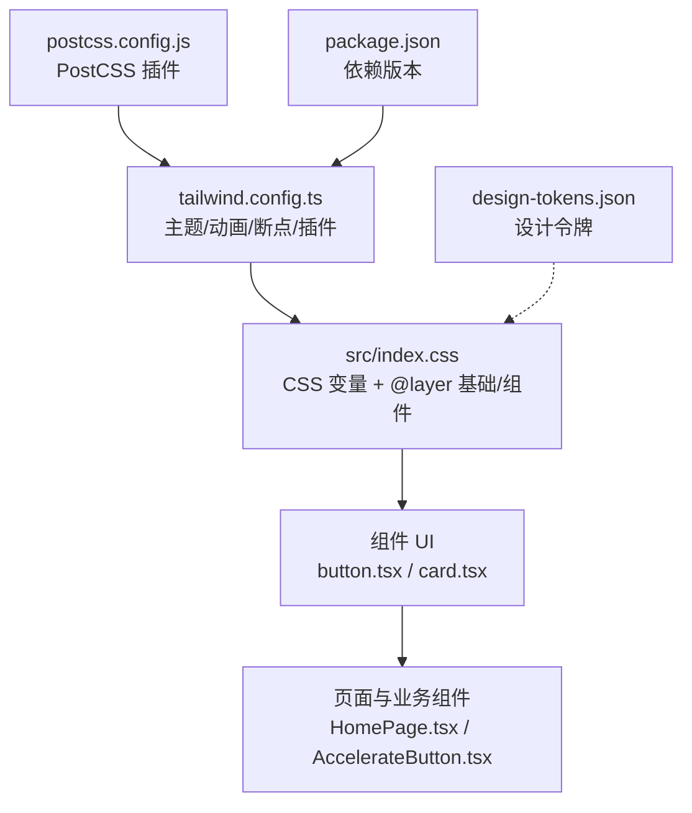
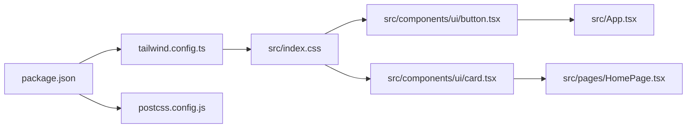

# 样式和主题系统

<cite>
**本文引用的文件**   
- [tailwind.config.ts](file://tailwind.config.ts)
- [src/index.css](file://src/index.css)
- [postcss.config.js](file://postcss.config.js)
- [package.json](file://package.json)
- [src/components/ui/button.tsx](file://src/components/ui/button.tsx)
- [src/components/ui/card.tsx](file://src/components/ui/card.tsx)
- [src/lib/utils.ts](file://src/lib/utils.ts)
- [src/pages/HomePage.tsx](file://src/pages/HomePage.tsx)
- [src/components/AccelerateButton.tsx](file://src/components/AccelerateButton.tsx)
- [src/App.tsx](file://src/App.tsx)
- [handoff/design-tokens.json](file://handoff/design-tokens.json)
- [feiyu-accelerator-ui-handoff/design-tokens.json](file://feiyu-accelerator-ui-handoff/design-tokens.json)
</cite>

## 目录
1. [简介](#简介)
2. [项目结构](#项目结构)
3. [核心组件](#核心组件)
4. [架构总览](#架构总览)
5. [详细组件分析](#详细组件分析)
6. [依赖关系分析](#依赖关系分析)
7. [性能考量](#性能考量)
8. [故障排查指南](#故障排查指南)
9. [结论](#结论)
10. [附录](#附录)

## 简介
本文件系统化梳理飞鱼加速器的样式与主题体系，覆盖 TailwindCSS 配置、自定义主题（海洋主题）设计理念、颜色方案与字体规范、响应式策略与移动端适配、动画实现与性能优化、样式定制最佳实践、跨设备兼容性与浏览器支持、CSS 架构组织与命名约定，以及主题切换的实现方案与未来扩展性。

## 项目结构
样式与主题相关的关键位置：
- 构建与工具链：TailwindCSS + PostCSS + Autoprefixer
- 主题变量与基础层：CSS 自定义属性（HSL）+ Tailwind 映射
- 组件级样式：基于 class-variance-authority 的变体系统与组合类名工具
- 设计令牌：design-tokens.json 作为设计与实现的契约



图表来源
- [tailwind.config.ts:1-131](file://tailwind.config.ts#L1-L131)
- [src/index.css:1-246](file://src/index.css#L1-L246)
- [postcss.config.js:1-7](file://postcss.config.js#L1-L7)
- [package.json:1-31](file://package.json#L1-L31)
- [handoff/design-tokens.json:1-249](file://handoff/design-tokens.json#L1-L249)

章节来源
- [tailwind.config.ts:1-131](file://tailwind.config.ts#L1-L131)
- [src/index.css:1-246](file://src/index.css#L1-L246)
- [postcss.config.js:1-7](file://postcss.config.js#L1-L7)
- [package.json:1-31](file://package.json#L1-L31)

## 核心组件
- 按钮组件（Button）：使用 class-variance-authority 定义多态变体（默认、破坏、描边、次要、幽灵、链接、海洋、玻璃、渐变），并统一尺寸与交互反馈。
- 卡片组件（Card）：提供 Card/CardHeader/CardTitle/CardDescription/CardContent/CardFooter 等语义化子组件，统一圆角、边框与阴影。
- 工具函数（cn）：封装 clsx + tailwind-merge，用于安全合并动态类名，避免冲突。

章节来源
- [src/components/ui/button.tsx:1-55](file://src/components/ui/button.tsx#L1-L55)
- [src/components/ui/card.tsx:1-80](file://src/components/ui/card.tsx#L1-L80)
- [src/lib/utils.ts:1-7](file://src/lib/utils.ts#L1-L7)

## 架构总览
样式系统采用“CSS 自定义属性 + Tailwind 映射 + 组件变体”的分层架构：
- 基础层（@layer base）：定义 CSS 变量（HSL）、全局字体、基础背景与文本色。
- 组件层（@layer components）：定义可复用视觉模式（如玻璃卡片、发光、渐变文字、粒子、连接环、闪烁加载）。
- 工具层（Tailwind extend）：将 CSS 变量映射为 color、borderRadius、keyframes、animation 等原子能力。
- 组件应用层：在 React 组件中以 class-variance-authority 与 cn 组合使用。

```mermaid
classDiagram
class ThemeTokens {
"+ --background"
"+ --foreground"
"+ --primary / --primary-foreground"
"+ --secondary / --secondary-foreground"
"+ --muted / --muted-foreground"
"+ --accent / --accent-foreground"
"+ --destructive / --destructive-foreground"
"+ --card / --card-foreground"
"+ --border / --input / --ring"
"+ --radius"
"+ --ocean-deep/mid/surface/glow"
"+ --status-connected/disconnected/warning"
}
class TailwindConfig {
"+ colors.* -> hsl(var(--...))"
"+ borderRadius.* -> var(--radius)"
"+ keyframes/*"
"+ animation/*"
}
class Components {
"+ Button (variants, sizes)"
"+ Card (+ Header/Title/Desc/Content/Footer)"
}
ThemeTokens --> TailwindConfig : "通过 HSL 变量映射"
TailwindConfig --> Components : "提供原子类与动画"
```

图表来源
- [src/index.css:6-90](file://src/index.css#L6-L90)
- [tailwind.config.ts:18-127](file://tailwind.config.ts#L18-L127)
- [src/components/ui/button.tsx:5-33](file://src/components/ui/button.tsx#L5-L33)
- [src/components/ui/card.tsx:4-16](file://src/components/ui/card.tsx#L4-L16)

## 详细组件分析

### 海洋主题设计理念与颜色方案
- 设计理念：以“深海”为隐喻，强调沉浸感与科技感。主色为亮青色（海面高光），辅以青绿强调色；状态色区分连接成功、断开与警告；整体低明度背景配合高对比前景，确保可读性与视觉层次。
- 颜色体系：
  - 基础色板：背景、前景、卡片、弹出层、边框、输入框、聚焦环等，全部以 HSL 变量驱动。
  - 海洋深度 Token：deep/mid/surface/glow，用于背景渐变、光晕与装饰。
  - 状态 Token：connected/disconnected/warning，用于连接状态与提示。
- 渐变与特效：
  - 页面背景渐变（线性/径向）、玻璃卡片（backdrop-filter 模糊）、发光效果（box-shadow 多层叠加）、渐变文字（background-clip: text）。
- 字体规范：
  - 系统优先字体栈，兼顾中文渲染体验。

章节来源
- [src/index.css:6-90](file://src/index.css#L6-L90)
- [src/index.css:102-146](file://src/index.css#L102-L146)
- [handoff/design-tokens.json:5-96](file://handoff/design-tokens.json#L5-L96)
- [feiyu-accelerator-ui-handoff/design-tokens.json:5-96](file://feiyu-accelerator-ui-handoff/design-tokens.json#L5-L96)

### 动画与动效实现
- 关键帧与动画：
  - 折叠面板（accordion-down/up）
  - 脉冲光晕（pulse-glow/pulse-connected）
  - 上浮粒子（float-up）
  - 涟漪（ripple）
  - 淡入/上移淡入（fade-in/fade-in-up）
  - 慢速旋转（spin-slow）
  - 右侧滑入（slide-in-right）
  - 火箭发射、火焰闪烁、速度线等自定义动画
- 使用方式：
  - 在 Tailwind 中注册 keyframes 与 animation，组件内直接调用对应动画类。
  - 部分动画结合 SVG 滤镜与 transform-origin 实现精细控制。

章节来源
- [tailwind.config.ts:71-127](file://tailwind.config.ts#L71-L127)
- [src/index.css:177-230](file://src/index.css#L177-L230)
- [src/components/AccelerateButton.tsx:107-154](file://src/components/AccelerateButton.tsx#L107-L154)

### 响应式设计与移动端适配
- 容器与断点：
  - 容器居中与最大宽度由 Tailwind container 配置管理，并提供 2xl 断点。
- 移动端优先：
  - 页面布局大量使用 flex/grid 与相对单位，适配不同屏幕。
  - 手机框架组件根据触摸设备与小屏判断进入全屏/模拟手机视图。
- 交互反馈：
  - 缩放、过渡时间、阴影变化等微交互增强触控体验。

章节来源
- [tailwind.config.ts:11-17](file://tailwind.config.ts#L11-L17)
- [src/pages/HomePage.tsx:39-183](file://src/pages/HomePage.tsx#L39-L183)
- [src/App.tsx:457-467](file://src/App.tsx#L457-L467)

### 组件样式与命名约定
- 组件变体：
  - 按钮通过 cva 声明 variant 与 size，默认值明确，便于统一风格。
- 类名合并：
  - 使用 cn 工具进行条件类名合并，避免重复与覆盖问题。
- 命名约定：
  - 语义化类名（如 glass-card、glow-primary、text-gradient-cyan）。
  - 状态类名与业务语义分离（如 status-*、animate-*）。

章节来源
- [src/components/ui/button.tsx:5-33](file://src/components/ui/button.tsx#L5-L33)
- [src/lib/utils.ts:4-6](file://src/lib/utils.ts#L4-L6)
- [src/index.css:102-146](file://src/index.css#L102-L146)

### 主题切换实现方案与扩展性
- 当前策略：
  - 默认深色主题，light 类提供浅色变量集（未启用）。
  - darkMode 使用 class 策略，可通过在根节点添加 light/dark 类切换。
- 扩展建议：
  - 将主题变量集中到独立模块或配置文件，运行时注入 CSS 变量。
  - 增加更多主题（如品牌主题、夜间节能主题），通过数据驱动替换变量。
  - 引入 prefers-color-scheme 媒体查询自动选择主题。

章节来源
- [tailwind.config.ts:4](file://tailwind.config.ts#L4)
- [src/index.css:62-89](file://src/index.css#L62-L89)

## 依赖关系分析
- 构建与样式管线：
  - Vite 开发/构建脚本
  - TailwindCSS 扫描 src/**/*.{ts,tsx} 生成样式
  - PostCSS 插件链：tailwindcss → autoprefixer
- 运行时依赖：
  - class-variance-authority：组件变体
  - clsx + tailwind-merge：类名合并
  - tailwindcss-animate：动画插件（已在 config 中 require）



图表来源
- [package.json:11-29](file://package.json#L11-L29)
- [postcss.config.js:1-7](file://postcss.config.js#L1-L7)
- [tailwind.config.ts:127-131](file://tailwind.config.ts#L127-L131)
- [src/components/ui/button.tsx:1-55](file://src/components/ui/button.tsx#L1-L55)
- [src/components/ui/card.tsx:1-80](file://src/components/ui/card.tsx#L1-L80)
- [src/pages/HomePage.tsx:1-187](file://src/pages/HomePage.tsx#L1-L187)
- [src/App.tsx:1-468](file://src/App.tsx#L1-L468)

章节来源
- [package.json:11-29](file://package.json#L11-L29)
- [postcss.config.js:1-7](file://postcss.config.js#L1-L7)
- [tailwind.config.ts:127-131](file://tailwind.config.ts#L127-L131)

## 性能考量
- 动画性能：
  - 优先使用 transform 与 opacity 动画，减少重排重绘。
  - 对复杂滤镜（如 blur、shadow）适度使用，避免大面积连续动画。
- 样式体积：
  - Tailwind 按需生成，保持 content 路径精准，避免扫描无关文件。
- 渲染优化：
  - 合理使用 will-change 与 GPU 加速（transform/opacity）。
  - 大列表与长页面避免过多实时动画。

[本节为通用指导，不直接分析具体文件]

## 故障排查指南
- 样式未生效：
  - 检查 Tailwind content 是否包含目标文件路径。
  - 确认 PostCSS 插件顺序正确（tailwindcss 在前，autoprefixer 在后）。
- 类名冲突：
  - 使用 cn 工具合并类名，确保后定义的类覆盖前序类。
- 主题变量缺失：
  - 确认 CSS 变量在 :root 或 .light 下已定义，且被 Tailwind colors 映射。
- 动画异常：
  - 检查 keyframes 与 animation 名称一致，transform-origin 设置合理。

章节来源
- [tailwind.config.ts:5-8](file://tailwind.config.ts#L5-L8)
- [postcss.config.js:1-7](file://postcss.config.js#L1-L7)
- [src/lib/utils.ts:4-6](file://src/lib/utils.ts#L4-L6)
- [src/index.css:6-90](file://src/index.css#L6-L90)

## 结论
本项目采用“CSS 变量 + Tailwind 映射 + 组件变体”的清晰分层，围绕“深海”主题构建了统一的视觉语言。通过设计令牌与设计文档对齐，保证了设计与实现的一致性。后续可在主题切换、多主题扩展与性能调优方面持续演进。

[本节为总结，不直接分析具体文件]

## 附录

### Tailwind 配置要点
- 内容扫描：index.html 与 src 下的 ts/tsx 文件
- 主题扩展：colors、borderRadius、keyframes、animation
- 插件：tailwindcss-animate

章节来源
- [tailwind.config.ts:1-131](file://tailwind.config.ts#L1-L131)

### 设计令牌概览
- 颜色、渐变、排版、间距、尺寸、效果、分隔线等完整定义，供前端与原生端共享。

章节来源
- [handoff/design-tokens.json:1-249](file://handoff/design-tokens.json#L1-L249)
- [feiyu-accelerator-ui-handoff/design-tokens.json:1-249](file://feiyu-accelerator-ui-handoff/design-tokens.json#L1-L249)

### 跨设备兼容性与浏览器支持
- 现代浏览器对 backdrop-filter、CSS 变量、HSL、Tailwind 工具类支持良好。
- 旧版浏览器需关注 Autoprefixer 输出兼容性，必要时降级效果（如模糊、渐变文字）。

[本节为通用指导，不直接分析具体文件]