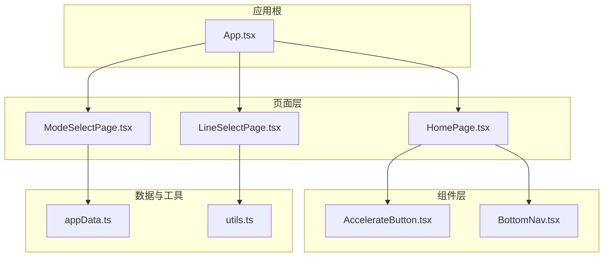
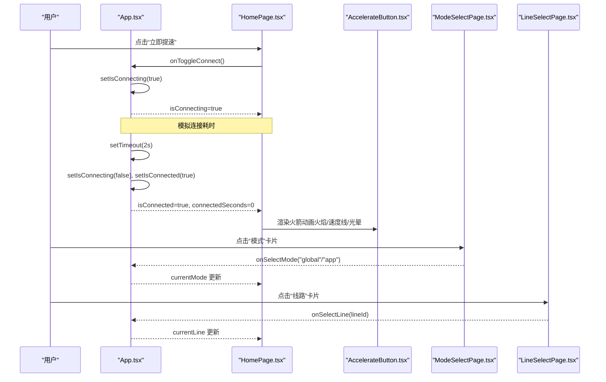
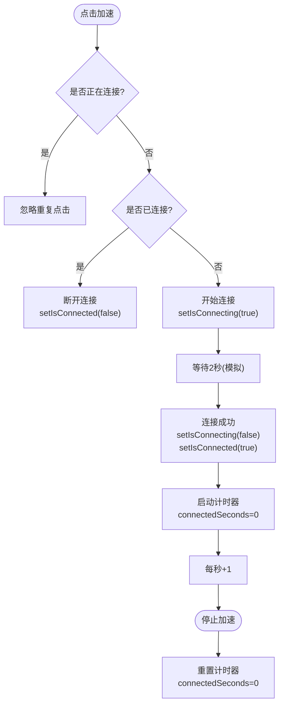
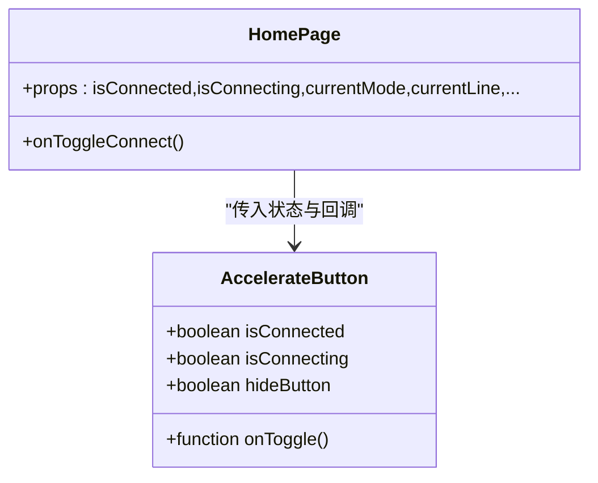
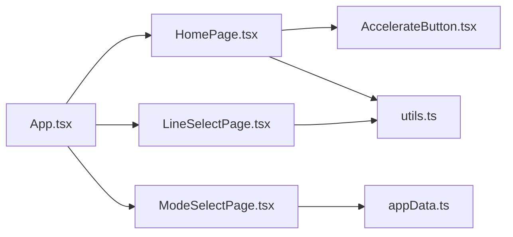

# 加速控制系统

<cite>
**本文引用的文件**   
- [App.tsx](file://src/App.tsx)
- [HomePage.tsx](file://src/pages/HomePage.tsx)
- [AccelerateButton.tsx](file://src/components/AccelerateButton.tsx)
- [ModeSelectPage.tsx](file://src/pages/ModeSelectPage.tsx)
- [LineSelectPage.tsx](file://src/pages/LineSelectPage.tsx)
- [BottomNav.tsx](file://src/components/BottomNav.tsx)
- [appData.ts](file://src/lib/appData.ts)
- [utils.ts](file://src/lib/utils.ts)
- [dev-handoff.md](file://docs/dev-handoff.md)
</cite>

## 目录
1. [简介](#简介)
2. [项目结构](#项目结构)
3. [核心组件](#核心组件)
4. [架构总览](#架构总览)
5. [详细组件分析](#详细组件分析)
6. [依赖关系分析](#依赖关系分析)
7. [性能考量](#性能考量)
8. [故障排查指南](#故障排查指南)
9. [结论](#结论)
10. [附录：扩展新加速模式与线路配置示例](#附录扩展新加速模式与线路配置示例)

## 简介
本文件面向飞鱼加速器的前端加速控制系统，聚焦全局加速与应用加速两种模式的实现逻辑、连接状态管理、模式切换机制与线路选择系统。文档同时覆盖 AccelerateButton 的动画与交互、HomePage 的状态显示与计时器、连接建立/断开/重连流程、不同模式下的网络请求差异（基于交付文档约定）、与后端 API 的集成方式与错误处理机制，并提供性能优化建议与常见问题解决方案。

## 项目结构
前端采用 React + TypeScript + Vite 构建，页面级路由由 App 内 stage 控制，底部导航在 main 阶段提供 home/tasks/profile 三个入口。加速相关能力集中在首页与两个设置页（模式选择、线路选择），并通过共享数据与工具函数进行协作。

图表来源
- [App.tsx:1-468](file://src/App.tsx#L1-L468)
- [HomePage.tsx:1-187](file://src/pages/HomePage.tsx#L1-L187)
- [AccelerateButton.tsx:1-182](file://src/components/AccelerateButton.tsx#L1-L182)
- [ModeSelectPage.tsx:1-170](file://src/pages/ModeSelectPage.tsx#L1-L170)
- [LineSelectPage.tsx:1-114](file://src/pages/LineSelectPage.tsx#L1-L114)
- [BottomNav.tsx:1-57](file://src/components/BottomNav.tsx#L1-L57)
- [appData.ts:1-48](file://src/lib/appData.ts#L1-L48)
- [utils.ts:1-7](file://src/lib/utils.ts#L1-L7)

章节来源
- [App.tsx:1-468](file://src/App.tsx#L1-L468)
- [HomePage.tsx:1-187](file://src/pages/HomePage.tsx#L1-L187)
- [AccelerateButton.tsx:1-182](file://src/components/AccelerateButton.tsx#L1-L182)
- [ModeSelectPage.tsx:1-170](file://src/pages/ModeSelectPage.tsx#L1-L170)
- [LineSelectPage.tsx:1-114](file://src/pages/LineSelectPage.tsx#L1-L114)
- [BottomNav.tsx:1-57](file://src/components/BottomNav.tsx#L1-L57)
- [appData.ts:1-48](file://src/lib/appData.ts#L1-L48)
- [utils.ts:1-7](file://src/lib/utils.ts#L1-L7)

## 核心组件
- App.tsx：集中式状态容器，维护登录、连接、模式、线路、应用选择、积分、会员时长等；负责页面 stage 切换与计时器生命周期管理。
- HomePage.tsx：展示当前模式与线路、连接状态与计时、加速按钮入口、快捷卡片跳转。
- AccelerateButton.tsx：火箭仪表盘 SVG 动画组件，支持三态（未连接/连接中/已连接）视觉反馈与点击交互。
- ModeSelectPage.tsx：全局加速与应用加速模式选择，应用模式下可进入应用列表选择。
- LineSelectPage.tsx：线路选择（智能优选/日本/香港/韩国/美国），返回后首页即时显示当前线路名称。
- BottomNav.tsx：底部导航，切换 home/tasks/profile 三大主区域。
- appData.ts：应用图标与分类数据，供模式选择与应用选择使用。
- utils.ts：样式合并工具函数。

章节来源
- [App.tsx:27-210](file://src/App.tsx#L27-L210)
- [HomePage.tsx:24-186](file://src/pages/HomePage.tsx#L24-L186)
- [AccelerateButton.tsx:27-181](file://src/components/AccelerateButton.tsx#L27-L181)
- [ModeSelectPage.tsx:13-169](file://src/pages/ModeSelectPage.tsx#L13-L169)
- [LineSelectPage.tsx:28-113](file://src/pages/LineSelectPage.tsx#L28-L113)
- [BottomNav.tsx:17-56](file://src/components/BottomNav.tsx#L17-L56)
- [appData.ts:11-47](file://src/lib/appData.ts#L11-L47)
- [utils.ts:4-6](file://src/lib/utils.ts#L4-L6)

## 架构总览
整体为单页应用，App 作为“状态中心”，通过 props 将连接状态、模式、线路、计时器等传递给 HomePage；HomePage 再调用 AccelerateButton 完成可视化交互。模式与线路选择以全屏页面形式呈现，选择结果回写至 App 状态并反映到首页。

图表来源
- [App.tsx:128-139](file://src/App.tsx#L128-L139)
- [App.tsx:94-107](file://src/App.tsx#L94-L107)
- [HomePage.tsx:114-131](file://src/pages/HomePage.tsx#L114-L131)
- [AccelerateButton.tsx:27-181](file://src/components/AccelerateButton.tsx#L27-L181)
- [ModeSelectPage.tsx:39-86](file://src/pages/ModeSelectPage.tsx#L39-L86)
- [LineSelectPage.tsx:57-57](file://src/pages/LineSelectPage.tsx#L57-L57)

## 详细组件分析

### 连接状态管理与计时器（App.tsx）
- 状态字段：isConnected、isConnecting、connectedSeconds、currentMode、currentLine、selectedApps 等。
- 计时器：当 isConnected 为真时启动 setInterval 每秒递增；断开或卸载时清理定时器并重置秒数。
- 连接切换：handleToggleConnect 防抖（isConnecting 时忽略），先置连接中，延时成功后置已连接。
- 退出/注销：清空连接与登录状态，回到主页。

图表来源
- [App.tsx:128-139](file://src/App.tsx#L128-L139)
- [App.tsx:94-107](file://src/App.tsx#L94-L107)

章节来源
- [App.tsx:27-210](file://src/App.tsx#L27-L210)

### 首页状态显示与计时器（HomePage.tsx）
- 顶部状态徽章：根据 isConnected/isConnecting 动态显示“加速中 X:XX:XX / 连接中... / 准备就绪”。
- 加速按钮区：包含小型火箭动画与大型操作按钮，文案/颜色/图标随状态变化。
- 模式与线路卡片：点击分别跳转到模式选择与线路选择页面，并在首页显示当前值。

章节来源
- [HomePage.tsx:66-131](file://src/pages/HomePage.tsx#L66-L131)
- [HomePage.tsx:137-175](file://src/pages/HomePage.tsx#L137-L175)

### 加速按钮动画与交互（AccelerateButton.tsx）
- 三态视觉：
  - 未连接：静态火箭，背景辉光较弱。
  - 连接中：外圈旋转进度环，提示连接进行中。
  - 已连接：火焰闪烁、速度线、绿色光晕脉冲。
- 交互：点击触发 onToggle，hideButton 控制是否显示下方大按钮。
- 动画细节：SVG 渐变、滤镜、关键帧动画组合，确保流畅与低开销。

图表来源
- [AccelerateButton.tsx:27-181](file://src/components/AccelerateButton.tsx#L27-L181)
- [HomePage.tsx:100-131](file://src/pages/HomePage.tsx#L100-L131)

章节来源
- [AccelerateButton.tsx:1-182](file://src/components/AccelerateButton.tsx#L1-L182)

### 模式选择（全局加速 vs 应用加速）
- 全局加速：所有流量经服务器中转，适合全量保护场景。
- 应用加速：仅对选定应用生效，节省流量与资源。
- 应用列表：从 appData.ts 读取图标与分类信息，支持多选与标签展示。

章节来源
- [ModeSelectPage.tsx:33-156](file://src/pages/ModeSelectPage.tsx#L33-L156)
- [appData.ts:11-47](file://src/lib/appData.ts#L11-L47)

### 线路选择系统
- 内置线路：智能优选、日本-东京、香港-九龙、韩国-首尔、美国-洛杉矶。
- 展示字段：名称、地区描述、延迟参考、标签（推荐/热门）。
- 交互：点击即选中，返回后首页显示当前线路名称。

章节来源
- [LineSelectPage.tsx:14-20](file://src/pages/LineSelectPage.tsx#L14-L20)
- [LineSelectPage.tsx:47-109](file://src/pages/LineSelectPage.tsx#L47-L109)

### 底部导航（BottomNav.tsx）
- 三个主 Tab：加速、免费会员、我的。
- 高亮态与图标描边增强，适配深色主题。

章节来源
- [BottomNav.tsx:11-56](file://src/components/BottomNav.tsx#L11-L56)

## 依赖关系分析
- App.tsx 作为状态中心，向下传递连接、模式、线路、应用选择、计时器格式化方法给 HomePage。
- HomePage 组合 AccelerateButton 与模式/线路卡片，向上回调状态变更。
- ModeSelectPage 依赖 appData.ts 的应用图标数据。
- LineSelectPage 定义线路枚举与选项常量，供首页展示。
- utils.ts 提供样式合并工具，被多处 UI 组件复用。

图表来源
- [App.tsx:1-468](file://src/App.tsx#L1-L468)
- [HomePage.tsx:1-187](file://src/pages/HomePage.tsx#L1-L187)
- [AccelerateButton.tsx:1-182](file://src/components/AccelerateButton.tsx#L1-L182)
- [ModeSelectPage.tsx:1-170](file://src/pages/ModeSelectPage.tsx#L1-L170)
- [LineSelectPage.tsx:1-114](file://src/pages/LineSelectPage.tsx#L1-L114)
- [appData.ts:1-48](file://src/lib/appData.ts#L1-L48)
- [utils.ts:1-7](file://src/lib/utils.ts#L1-L7)

## 性能考量
- 计时器优化：仅在 isConnected 时启用，避免后台运行；组件卸载时清理定时器，防止内存泄漏。
- 动画性能：大量 SVG 与 CSS 动画，建议使用 will-change 与 transform 提升合成层性能；减少不必要的重绘。
- 列表渲染：应用列表与线路列表使用稳定 key，避免频繁重建。
- 状态粒度：将连接、模式、线路等状态拆分到独立模块或服务层，降低 App 臃肿度，便于测试与复用。
- 网络请求：接入后端前增加请求去抖/节流、重试与超时策略，避免频繁抖动导致体验下降。

[本节为通用指导，不直接分析具体文件]

## 故障排查指南
- 连接无响应
  - 检查 handleToggleConnect 是否被重复点击拦截（isConnecting 守卫）。
  - 确认计时器是否正确启动与清理。
- 模式/线路未生效
  - 确认 ModeSelectPage/LineSelectPage 的回调是否回写到 App 状态。
  - 检查 HomePage 是否正确读取 currentMode/currentLine 并显示。
- 动画异常
  - 检查 SVG 滤镜与动画类名是否存在冲突。
  - 在低端设备上关闭部分特效以提升稳定性。
- 页面跳转异常
  - 核对 App 的 stage 分支与 BottomNav 的 PageKey 映射。

章节来源
- [App.tsx:128-139](file://src/App.tsx#L128-L139)
- [App.tsx:94-107](file://src/App.tsx#L94-L107)
- [HomePage.tsx:137-175](file://src/pages/HomePage.tsx#L137-L175)
- [ModeSelectPage.tsx:39-86](file://src/pages/ModeSelectPage.tsx#L39-L86)
- [LineSelectPage.tsx:57-57](file://src/pages/LineSelectPage.tsx#L57-L57)

## 结论
本加速控制系统以 App 为中心管理连接、模式与线路状态，通过 HomePage 与 AccelerateButton 提供直观的用户交互与视觉反馈。模式与线路选择以独立页面承载，选择结果实时回写并影响首页展示。后续可在服务层抽象连接与网络请求，结合交付文档中的 API 规范与错误码体系，完善跨端一致性与健壮性。

[本节为总结，不直接分析具体文件]

## 附录：扩展新加速模式与线路配置示例

### 新增线路配置
- 在 LineSelectPage 的 LINE_OPTIONS 数组中添加新条目（id、name、region、ping、tag）。
- 若需要新的 LineId 类型，请在类型声明处扩展。
- 首页将根据 currentLine 查找对应 name 展示。

章节来源
- [LineSelectPage.tsx:4-20](file://src/pages/LineSelectPage.tsx#L4-L20)
- [LineSelectPage.tsx:47-109](file://src/pages/LineSelectPage.tsx#L47-L109)

### 新增应用加速目标
- 在 appData.ts 的 APP_ICONS 与 MOCK_APPS 中补充新应用图标与分类。
- 在 ModeSelectPage 的应用列表中自动展示，支持勾选与计数。

章节来源
- [appData.ts:11-47](file://src/lib/appData.ts#L11-L47)
- [ModeSelectPage.tsx:125-155](file://src/pages/ModeSelectPage.tsx#L125-L155)

### 与后端 API 集成与错误处理（基于交付文档）
- 通用请求头：Authorization、Content-Type、X-Platform、X-App-Version。
- 通用响应格式：code、message、data。
- 常见错误码：0 成功、401 Token 过期/未登录、403 权限不足等。
- 建议封装统一请求层：
  - 自动附加请求头与鉴权。
  - 统一错误码处理：401 跳转登录，403 提示权限不足，其他错误 Toast 提示。
  - 重试与退避：对网络不稳定接口实施指数退避重试。
  - 超时与取消：为长耗时操作设置超时与 AbortController。
- 加速相关接口（示例）：
  - GET /api/accel/status 查询连接状态
  - 其他业务接口参见交付文档 API 清单

章节来源
- [dev-handoff.md:563-618](file://docs/dev-handoff.md#L563-L618)