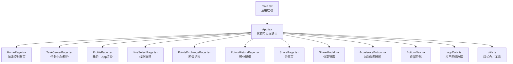
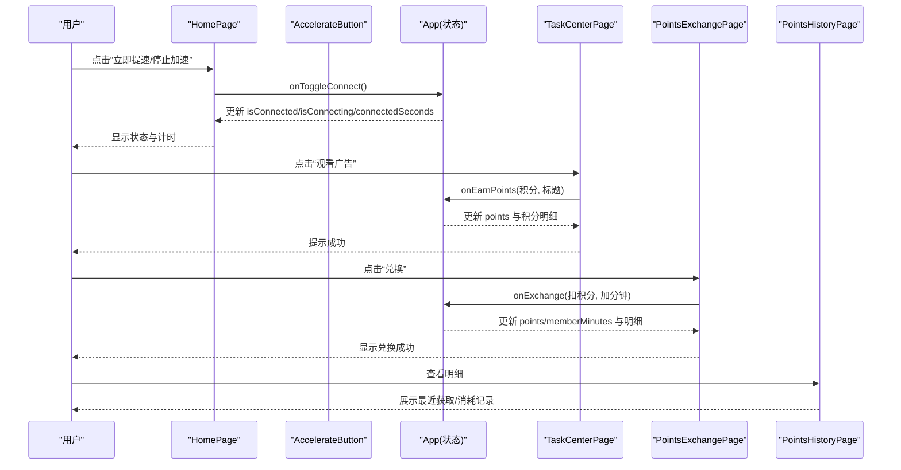
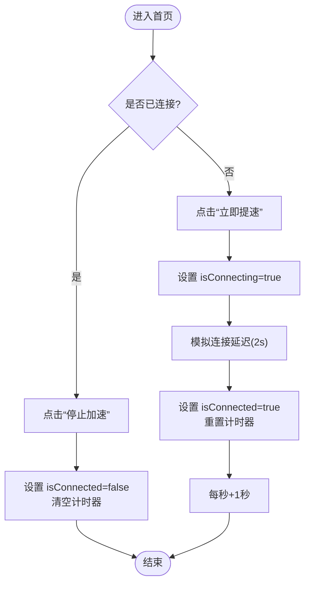
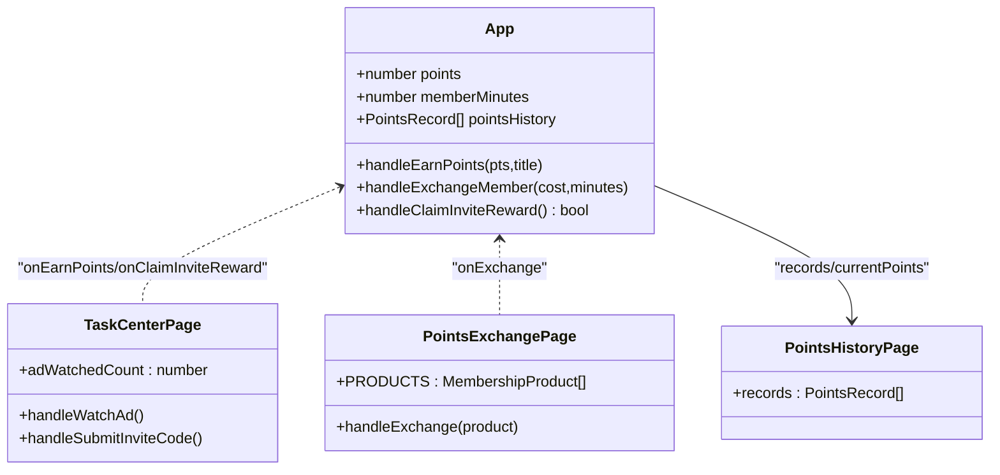
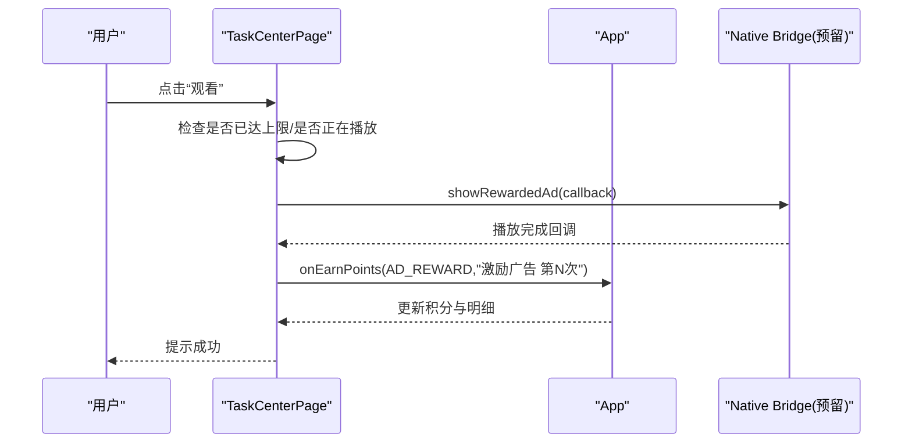
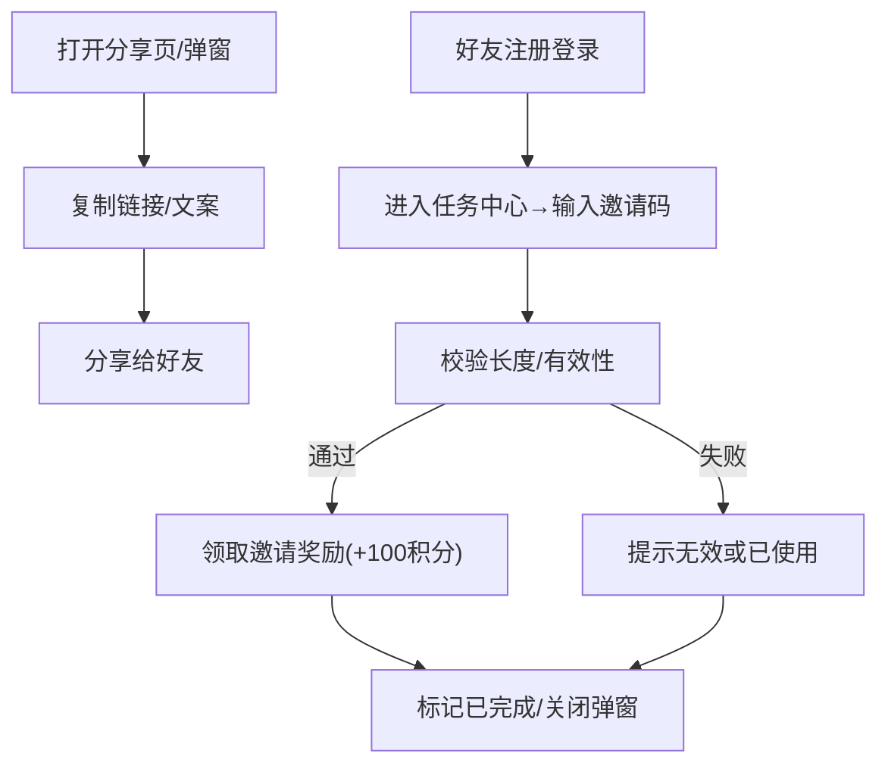
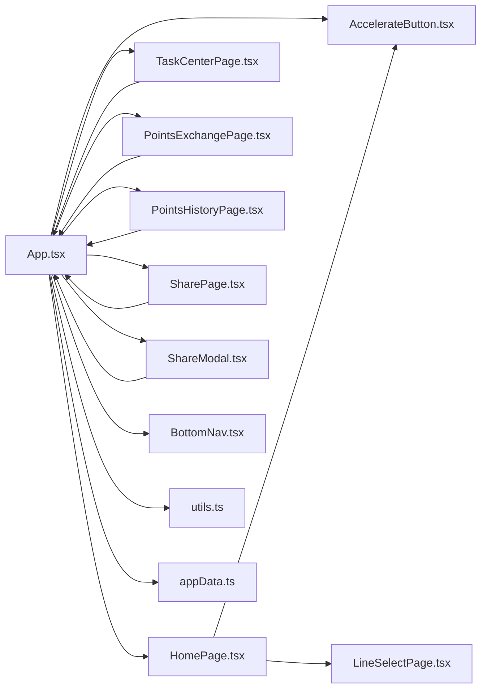

# 核心功能模块

<cite>
**本文引用的文件**   
- [src/App.tsx](file://src/App.tsx)
- [src/main.tsx](file://src/main.tsx)
- [package.json](file://package.json)
- [src/lib/appData.ts](file://src/lib/appData.ts)
- [src/lib/utils.ts](file://src/lib/utils.ts)
- [src/pages/HomePage.tsx](file://src/pages/HomePage.tsx)
- [src/components/AccelerateButton.tsx](file://src/components/AccelerateButton.tsx)
- [src/pages/LineSelectPage.tsx](file://src/pages/LineSelectPage.tsx)
- [src/pages/TaskCenterPage.tsx](file://src/pages/TaskCenterPage.tsx)
- [src/pages/SharePage.tsx](file://src/pages/SharePage.tsx)
- [src/components/ShareModal.tsx](file://src/components/ShareModal.tsx)
- [src/pages/PointsExchangePage.tsx](file://src/pages/PointsExchangePage.tsx)
- [src/pages/PointsHistoryPage.tsx](file://src/pages/PointsHistoryPage.tsx)
- [src/components/BottomNav.tsx](file://src/components/BottomNav.tsx)
- [docs/dev-handoff.md](file://docs/dev-handoff.md)
</cite>

## 目录
1. [简介](#简介)
2. [项目结构](#项目结构)
3. [核心组件](#核心组件)
4. [架构总览](#架构总览)
5. [详细组件分析](#详细组件分析)
6. [依赖关系分析](#依赖关系分析)
7. [性能与体验优化](#性能与体验优化)
8. [故障排查指南](#故障排查指南)
9. [结论](#结论)
10. [附录：API 与集成说明](#附录api-与集成说明)

## 简介
本文件面向飞鱼加速器的核心功能模块，围绕以下四大子系统展开：
- 加速控制系统：全局/应用模式、线路选择、连接状态与计时。
- 用户激励系统：积分获取、消耗、明细与会员时长兑换。
- 广告集成系统：观看激励广告任务流程（前端模拟），并预留原生桥接接口。
- 邀请分享系统：分享链接、邀请码复制、邀请奖励领取与规则说明。

文档将解释各模块的业务逻辑、技术实现、交互关系、配置项与返回值，并提供可视化图示与常见问题解决方案，兼顾初学者理解与资深开发者深度需求。

## 项目结构
本项目为基于 React + Vite + Tailwind 的移动端 H5 应用，采用页面级路由与底部导航切换。核心入口在 main.tsx，主应用容器在 App.tsx，业务页面集中在 src/pages，通用组件位于 src/components，共享数据与工具函数位于 src/lib。

图表来源
- [src/main.tsx:1-11](file://src/main.tsx#L1-L11)
- [src/App.tsx:1-468](file://src/App.tsx#L1-L468)
- [src/pages/HomePage.tsx:1-187](file://src/pages/HomePage.tsx#L1-L187)
- [src/pages/TaskCenterPage.tsx:1-521](file://src/pages/TaskCenterPage.tsx#L1-L521)
- [src/pages/LineSelectPage.tsx:1-114](file://src/pages/LineSelectPage.tsx#L1-L114)
- [src/pages/PointsExchangePage.tsx:1-158](file://src/pages/PointsExchangePage.tsx#L1-L158)
- [src/pages/PointsHistoryPage.tsx:1-118](file://src/pages/PointsHistoryPage.tsx#L1-L118)
- [src/pages/SharePage.tsx:1-167](file://src/pages/SharePage.tsx#L1-L167)
- [src/components/ShareModal.tsx:1-199](file://src/components/ShareModal.tsx#L1-L199)
- [src/components/AccelerateButton.tsx:1-182](file://src/components/AccelerateButton.tsx#L1-L182)
- [src/components/BottomNav.tsx:1-57](file://src/components/BottomNav.tsx#L1-L57)
- [src/lib/appData.ts:1-48](file://src/lib/appData.ts#L1-L48)
- [src/lib/utils.ts:1-7](file://src/lib/utils.ts#L1-L7)

章节来源
- [src/main.tsx:1-11](file://src/main.tsx#L1-L11)
- [src/App.tsx:1-468](file://src/App.tsx#L1-L468)
- [package.json:1-31](file://package.json#L1-L31)

## 核心组件
- 加速控制
  - 首页展示连接状态、模式与线路卡片、广告位占位；点击“立即提速/停止加速”触发连接状态切换与计时器。
  - 加速按钮组件提供 SVG 火箭动画与仪表盘刻度，支持隐藏按钮仅显示图形区域。
- 任务与积分
  - 任务中心包含“看广告赚积分”、“邀请好友得积分”等任务；支持输入邀请码领取一次性奖励。
  - 积分兑换页提供多档会员时长产品，校验余额后调用父级回调更新积分与会员时长。
  - 积分明细按获取/消耗分类展示最近记录。
- 分享与邀请
  - 分享页提供邀请链接与邀请码复制，展示规则与步骤说明。
  - 分享弹窗用于从其他页面拉起，统一文案与链接。
- 线路选择
  - 提供智能优选与多地节点列表，当前选中高亮并回传选择结果。

章节来源
- [src/pages/HomePage.tsx:1-187](file://src/pages/HomePage.tsx#L1-L187)
- [src/components/AccelerateButton.tsx:1-182](file://src/components/AccelerateButton.tsx#L1-L182)
- [src/pages/TaskCenterPage.tsx:1-521](file://src/pages/TaskCenterPage.tsx#L1-L521)
- [src/pages/PointsExchangePage.tsx:1-158](file://src/pages/PointsExchangePage.tsx#L1-L158)
- [src/pages/PointsHistoryPage.tsx:1-118](file://src/pages/PointsHistoryPage.tsx#L1-L118)
- [src/pages/SharePage.tsx:1-167](file://src/pages/SharePage.tsx#L1-L167)
- [src/components/ShareModal.tsx:1-199](file://src/components/ShareModal.tsx#L1-L199)
- [src/pages/LineSelectPage.tsx:1-114](file://src/pages/LineSelectPage.tsx#L1-L114)

## 架构总览
整体采用“单例状态 + 子组件回调”的轻量架构：App 集中管理连接、模式、线路、积分、会员时长、任务完成态等状态，并通过 props 向下传递；子组件通过回调向上汇报事件。

图表来源
- [src/App.tsx:128-202](file://src/App.tsx#L128-L202)
- [src/pages/HomePage.tsx:114-131](file://src/pages/HomePage.tsx#L114-L131)
- [src/components/AccelerateButton.tsx:27-182](file://src/components/AccelerateButton.tsx#L27-L182)
- [src/pages/TaskCenterPage.tsx:60-69](file://src/pages/TaskCenterPage.tsx#L60-L69)
- [src/pages/PointsExchangePage.tsx:31-40](file://src/pages/PointsExchangePage.tsx#L31-L40)
- [src/pages/PointsHistoryPage.tsx:18-24](file://src/pages/PointsHistoryPage.tsx#L18-L24)

## 详细组件分析

### 加速控制系统
- 业务逻辑
  - 连接状态：未连接 -> 连接中 -> 已连接；已连接可断开。
  - 计时器：连接时每秒累加 connectedSeconds，断开清零。
  - 模式与线路：全局/应用模式；线路支持智能优选与多地节点。
- 关键实现要点
  - 使用 useEffect 维护定时器，避免内存泄漏。
  - 首页与加速按钮组件共用同一套状态与回调，保证 UI 一致性。
  - 线路选择返回 LineId，首页根据 LINE_OPTIONS 映射名称展示。
- 配置与参数
  - 模式 currentMode: "global" | "app"
  - 线路 currentLine: LineId（smart/japan/hongkong/korea/usa）
  - 选中应用 selectedApps: string[]
  - 连接状态 isConnected/isConnecting: boolean
  - 计时 connectedSeconds: number
- 与其他模块交互
  - 任务中心与兑换页不直接耦合加速状态，但会员时长影响用户体验。
  - 分享与邀请独立于加速流程。

图表来源
- [src/App.tsx:94-107](file://src/App.tsx#L94-L107)
- [src/App.tsx:128-139](file://src/App.tsx#L128-L139)
- [src/pages/HomePage.tsx:114-131](file://src/pages/HomePage.tsx#L114-L131)
- [src/components/AccelerateButton.tsx:27-182](file://src/components/AccelerateButton.tsx#L27-L182)
- [src/pages/LineSelectPage.tsx:14-20](file://src/pages/LineSelectPage.tsx#L14-L20)

章节来源
- [src/App.tsx:27-44](file://src/App.tsx#L27-L44)
- [src/App.tsx:94-107](file://src/App.tsx#L94-L107)
- [src/App.tsx:128-139](file://src/App.tsx#L128-L139)
- [src/pages/HomePage.tsx:1-187](file://src/pages/HomePage.tsx#L1-L187)
- [src/components/AccelerateButton.tsx:1-182](file://src/components/AccelerateButton.tsx#L1-L182)
- [src/pages/LineSelectPage.tsx:1-114](file://src/pages/LineSelectPage.tsx#L1-L114)

### 用户激励系统（积分与会员）
- 业务逻辑
  - 积分获取：签到（预留）、看广告、邀请注册、完成任务等。
  - 积分消耗：兑换会员时长。
  - 会员时长：以分钟为单位累计，首页/任务中心展示到期时间。
- 数据结构与复杂度
  - 积分记录 PointsRecord：id、type、title、amount、time；新增记录 O(1)，列表展示 O(n)。
  - 任务列表 TaskItem：本地状态驱动，操作均为 O(1)。
- 关键实现要点
  - 统一的 addPointsRecord 生成带时间的流水记录，保持获取/消耗一致格式。
  - 兑换前进行余额校验，成功后同时更新积分与会员时长。
- 配置与参数
  - 兑换产品 PRODUCTS：duration/costPoints/popular 等字段。
  - 每日广告上限 AD_MAX=8，单次奖励 AD_REWARD=50。
- 与其他模块交互
  - 任务中心与兑换页均通过回调与 App 同步积分与会员时长。
  - 分享与邀请奖励通过 handleClaimInviteReward 发放一次性积分。

图表来源
- [src/App.tsx:78-91](file://src/App.tsx#L78-L91)
- [src/App.tsx:147-156](file://src/App.tsx#L147-L156)
- [src/App.tsx:197-202](file://src/App.tsx#L197-L202)
- [src/pages/TaskCenterPage.tsx:55-69](file://src/pages/TaskCenterPage.tsx#L55-L69)
- [src/pages/TaskCenterPage.tsx:152-175](file://src/pages/TaskCenterPage.tsx#L152-L175)
- [src/pages/PointsExchangePage.tsx:20-40](file://src/pages/PointsExchangePage.tsx#L20-L40)
- [src/pages/PointsHistoryPage.tsx:4-10](file://src/pages/PointsHistoryPage.tsx#L4-L10)

章节来源
- [src/App.tsx:46-91](file://src/App.tsx#L46-L91)
- [src/App.tsx:147-156](file://src/App.tsx#L147-L156)
- [src/pages/TaskCenterPage.tsx:1-521](file://src/pages/TaskCenterPage.tsx#L1-L521)
- [src/pages/PointsExchangePage.tsx:1-158](file://src/pages/PointsExchangePage.tsx#L1-L158)
- [src/pages/PointsHistoryPage.tsx:1-118](file://src/pages/PointsHistoryPage.tsx#L1-L118)

### 广告集成系统
- 业务逻辑
  - 前端模拟观看激励广告：限制每日次数，完成后发放固定积分。
  - 预留原生桥接接口 showRewardedAd，待后端/原生实现真实广告 SDK。
- 关键实现要点
  - 使用 setTimeout 模拟播放时长，完成后调用 onEarnPoints 增加积分。
  - 任务中心内维护 adWatchedCount 与 isWatchingAd 状态，防止重复触发。
- 配置与参数
  - AD_MAX=8，AD_REWARD=50。
  - 原生桥接 window.FeiyuBridge.showRewardedAd(callback)。
- 与其他模块交互
  - 与激励系统紧密耦合，通过统一回调写入积分与明细。

图表来源
- [src/pages/TaskCenterPage.tsx:60-69](file://src/pages/TaskCenterPage.tsx#L60-L69)
- [docs/dev-handoff.md:253-264](file://docs/dev-handoff.md#L253-L264)

章节来源
- [src/pages/TaskCenterPage.tsx:55-69](file://src/pages/TaskCenterPage.tsx#L55-L69)
- [docs/dev-handoff.md:253-264](file://docs/dev-handoff.md#L253-L264)

### 邀请分享系统
- 业务逻辑
  - 分享页提供邀请链接与邀请码复制，展示“双方各得奖励”的规则与参与步骤。
  - 任务中心支持输入邀请码领取一次性奖励，防重复领取。
- 关键实现要点
  - 使用 navigator.clipboard.writeText 复制文本，失败静默处理。
  - 邀请码校验长度与唯一性（前端模拟），成功后调用 handleClaimInviteReward。
- 配置与参数
  - shareUrl/shareText/inviteCode 可在 SharePage 或 ShareModal 中调整。
  - 邀请奖励金额与规则由业务侧定义（示例为 100 积分）。
- 与其他模块交互
  - 通过 App 的 handleClaimInviteReward 发放积分，并与任务中心联动标记已完成。

图表来源
- [src/pages/SharePage.tsx:17-27](file://src/pages/SharePage.tsx#L17-L27)
- [src/components/ShareModal.tsx:16-20](file://src/components/ShareModal.tsx#L16-L20)
- [src/pages/TaskCenterPage.tsx:152-175](file://src/pages/TaskCenterPage.tsx#L152-L175)
- [src/App.tsx:197-202](file://src/App.tsx#L197-L202)

章节来源
- [src/pages/SharePage.tsx:1-167](file://src/pages/SharePage.tsx#L1-L167)
- [src/components/ShareModal.tsx:1-199](file://src/components/ShareModal.tsx#L1-L199)
- [src/pages/TaskCenterPage.tsx:126-175](file://src/pages/TaskCenterPage.tsx#L126-L175)
- [src/App.tsx:197-202](file://src/App.tsx#L197-L202)

## 依赖关系分析
- 内部依赖
  - App 作为状态中枢，依赖所有页面组件与基础组件。
  - HomePage 依赖 AccelerateButton、LineSelectPage 的数据类型与选项。
  - TaskCenterPage 与 PointsExchangePage/PointsHistoryPage 通过回调与 App 同步数据。
  - BottomNav 负责页面切换，配合 App 的 stage/page 状态。
- 外部依赖
  - React、React-DOM、Tailwind 相关库（clsx、tailwind-merge、lucide-react 等）。
  - 构建工具 Vite 与 TypeScript。

图表来源
- [src/App.tsx:1-468](file://src/App.tsx#L1-L468)
- [src/pages/HomePage.tsx:1-187](file://src/pages/HomePage.tsx#L1-L187)
- [src/pages/TaskCenterPage.tsx:1-521](file://src/pages/TaskCenterPage.tsx#L1-L521)
- [src/pages/PointsExchangePage.tsx:1-158](file://src/pages/PointsExchangePage.tsx#L1-L158)
- [src/pages/PointsHistoryPage.tsx:1-118](file://src/pages/PointsHistoryPage.tsx#L1-L118)
- [src/pages/SharePage.tsx:1-167](file://src/pages/SharePage.tsx#L1-L167)
- [src/components/ShareModal.tsx:1-199](file://src/components/ShareModal.tsx#L1-L199)
- [src/components/AccelerateButton.tsx:1-182](file://src/components/AccelerateButton.tsx#L1-L182)
- [src/components/BottomNav.tsx:1-57](file://src/components/BottomNav.tsx#L1-L57)
- [src/pages/LineSelectPage.tsx:1-114](file://src/pages/LineSelectPage.tsx#L1-L114)
- [src/lib/utils.ts:1-7](file://src/lib/utils.ts#L1-L7)
- [src/lib/appData.ts:1-48](file://src/lib/appData.ts#L1-L48)

章节来源
- [package.json:1-31](file://package.json#L1-L31)
- [src/lib/utils.ts:1-7](file://src/lib/utils.ts#L1-L7)
- [src/lib/appData.ts:1-48](file://src/lib/appData.ts#L1-L48)

## 性能与体验优化
- 定时器清理：在 useEffect 中正确清理 setInterval，避免内存泄漏与重复计时。
- 状态提升：将连接、积分、会员时长等状态提升至 App，减少跨层 prop drilling 带来的重渲染。
- 列表渲染：积分明细与任务列表使用稳定 key，必要时对长列表做分页或虚拟滚动（当前为小数据量）。
- 动画与 SVG：加速按钮使用 SVG 与 CSS 动画，注意在低端设备上减少复杂滤镜与过度 blur。
- 剪贴板 API：复制操作捕获异常，避免阻塞主线程。

[本节为通用建议，无需特定文件引用]

## 故障排查指南
- 连接状态不同步
  - 现象：点击按钮后状态未变化或计时异常。
  - 排查：确认 App 中的 handleToggleConnect 与 useEffect 定时器是否正确执行；检查 HomePage 与 AccelerateButton 的回调绑定。
- 积分未更新或明细缺失
  - 现象：完成任务后积分不变或无记录。
  - 排查：核对 onEarnPoints/addPointsRecord 调用链；确认 PointsHistoryPage 接收 records 与 currentPoints。
- 邀请码无效或重复领取
  - 现象：提示无效或无法再次领取。
  - 排查：检查 TaskCenterPage 的邀请码校验逻辑与 App 的 hasClaimedInviteReward 标志。
- 广告任务不可用
  - 现象：点击观看无反应或重复触发。
  - 排查：确认 isWatchingAd 与 adDone 状态；若接入原生桥接，检查 FeiyuBridge.showRewardedAd 回调是否被调用。
- 分享复制失败
  - 现象：复制按钮无反馈。
  - 排查：浏览器环境是否支持 clipboard API；捕获错误并降级提示。

章节来源
- [src/App.tsx:94-107](file://src/App.tsx#L94-L107)
- [src/App.tsx:128-139](file://src/App.tsx#L128-L139)
- [src/pages/TaskCenterPage.tsx:152-175](file://src/pages/TaskCenterPage.tsx#L152-L175)
- [src/pages/PointsHistoryPage.tsx:18-24](file://src/pages/PointsHistoryPage.tsx#L18-L24)
- [src/pages/SharePage.tsx:17-27](file://src/pages/SharePage.tsx#L17-L27)
- [docs/dev-handoff.md:253-264](file://docs/dev-handoff.md#L253-L264)

## 结论
本项目以 App 为中心的状态管理模式，清晰划分了加速控制、激励体系、广告集成与邀请分享四大模块。通过回调机制实现松耦合交互，便于后续扩展真实后端 API 与原生能力。当前广告与分享仍为前端模拟，建议在后续迭代中接入原生桥接与后端服务，完善数据持久化与风控策略。

[本节为总结，无需特定文件引用]

## 附录：API 与集成说明
- 原生桥接（预留）
  - getUserToken：获取登录 token
  - showRewardedAd：展示激励广告，完成后回调
  - shareToApp：调用系统分享
  - getDeviceId：获取设备 ID
  - openAppStore：打开应用市场
  - vibrate：触觉反馈
- 部署与适配
  - SPA 静态部署，所有路由重定向到 index.html。
  - 设计基准宽度 390px，使用相对单位自适应 320~430px。

章节来源
- [docs/dev-handoff.md:253-264](file://docs/dev-handoff.md#L253-L264)
- [docs/dev-handoff.md:273-284](file://docs/dev-handoff.md#L273-L284)