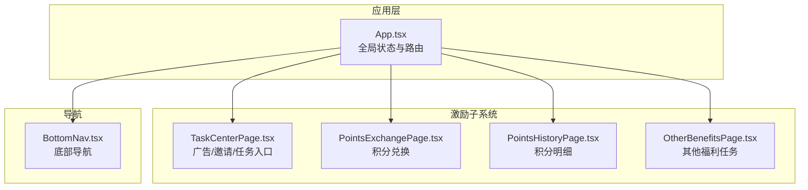
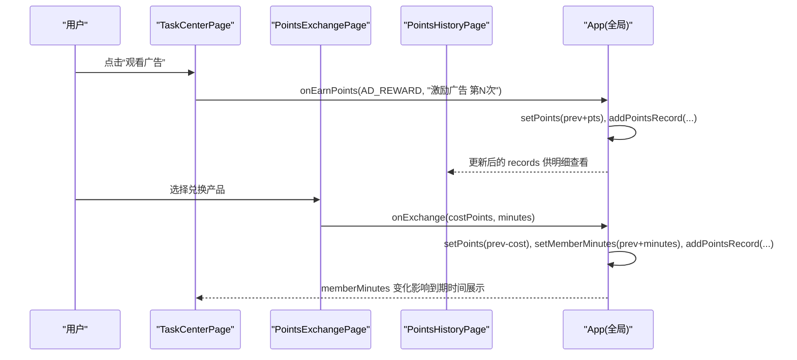
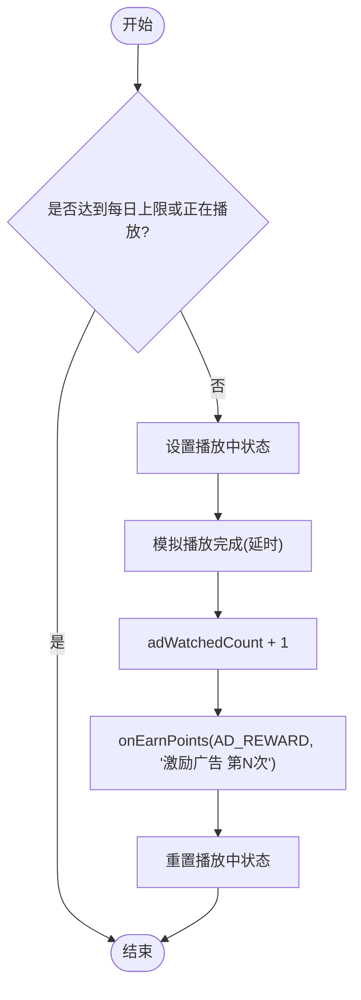
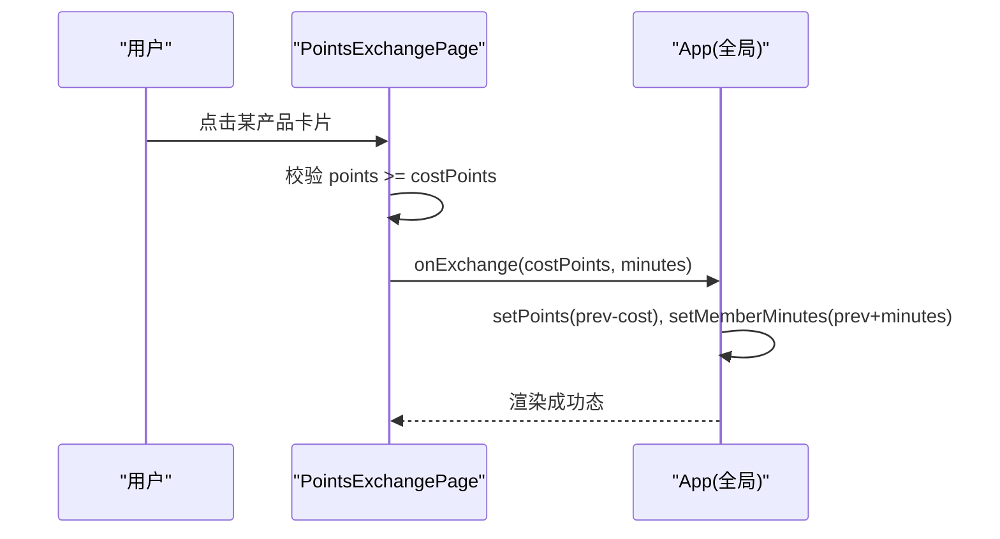
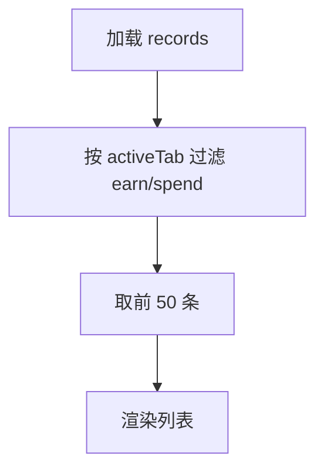
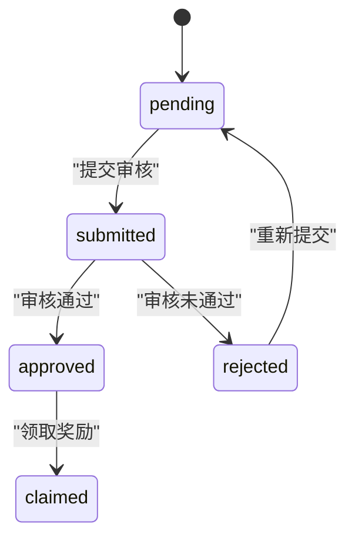
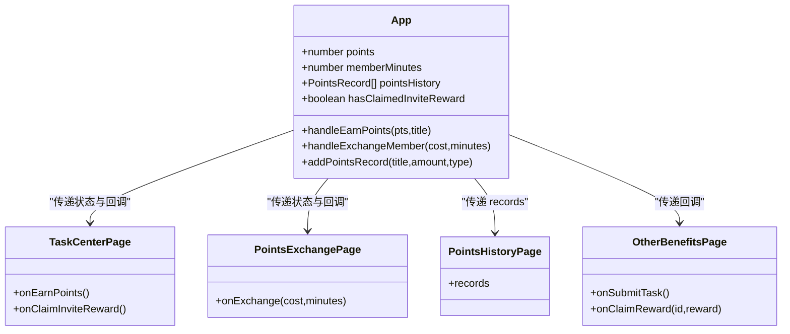

# 用户激励系统

<cite>
**本文引用的文件**   
- [App.tsx](file://src/App.tsx)
- [TaskCenterPage.tsx](file://src/pages/TaskCenterPage.tsx)
- [PointsExchangePage.tsx](file://src/pages/PointsExchangePage.tsx)
- [PointsHistoryPage.tsx](file://src/pages/PointsHistoryPage.tsx)
- [BottomNav.tsx](file://src/components/BottomNav.tsx)
- [OtherBenefitsPage.tsx](file://src/pages/OtherBenefitsPage.tsx)
</cite>

## 目录
1. [简介](#简介)
2. [项目结构](#项目结构)
3. [核心组件](#核心组件)
4. [架构总览](#架构总览)
5. [详细组件分析](#详细组件分析)
6. [依赖关系分析](#依赖关系分析)
7. [性能与一致性](#性能与一致性)
8. [故障排查指南](#故障排查指南)
9. [结论](#结论)
10. [附录：扩展接口说明](#附录扩展接口说明)

## 简介
本文件为飞鱼加速器“用户激励系统”的综合文档，围绕积分获取、会员时长管理与任务完成三大主线展开。重点解析以下实现要点：
- 积分获取机制：广告观看、邀请奖励、其他福利任务等路径的触发与发放流程
- 会员时长管理：兑换规则、时长叠加与到期时间展示
- 任务完成系统：任务列表、状态流转、审核与领取
- TaskCenterPage 的广告观看逻辑：每日限制检查与奖励发放算法
- PointsExchangePage 的积分兑换流程与时长计算规则
- PointsHistoryPage 的历史记录查询与筛选
- 数据持久化策略与本地存储结构（当前实现）
- 防刷机制与并发访问问题现状与建议
- 扩展新任务与兑换规则的接口说明

## 项目结构
激励系统相关页面与状态集中在应用顶层 App 中统一管理，并通过回调向子页面下发操作指令；各页面负责交互与展示。

图表来源
- [App.tsx:1-468](file://src/App.tsx#L1-L468)
- [TaskCenterPage.tsx:1-521](file://src/pages/TaskCenterPage.tsx#L1-L521)
- [PointsExchangePage.tsx:1-158](file://src/pages/PointsExchangePage.tsx#L1-L158)
- [PointsHistoryPage.tsx:1-118](file://src/pages/PointsHistoryPage.tsx#L1-L118)
- [BottomNav.tsx:1-57](file://src/components/BottomNav.tsx#L1-L57)
- [OtherBenefitsPage.tsx:1-354](file://src/pages/OtherBenefitsPage.tsx#L1-L354)

章节来源
- [App.tsx:1-468](file://src/App.tsx#L1-L468)
- [BottomNav.tsx:1-57](file://src/components/BottomNav.tsx#L1-L57)

## 核心组件
- 全局状态与事件总线（App.tsx）
  - 维护 points、memberMinutes、pointsHistory、hasClaimedInviteReward 等关键状态
  - 提供 handleEarnPoints、handleExchangeMember、addPointsRecord 等统一处理函数
  - 通过 stage 控制页面切换，将激励相关页面挂载到主界面
- 任务中心（TaskCenterPage.tsx）
  - 广告观看任务：每日上限、进度可视化、单次奖励发放
  - 邀请码领取：一次性校验与奖励发放
  - 分享与其他福利入口跳转
- 积分兑换（PointsExchangePage.tsx）
  - 产品矩阵（时长与积分成本），前端余额校验与异步模拟兑换
  - 成功态反馈与返回上层
- 积分明细（PointsHistoryPage.tsx）
  - 获取/消耗两类流水，按类型筛选并限制显示条数
- 其他福利任务（OtherBenefitsPage.tsx）
  - 任务提交、审核、领取的状态机与奖励发放

章节来源
- [App.tsx:147-202](file://src/App.tsx#L147-L202)
- [TaskCenterPage.tsx:47-175](file://src/pages/TaskCenterPage.tsx#L47-L175)
- [PointsExchangePage.tsx:27-40](file://src/pages/PointsExchangePage.tsx#L27-L40)
- [PointsHistoryPage.tsx:18-24](file://src/pages/PointsHistoryPage.tsx#L18-L24)
- [OtherBenefitsPage.tsx:38-167](file://src/pages/OtherBenefitsPage.tsx#L38-L167)

## 架构总览
激励系统的核心数据流由 App 集中管理，页面仅消费状态与调用回调。

图表来源
- [TaskCenterPage.tsx:60-69](file://src/pages/TaskCenterPage.tsx#L60-L69)
- [App.tsx:147-156](file://src/App.tsx#L147-L156)
- [PointsExchangePage.tsx:31-40](file://src/pages/PointsExchangePage.tsx#L31-L40)
- [PointsHistoryPage.tsx:18-24](file://src/pages/PointsHistoryPage.tsx#L18-L24)

## 详细组件分析

### 任务中心（TaskCenterPage）
- 广告观看任务
  - 每日上限 AD_MAX=8，单次奖励 AD_REWARD=50
  - 观看流程：点击后进入“播放中”，延时完成后计数+1，调用 onEarnPoints 发放积分
  - 进度条与文案根据 adWatchedCount 动态变化
- 邀请奖励
  - 输入邀请码，长度校验通过后调用 onClaimInviteReward，成功后标记 hasClaimedInviteReward=true 并加 100 积分
- 任务列表
  - 支持“分享好友得积分”跳转分享页，“其他福利”跳转其他福利页
  - 普通任务点击即完成并立即发放对应积分

图表来源
- [TaskCenterPage.tsx:55-69](file://src/pages/TaskCenterPage.tsx#L55-L69)

章节来源
- [TaskCenterPage.tsx:47-175](file://src/pages/TaskCenterPage.tsx#L47-L175)

### 积分兑换（PointsExchangePage）
- 产品矩阵
  - 30分钟/30积分、1小时/60积分、24小时/1200积分、7天/7200积分
- 兑换流程
  - 前端余额校验：points >= costPoints
  - 进入“兑换中”状态，延时后调用 onExchange(costPoints, minutes)
  - 成功后短暂提示“兑换成功”，随后恢复
- 时长计算规则
  - 兑换后会员时长以分钟为单位累加，到期时间基于当前时间与累计分钟数计算

图表来源
- [PointsExchangePage.tsx:20-40](file://src/pages/PointsExchangePage.tsx#L20-L40)
- [App.tsx:152-156](file://src/App.tsx#L152-L156)

章节来源
- [PointsExchangePage.tsx:27-40](file://src/pages/PointsExchangePage.tsx#L27-L40)
- [App.tsx:152-156](file://src/App.tsx#L152-L156)

### 积分明细（PointsHistoryPage）
- 数据来源：由 App 中的 pointsHistory 驱动
- 筛选功能：支持“获取/消耗”两个标签页，分别过滤 type === "earn"/"spend"
- 分页限制：仅显示最近 50 条记录（slice(0, 50)）

图表来源
- [PointsHistoryPage.tsx:18-24](file://src/pages/PointsHistoryPage.tsx#L18-L24)

章节来源
- [PointsHistoryPage.tsx:18-24](file://src/pages/PointsHistoryPage.tsx#L18-L24)

### 其他福利任务（OtherBenefitsPage）
- 任务状态机：pending → submitted → approved/rejected → claimed
- 提交审核：上传凭证（UI 已预留）
- 领取奖励：approved 状态下可领取，调用 onClaimReward(taskId, reward) 发放积分

图表来源
- [OtherBenefitsPage.tsx:13-30](file://src/pages/OtherBenefitsPage.tsx#L13-L30)
- [OtherBenefitsPage.tsx:160-167](file://src/pages/OtherBenefitsPage.tsx#L160-L167)

章节来源
- [OtherBenefitsPage.tsx:38-167](file://src/pages/OtherBenefitsPage.tsx#L38-L167)

## 依赖关系分析
- 页面与 App 的耦合方式
  - 所有激励相关状态集中于 App，页面通过 props 接收状态与回调
  - 页面不直接读写全局状态，避免跨组件同步问题
- 导航与页面挂载
  - BottomNav 控制 currentPage，App 根据 currentPage 渲染对应页面
  - 激励相关页面在 main 阶段下作为子页面渲染

图表来源
- [App.tsx:27-202](file://src/App.tsx#L27-L202)
- [TaskCenterPage.tsx:21-31](file://src/pages/TaskCenterPage.tsx#L21-L31)
- [PointsExchangePage.tsx:5-10](file://src/pages/PointsExchangePage.tsx#L5-L10)
- [PointsHistoryPage.tsx:12-16](file://src/pages/PointsHistoryPage.tsx#L12-L16)
- [OtherBenefitsPage.tsx:32-36](file://src/pages/OtherBenefitsPage.tsx#L32-L36)

章节来源
- [BottomNav.tsx:1-57](file://src/components/BottomNav.tsx#L1-L57)
- [App.tsx:404-453](file://src/App.tsx#L404-L453)

## 性能与一致性
- 当前实现特点
  - 状态全部位于内存（React state），刷新页面会丢失
  - 无后端服务集成，无分布式锁与幂等保障
- 潜在风险
  - 并发兑换：短时间内多次点击可能导致重复扣减与时长叠加不一致
  - 广告刷量：前端仅靠本地计数，易被绕过
  - 数据不一致：多标签页或多实例同时修改同一份状态时无法自动同步
- 建议优化方向
  - 引入本地持久化（如 IndexedDB 或 localStorage）保存 points、memberMinutes、pointsHistory、adWatchedCount、hasClaimedInviteReward 等
  - 增加幂等键（如 task_id + user_id + timestamp）防止重复发放
  - 对高频操作（兑换、广告）增加客户端节流与去抖
  - 接入后端 API 进行最终一致性校验与审计

[本节为通用指导，不直接分析具体文件]

## 故障排查指南
- 常见问题定位
  - 广告任务不可用：检查 adDone 与 isWatchingAd 状态，确认 AD_MAX 与计时器逻辑
  - 兑换失败：核对 points 是否足够，确认 onExchange 回调是否被正确调用
  - 明细缺失：确认 addPointsRecord 是否在 earn/spend 分支中被调用
- 调试建议
  - 在 App 的 handleEarnPoints 与 handleExchangeMember 处打印日志
  - 在 PointsHistoryPage 渲染前输出 records 长度与类型分布
  - 使用浏览器开发者工具观察 React State 变更

章节来源
- [TaskCenterPage.tsx:55-69](file://src/pages/TaskCenterPage.tsx#L55-L69)
- [PointsExchangePage.tsx:31-40](file://src/pages/PointsExchangePage.tsx#L31-L40)
- [App.tsx:147-156](file://src/App.tsx#L147-L156)
- [PointsHistoryPage.tsx:18-24](file://src/pages/PointsHistoryPage.tsx#L18-L24)

## 结论
当前激励系统采用“集中状态 + 页面回调”的轻量架构，满足演示与原型阶段需求。广告观看、邀请奖励、积分兑换与明细查看均已具备基础闭环。后续应优先完善数据持久化、防刷与并发安全，并逐步接入后端服务以实现一致性与可审计性。

[本节为总结，不直接分析具体文件]

## 附录：扩展接口说明

### 新增广告任务
- 目标：在不改动核心流程的前提下，新增一种广告任务类型
- 步骤
  - 在 TaskCenterPage 中定义新的常量（如 NEW_AD_MAX、NEW_AD_REWARD）
  - 新增独立计数器与按钮逻辑，复用 onEarnPoints 发放积分
  - 如需区分不同广告来源，可在 addPointsRecord 的 title 中标注来源
- 参考位置
  - [TaskCenterPage.tsx:55-69](file://src/pages/TaskCenterPage.tsx#L55-L69)
  - [App.tsx:147-150](file://src/App.tsx#L147-L150)

### 新增兑换产品
- 目标：在 PointsExchangePage 中添加新的会员时长与积分成本组合
- 步骤
  - 在 PRODUCTS 数组中追加对象，包含 id、duration、durationLabel、costPoints
  - 确保 duration 单位为分钟，costPoints 为正整数
- 参考位置
  - [PointsExchangePage.tsx:20-25](file://src/pages/PointsExchangePage.tsx#L20-L25)

### 新增任务类型（其他福利）
- 目标：在 OtherBenefitsPage 中新增一个高价值任务
- 步骤
  - 在 tasks 初始数据中新增条目，定义 requirements、reward、status 等字段
  - 若需上传凭证，对接 TaskSubmitPage 的提交流程
  - 审核通过后，调用 onClaimReward 发放积分
- 参考位置
  - [OtherBenefitsPage.tsx:41-167](file://src/pages/OtherBenefitsPage.tsx#L41-L167)

### 数据持久化与同步方案（建议）
- 本地持久化
  - 使用 localStorage 或 IndexedDB 持久化 points、memberMinutes、pointsHistory、adWatchedCount、hasClaimedInviteReward
  - 在 App 启动时从存储恢复状态，并在每次变更后落盘
- 服务端同步
  - 参考开发交接文档中的 API 清单，将积分与会员状态同步至后端
  - 关键接口示例（来自文档）：
    - GET /api/points/balance
    - GET /api/points/history
    - POST /api/member/exchange
    - GET /api/tasks/list
    - POST /api/tasks/submit
    - POST /api/tasks/claim
- 防刷与幂等
  - 为每次发放生成唯一幂等键（如 taskId + userId + ts）
  - 服务端校验每日上限与历史发放记录
  - 客户端增加节流与二次确认

章节来源
- [docs/dev-handoff.html:605-618](file://docs/dev-handoff.html#L605-L618)