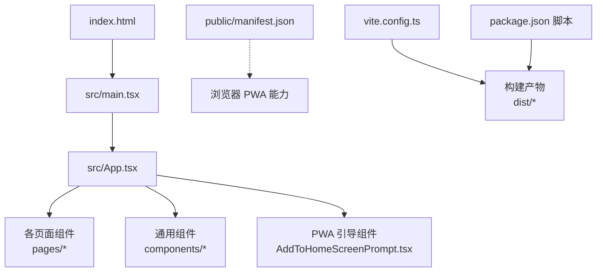
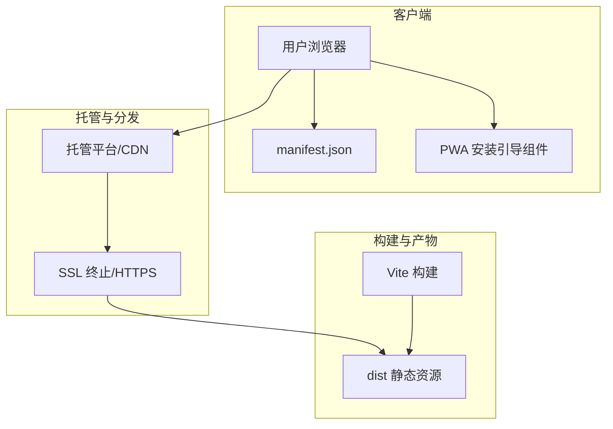
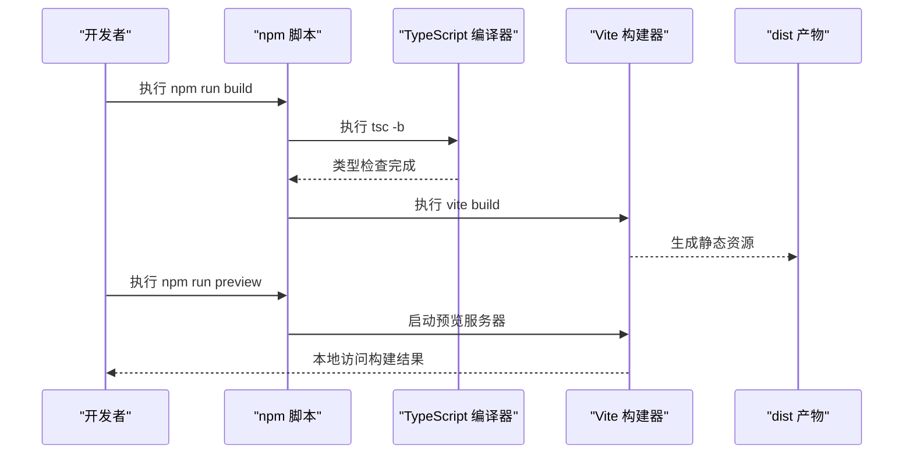
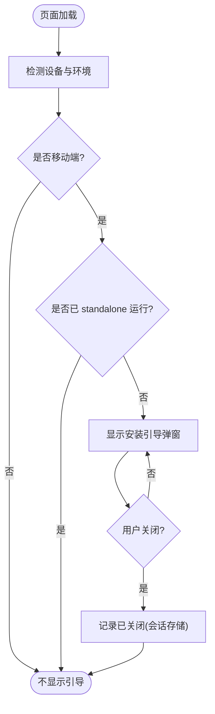
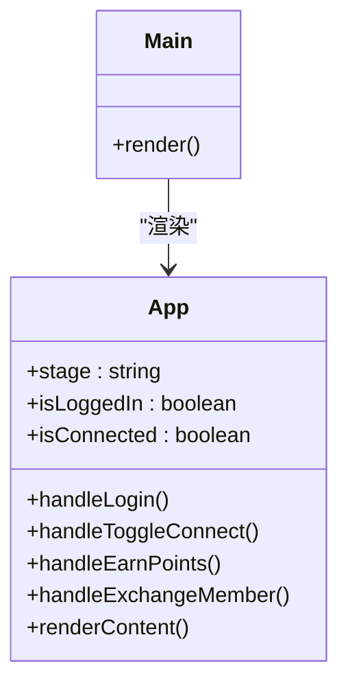
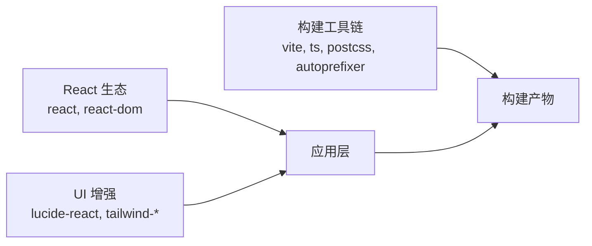

# 部署和生产环境

<cite>
**本文引用的文件**   
- [package.json](file://package.json)
- [vite.config.ts](file://vite.config.ts)
- [public/manifest.json](file://public/manifest.json)
- [src/main.tsx](file://src/main.tsx)
- [src/App.tsx](file://src/App.tsx)
- [src/components/AddToHomeScreenPrompt.tsx](file://src/components/AddToHomeScreenPrompt.tsx)
- [.vercel-tmp/vercel-install.cjs](file://.vercel-tmp/vercel-install.cjs)
</cite>

## 目录
1. [简介](#简介)
2. [项目结构](#项目结构)
3. [核心组件](#核心组件)
4. [架构总览](#架构总览)
5. [详细组件分析](#详细组件分析)
6. [依赖分析](#依赖分析)
7. [性能考虑](#性能考虑)
8. [故障排除指南](#故障排除指南)
9. [结论](#结论)
10. [附录](#附录)

## 简介
本文件面向飞鱼加速器的构建、生产环境优化与部署，覆盖以下主题：
- 构建配置与产物输出
- PWA 支持（manifest、安装提示）
- 环境变量与安全设置
- CDN 与资源优化策略
- SSL 证书与域名绑定
- 多平台部署（Vercel、Netlify）
- 版本管理与回滚策略
- 性能监控与错误追踪集成方案
- 生产环境故障排除与调优

## 项目结构
本项目为基于 Vite + React 的前端应用，采用模块化的页面与组件组织方式。关键入口与配置如下：
- 应用入口：src/main.tsx
- 根组件：src/App.tsx
- 构建工具链：vite.config.ts、postcss.config.js、tailwind.config.ts
- 包脚本与依赖：package.json
- PWA 清单：public/manifest.json
- 移动端“添加到主屏幕”引导：src/components/AddToHomeScreenPrompt.tsx
- Vercel 临时安装脚本：.vercel-tmp/vercel-install.cjs

图表来源
- [src/main.tsx:1-11](file://src/main.tsx#L1-L11)
- [src/App.tsx:1-468](file://src/App.tsx#L1-L468)
- [public/manifest.json:1-23](file://public/manifest.json#L1-L23)
- [vite.config.ts:1-16](file://vite.config.ts#L1-L16)
- [package.json:1-31](file://package.json#L1-L31)

章节来源
- [src/main.tsx:1-11](file://src/main.tsx#L1-L11)
- [src/App.tsx:1-468](file://src/App.tsx#L1-L468)
- [public/manifest.json:1-23](file://public/manifest.json#L1-L23)
- [vite.config.ts:1-16](file://vite.config.ts#L1-L16)
- [package.json:1-31](file://package.json#L1-L31)

## 核心组件
- 构建与运行脚本
  - dev/build/preview 命令由 package.json 定义，使用 vite 进行开发与预览，build 前执行 tsc 类型检查。
- 构建配置
  - Vite 插件启用 React；路径别名 @ 指向 src；开发服务器允许任意 host。
- PWA 清单
  - public/manifest.json 定义了名称、启动路径、显示模式、主题色与图标等。
- 应用入口与根组件
  - main.tsx 挂载 React 根节点并渲染 App；App.tsx 管理路由阶段与业务状态。
- PWA 安装引导
  - AddToHomeScreenPrompt.tsx 在非 standalone 模式下检测移动端设备并展示安装引导。

章节来源
- [package.json:6-10](file://package.json#L6-L10)
- [vite.config.ts:5-15](file://vite.config.ts#L5-L15)
- [public/manifest.json:1-23](file://public/manifest.json#L1-L23)
- [src/main.tsx:1-11](file://src/main.tsx#L1-L11)
- [src/App.tsx:1-468](file://src/App.tsx#L1-L468)
- [src/components/AddToHomeScreenPrompt.tsx:1-104](file://src/components/AddToHomeScreenPrompt.tsx#L1-L104)

## 架构总览
前端静态站点通过 Vite 构建后，由托管平台或 CDN 提供 HTTP(S) 服务。PWA 清单与图标在运行时被浏览器加载，用于“添加到主屏幕”。

图表来源
- [public/manifest.json:1-23](file://public/manifest.json#L1-L23)
- [src/components/AddToHomeScreenPrompt.tsx:1-104](file://src/components/AddToHomeScreenPrompt.tsx#L1-L104)
- [vite.config.ts:1-16](file://vite.config.ts#L1-L16)

## 详细组件分析

### 构建与运行流程
- 本地开发：npm run dev 启动 Vite 开发服务器，支持热更新与任意 host 访问。
- 构建：npm run build 先执行 TypeScript 编译，再调用 Vite 打包生成 dist。
- 预览：npm run preview 本地预览构建产物。

图表来源
- [package.json:6-10](file://package.json#L6-L10)
- [vite.config.ts:5-15](file://vite.config.ts#L5-L15)

章节来源
- [package.json:6-10](file://package.json#L6-L10)
- [vite.config.ts:5-15](file://vite.config.ts#L5-L15)

### PWA 支持与安装引导
- manifest.json 提供应用元信息，包括名称、短名、描述、启动路径、显示模式、背景与主题色、图标尺寸等。
- 安装引导组件在检测到移动端且非 standalone 模式时弹出全屏提示，指导用户将站点添加到主屏幕。

图表来源
- [public/manifest.json:1-23](file://public/manifest.json#L1-L23)
- [src/components/AddToHomeScreenPrompt.tsx:1-104](file://src/components/AddToHomeScreenPrompt.tsx#L1-L104)

章节来源
- [public/manifest.json:1-23](file://public/manifest.json#L1-L23)
- [src/components/AddToHomeScreenPrompt.tsx:1-104](file://src/components/AddToHomeScreenPrompt.tsx#L1-L104)

### 应用入口与根组件
- main.tsx 创建 React 根节点并在 StrictMode 下渲染 App。
- App.tsx 集中管理应用阶段（splash、隐私协议、登录、主页等），维护连接状态、积分、会员时长等业务数据，并通过底部导航切换页面。

图表来源
- [src/main.tsx:1-11](file://src/main.tsx#L1-L11)
- [src/App.tsx:1-468](file://src/App.tsx#L1-L468)

章节来源
- [src/main.tsx:1-11](file://src/main.tsx#L1-L11)
- [src/App.tsx:1-468](file://src/App.tsx#L1-L468)

### Vercel 安装脚本说明
- .vercel-tmp/vercel-install.cjs 用于检测 Node.js 与包管理器，并在需要时全局安装 Vercel CLI。该脚本仅作为临时辅助，不影响常规构建流程。

章节来源
- [.vercel-tmp/vercel-install.cjs:1-59](file://.vercel-tmp/vercel-install.cjs#L1-L59)

## 依赖分析
- 运行时依赖
  - react、react-dom 为核心 UI 框架。
  - lucide-react 提供图标。
  - tailwind-merge、tailwindcss-animate 配合 Tailwind 样式体系。
- 开发依赖
  - vite、@vitejs/plugin-react、typescript、autoprefixer、postcss、tailwindcss 等构成构建与样式管线。

图表来源
- [package.json:11-29](file://package.json#L11-L29)

章节来源
- [package.json:11-29](file://package.json#L11-L29)

## 性能考虑
- 构建优化建议
  - 开启压缩与代码分割：在 Vite 中启用默认生产优化（如 Terser、CSS 压缩、资源内联阈值等）。
  - 图片与字体优化：对 public/images 中的图标进行 WebP/AVIF 转换与懒加载。
  - 预加载关键资源：在 index.html 中对首屏关键 CSS/JS 添加 rel="preload"。
- 缓存策略
  - 利用 Vite 的哈希文件名与 CDN 长缓存；对 HTML 使用短缓存或无缓存。
- 网络与传输
  - 启用 HTTP/2 或 HTTP/3；开启 gzip/brotli 压缩。
- 运行时优化
  - 减少不必要的重渲染；按需加载大组件；避免在主线程执行耗时任务。

[本节为通用指导，无需源码引用]

## 故障排除指南
- 常见问题定位
  - 构建失败：检查 TypeScript 类型错误与 Vite 插件兼容性。
  - 资源 404：确认 public 目录下的静态资源路径与引用一致。
  - PWA 无法安装：验证 manifest.json 可被正确访问，且站点通过 HTTPS 提供。
- 调试手段
  - 使用 npm run preview 本地验证构建产物。
  - 在浏览器开发者工具中查看 Network、Application（Manifest、Service Worker）、Console 日志。
- 回滚策略
  - 保留最近稳定版本的 dist 快照；在托管平台启用版本化发布与一键回滚。
  - 若使用 CDN，按版本号发布资源，并将旧版本保留一段时间以支持快速回退。

[本节为通用指导，无需源码引用]

## 结论
本项目具备清晰的构建与运行脚本、基础 PWA 清单与安装引导逻辑。生产环境应结合托管平台特性完善环境变量、安全头、CDN 缓存与监控告警，确保高可用与高性能交付。

[本节为总结性内容，无需源码引用]

## 附录

### 环境变量配置与安全设置
- 环境变量
  - 当前仓库未包含 .env 文件。建议在托管平台的环境变量面板中注入 API 地址、埋点密钥等敏感信息，并在构建期通过 Vite 的公共前缀注入到前端（注意仅暴露必要字段）。
- 安全建议
  - 强制 HTTPS；配置 CSP、X-Frame-Options、Referrer-Policy 等响应头。
  - 最小权限原则：仅在前端暴露只读配置，避免泄露后端密钥。

[本节为通用指导，无需源码引用]

### CDN 配置与资源优化策略
- 静态资源
  - 将 dist 目录部署至对象存储或 CDN，开启边缘缓存与压缩。
  - 对图片、字体等资源启用现代格式与自适应尺寸。
- 缓存控制
  - HTML 文件设置较短缓存或禁用缓存；带哈希的资源设置长期缓存。
- 预取与预连接
  - 对第三方域名使用 rel="preconnect"；对关键资源使用 rel="prefetch"。

[本节为通用指导，无需源码引用]

### SSL 证书配置与域名绑定
- 托管平台
  - 在平台控制台绑定自定义域名并启用自动 HTTPS（Let’s Encrypt 或自有证书）。
- 自建反向代理
  - 使用 Nginx/Traefik 等终止 TLS，并配置 HSTS、OCSP Stapling。

[本节为通用指导，无需源码引用]

### 多平台部署方法（Vercel、Netlify）
- Vercel
  - 框架预设选择 Vite；构建命令使用 npm run build；输出目录为 dist。
  - 环境变量在 Vercel 项目设置中配置。
- Netlify
  - 构建命令：npm run build；发布目录：dist。
  - 环境变量在 Netlify 项目设置中配置。
- 其他平台
  - 任何支持静态站点的平台均可，只需上传 dist 并配置 HTTPS 与缓存策略。

[本节为通用指导，无需源码引用]

### 版本管理与回滚策略
- 版本标记
  - 在 package.json 的 version 字段维护语义化版本；每次发布打 tag。
- 发布流水线
  - CI 中执行构建与测试，产出 dist 并上传至对象存储/CDN，附带版本号。
- 回滚
  - 通过切换 CDN 指向或平台回滚功能快速恢复上一稳定版本。

[本节为通用指导，无需源码引用]

### 性能监控与错误追踪集成方案
- 性能监控
  - 接入前端性能 SDK（如 Sentry Performance、Web Vitals 上报），采集 LCP、FID、CLS 等指标。
- 错误追踪
  - 集成错误上报 SDK，捕获未处理异常与 Promise 拒绝，关联用户上下文与版本信息。
- 日志与告警
  - 将关键事件上报至日志系统，设置阈值告警与仪表盘可视化。

[本节为通用指导，无需源码引用]