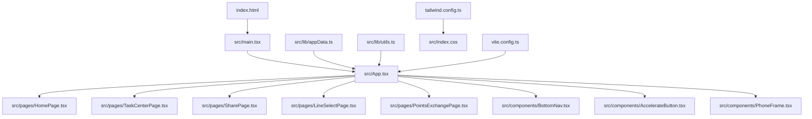
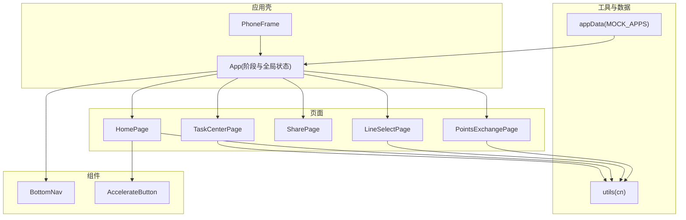
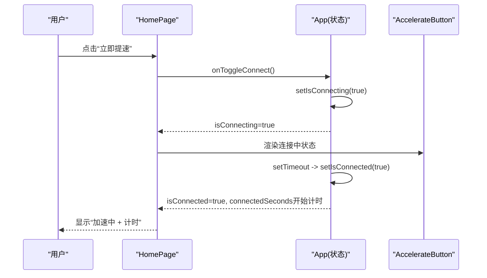
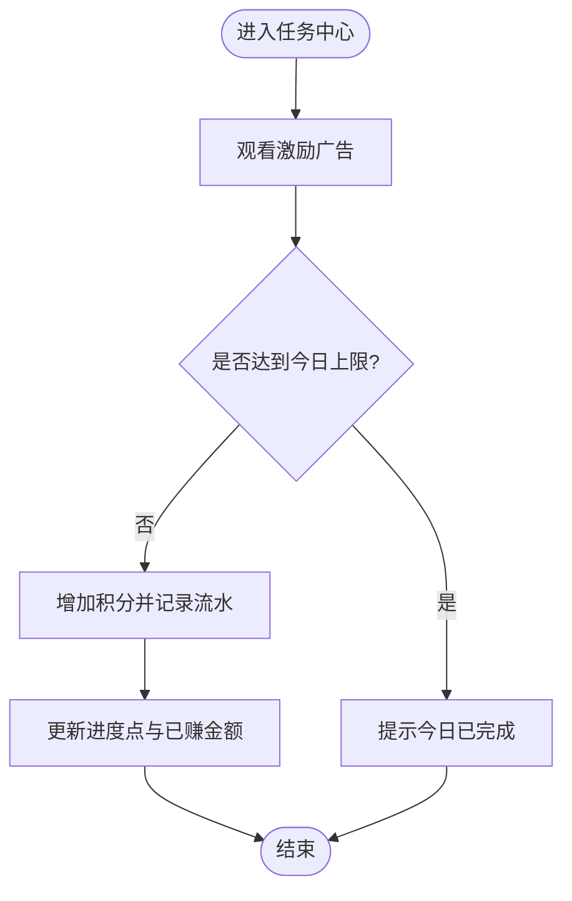
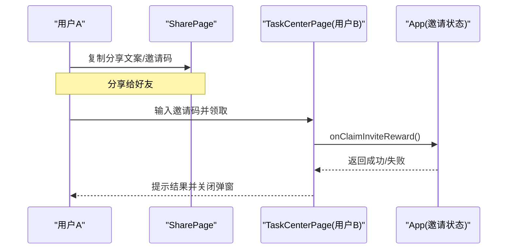
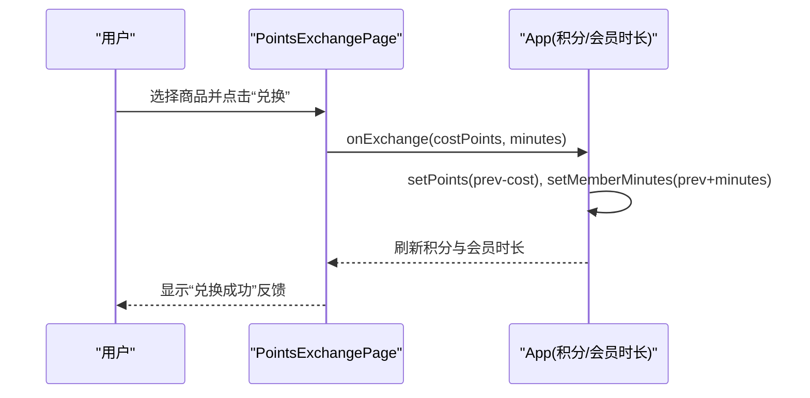
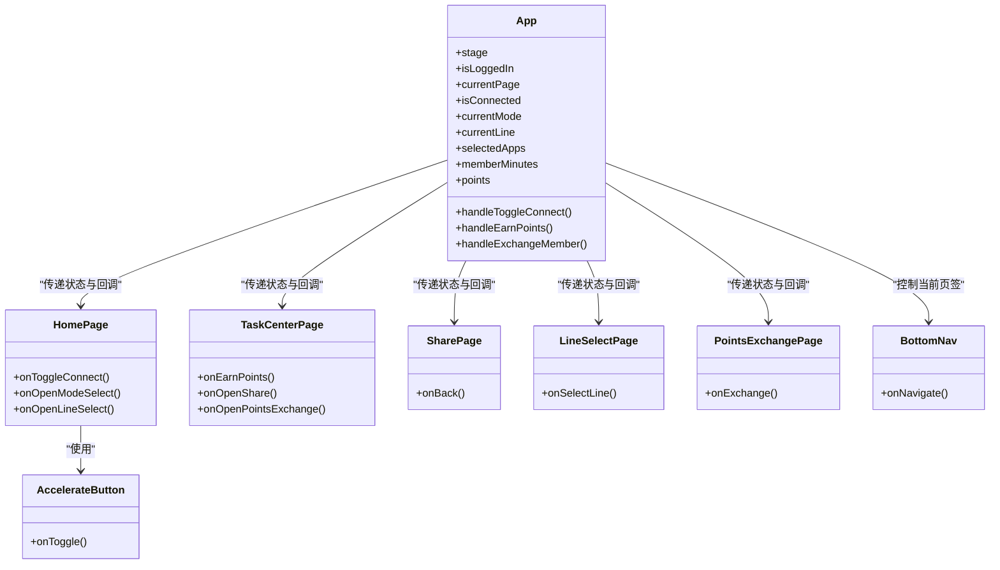
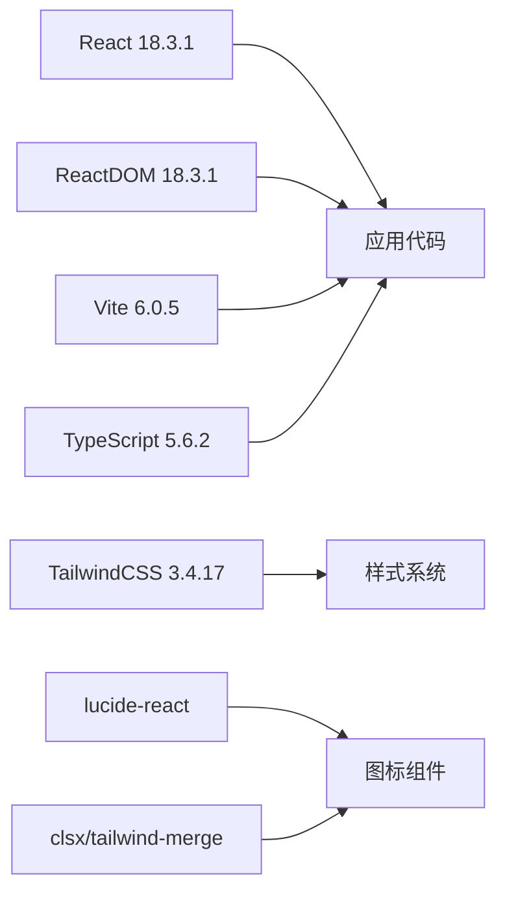

# 项目概述

<cite>
**本文引用的文件**   
- [package.json](file://package.json)
- [vite.config.ts](file://vite.config.ts)
- [tailwind.config.ts](file://tailwind.config.ts)
- [index.html](file://index.html)
- [src/index.css](file://src/index.css)
- [src/main.tsx](file://src/main.tsx)
- [src/App.tsx](file://src/App.tsx)
- [src/components/BottomNav.tsx](file://src/components/BottomNav.tsx)
- [src/components/AccelerateButton.tsx](file://src/components/AccelerateButton.tsx)
- [src/components/PhoneFrame.tsx](file://src/components/PhoneFrame.tsx)
- [src/pages/HomePage.tsx](file://src/pages/HomePage.tsx)
- [src/pages/TaskCenterPage.tsx](file://src/pages/TaskCenterPage.tsx)
- [src/pages/SharePage.tsx](file://src/pages/SharePage.tsx)
- [src/pages/LineSelectPage.tsx](file://src/pages/LineSelectPage.tsx)
- [src/pages/PointsExchangePage.tsx](file://src/pages/PointsExchangePage.tsx)
- [src/lib/appData.ts](file://src/lib/appData.ts)
- [src/lib/utils.ts](file://src/lib/utils.ts)
</cite>

## 目录
1. [简介](#简介)
2. [项目结构](#项目结构)
3. [核心组件](#核心组件)
4. [架构总览](#架构总览)
5. [详细组件分析](#详细组件分析)
6. [依赖分析](#依赖分析)
7. [性能与体验优化建议](#性能与体验优化建议)
8. [故障排查指南](#故障排查指南)
9. [结论](#结论)
10. [附录：技术栈选择与优势](#附录技术栈选择与优势)

## 简介
飞鱼加速器是一个基于 React 与 TypeScript 构建的移动端网络加速器应用原型，聚焦于“加速控制、用户激励、广告集成、邀请分享”四大核心能力。它通过直观的交互界面模拟全局与应用双模式加速、线路选择、积分获取与兑换、观看激励广告、邀请好友等流程，帮助团队快速验证产品形态与增长策略。

核心价值主张
- 一触即连：一键启动/停止加速，状态清晰可见
- 免费可用：通过任务与广告赚取积分，兑换会员时长
- 精准加速：支持全局与应用模式，智能优选或手动选择线路
- 增长闭环：邀请分享与积分体系驱动拉新与留存

使用场景示例
- 新用户首次打开应用，阅读并同意隐私政策后进入主页，点击“立即提速”完成连接
- 在“免费会员”页面观看激励广告、完成任务，获得积分并兑换会员时长
- 通过分享链接邀请好友注册，双方均可获得积分奖励

## 项目结构
本项目采用按功能域组织页面的方式，结合通用 UI 组件与工具库，形成清晰的层次：
- 入口与配置：index.html、main.tsx、App.tsx、vite.config.ts、tailwind.config.ts、index.css
- 页面层（pages）：首页、任务中心、分享、线路选择、积分兑换等
- 组件层（components）：加速按钮、底部导航、手机外壳等
- 数据与工具（lib）：应用图标数据、样式合并工具

图示来源
- [index.html:1-23](file://index.html#L1-L23)
- [src/main.tsx:1-11](file://src/main.tsx#L1-L11)
- [src/App.tsx:1-468](file://src/App.tsx#L1-L468)
- [src/pages/HomePage.tsx:1-187](file://src/pages/HomePage.tsx#L1-L187)
- [src/pages/TaskCenterPage.tsx:1-521](file://src/pages/TaskCenterPage.tsx#L1-L521)
- [src/pages/SharePage.tsx:1-167](file://src/pages/SharePage.tsx#L1-L167)
- [src/pages/LineSelectPage.tsx:1-114](file://src/pages/LineSelectPage.tsx#L1-L114)
- [src/pages/PointsExchangePage.tsx:1-158](file://src/pages/PointsExchangePage.tsx#L1-L158)
- [src/components/BottomNav.tsx:1-57](file://src/components/BottomNav.tsx#L1-L57)
- [src/components/AccelerateButton.tsx:1-182](file://src/components/AccelerateButton.tsx#L1-L182)
- [src/components/PhoneFrame.tsx:1-87](file://src/components/PhoneFrame.tsx#L1-L87)
- [src/lib/appData.ts:1-48](file://src/lib/appData.ts#L1-L48)
- [src/lib/utils.ts:1-7](file://src/lib/utils.ts#L1-L7)
- [tailwind.config.ts:1-131](file://tailwind.config.ts#L1-L131)
- [src/index.css:1-246](file://src/index.css#L1-L246)
- [vite.config.ts:1-16](file://vite.config.ts#L1-L16)

章节来源
- [index.html:1-23](file://index.html#L1-L23)
- [src/main.tsx:1-11](file://src/main.tsx#L1-L11)
- [src/App.tsx:1-468](file://src/App.tsx#L1-L468)
- [vite.config.ts:1-16](file://vite.config.ts#L1-L16)
- [tailwind.config.ts:1-131](file://tailwind.config.ts#L1-L131)
- [src/index.css:1-246](file://src/index.css#L1-L246)

## 核心组件
- 应用壳与路由容器
  - App 负责应用阶段管理（启动页、协议、主流程、设置等），集中维护连接状态、模式、线路、积分、会员时长等全局状态，并通过回调向子页面下发操作。
  - PhoneFrame 提供桌面端的手机外框展示与移动端全屏切换，提升演示体验。
- 页面级模块
  - HomePage：加速控制主入口，展示连接状态、模式与线路卡片、广告位预留区。
  - TaskCenterPage：积分与会员权益中心，包含看广告赚积分、邀请码领取、任务列表等。
  - SharePage：分享与邀请规则说明，支持复制文案与邀请码。
  - LineSelectPage：线路选择，支持智能优选与多地区手动选择。
  - PointsExchangePage：积分兑换会员时长，含商品列表与兑换反馈。
- 通用组件
  - BottomNav：底部导航，承载“加速/免费会员/我的”三大入口。
  - AccelerateButton：带火箭动效的加速开关，提供可视化连接反馈。
- 工具与数据
  - appData：应用图标与分类数据，供模式/应用选择页面复用。
  - utils：clsx + tailwind-merge 的样式合并工具函数。

章节来源
- [src/App.tsx:1-468](file://src/App.tsx#L1-L468)
- [src/components/PhoneFrame.tsx:1-87](file://src/components/PhoneFrame.tsx#L1-L87)
- [src/pages/HomePage.tsx:1-187](file://src/pages/HomePage.tsx#L1-L187)
- [src/pages/TaskCenterPage.tsx:1-521](file://src/pages/TaskCenterPage.tsx#L1-L521)
- [src/pages/SharePage.tsx:1-167](file://src/pages/SharePage.tsx#L1-L167)
- [src/pages/LineSelectPage.tsx:1-114](file://src/pages/LineSelectPage.tsx#L1-L114)
- [src/pages/PointsExchangePage.tsx:1-158](file://src/pages/PointsExchangePage.tsx#L1-L158)
- [src/components/BottomNav.tsx:1-57](file://src/components/BottomNav.tsx#L1-L57)
- [src/components/AccelerateButton.tsx:1-182](file://src/components/AccelerateButton.tsx#L1-L182)
- [src/lib/appData.ts:1-48](file://src/lib/appData.ts#L1-L48)
- [src/lib/utils.ts:1-7](file://src/lib/utils.ts#L1-L7)

## 架构总览
整体为单页应用，React 作为视图层，Vite 作为构建与开发服务器，TailwindCSS 提供原子化样式与主题扩展。App 作为根容器，通过 stage 与 currentPage 组合实现页面切换；各页面以受控 props 形式接收状态与回调，保持单向数据流。

图示来源
- [src/App.tsx:1-468](file://src/App.tsx#L1-L468)
- [src/components/PhoneFrame.tsx:1-87](file://src/components/PhoneFrame.tsx#L1-L87)
- [src/pages/HomePage.tsx:1-187](file://src/pages/HomePage.tsx#L1-L187)
- [src/pages/TaskCenterPage.tsx:1-521](file://src/pages/TaskCenterPage.tsx#L1-L521)
- [src/pages/SharePage.tsx:1-167](file://src/pages/SharePage.tsx#L1-L167)
- [src/pages/LineSelectPage.tsx:1-114](file://src/pages/LineSelectPage.tsx#L1-L114)
- [src/pages/PointsExchangePage.tsx:1-158](file://src/pages/PointsExchangePage.tsx#L1-L158)
- [src/components/BottomNav.tsx:1-57](file://src/components/BottomNav.tsx#L1-L57)
- [src/components/AccelerateButton.tsx:1-182](file://src/components/AccelerateButton.tsx#L1-L182)
- [src/lib/appData.ts:1-48](file://src/lib/appData.ts#L1-L48)
- [src/lib/utils.ts:1-7](file://src/lib/utils.ts#L1-L7)

## 详细组件分析

### 加速控制流程（首页）
- 用户点击“立即提速”，触发连接状态变更，显示“连接中”，随后进入“加速中”并累计连接时长
- 顶部状态徽章与按钮文案随状态变化，提供明确反馈
- 模式与线路卡片可跳转至对应设置页

图示来源
- [src/pages/HomePage.tsx:1-187](file://src/pages/HomePage.tsx#L1-L187)
- [src/App.tsx:128-139](file://src/App.tsx#L128-L139)
- [src/components/AccelerateButton.tsx:1-182](file://src/components/AccelerateButton.tsx#L1-L182)

章节来源
- [src/pages/HomePage.tsx:1-187](file://src/pages/HomePage.tsx#L1-L187)
- [src/App.tsx:94-107](file://src/App.tsx#L94-L107)
- [src/components/AccelerateButton.tsx:1-182](file://src/components/AccelerateButton.tsx#L1-L182)

### 积分与广告激励流程（任务中心）
- 每日观看激励广告上限固定，每次观看后增加积分并记录流水
- 邀请码领取弹窗校验输入长度，成功后发放一次性奖励
- 任务列表项根据类型跳转分享页或直接标记完成

图示来源
- [src/pages/TaskCenterPage.tsx:60-69](file://src/pages/TaskCenterPage.tsx#L60-L69)
- [src/pages/TaskCenterPage.tsx:152-175](file://src/pages/TaskCenterPage.tsx#L152-L175)
- [src/App.tsx:78-91](file://src/App.tsx#L78-L91)

章节来源
- [src/pages/TaskCenterPage.tsx:1-521](file://src/pages/TaskCenterPage.tsx#L1-L521)
- [src/App.tsx:78-91](file://src/App.tsx#L78-L91)

### 分享与邀请流程
- 复制分享文案与邀请码到剪贴板，引导好友下载注册
- 好友登录后在任务中心输入邀请码，双方获得额外积分

图示来源
- [src/pages/SharePage.tsx:17-27](file://src/pages/SharePage.tsx#L17-L27)
- [src/pages/TaskCenterPage.tsx:152-175](file://src/pages/TaskCenterPage.tsx#L152-L175)
- [src/App.tsx:197-202](file://src/App.tsx#L197-L202)

章节来源
- [src/pages/SharePage.tsx:1-167](file://src/pages/SharePage.tsx#L1-L167)
- [src/pages/TaskCenterPage.tsx:1-521](file://src/pages/TaskCenterPage.tsx#L1-L521)
- [src/App.tsx:197-202](file://src/App.tsx#L197-L202)

### 积分兑换流程
- 展示当前积分与可选会员时长商品
- 点击兑换后校验积分余额，执行扣减并延长会员时长，同时记录流水

图示来源
- [src/pages/PointsExchangePage.tsx:31-40](file://src/pages/PointsExchangePage.tsx#L31-L40)
- [src/App.tsx:152-156](file://src/App.tsx#L152-L156)

章节来源
- [src/pages/PointsExchangePage.tsx:1-158](file://src/pages/PointsExchangePage.tsx#L1-L158)
- [src/App.tsx:152-156](file://src/App.tsx#L152-L156)

### 组件类图（代码关系）

图示来源
- [src/App.tsx:1-468](file://src/App.tsx#L1-L468)
- [src/pages/HomePage.tsx:1-187](file://src/pages/HomePage.tsx#L1-L187)
- [src/pages/TaskCenterPage.tsx:1-521](file://src/pages/TaskCenterPage.tsx#L1-L521)
- [src/pages/SharePage.tsx:1-167](file://src/pages/SharePage.tsx#L1-L167)
- [src/pages/LineSelectPage.tsx:1-114](file://src/pages/LineSelectPage.tsx#L1-L114)
- [src/pages/PointsExchangePage.tsx:1-158](file://src/pages/PointsExchangePage.tsx#L1-L158)
- [src/components/BottomNav.tsx:1-57](file://src/components/BottomNav.tsx#L1-L57)
- [src/components/AccelerateButton.tsx:1-182](file://src/components/AccelerateButton.tsx#L1-L182)

## 依赖分析
- 运行时依赖
  - React 18.3.1 与 ReactDOM：提供组件化视图与渲染能力
  - lucide-react：统一图标资源
  - class-variance-authority、clsx、tailwind-merge：样式与变体管理
  - tailwindcss-animate：动画增强
- 开发时依赖
  - Vite 6.0.5：极速开发与构建
  - @vitejs/plugin-react：React 支持
  - TailwindCSS 3.4.17：原子化样式与主题扩展
  - TypeScript 5.6.2：类型安全与开发体验

图示来源
- [package.json:11-29](file://package.json#L11-L29)
- [vite.config.ts:1-16](file://vite.config.ts#L1-L16)
- [tailwind.config.ts:1-131](file://tailwind.config.ts#L1-L131)
- [src/index.css:1-246](file://src/index.css#L1-L246)

章节来源
- [package.json:1-31](file://package.json#L1-L31)
- [vite.config.ts:1-16](file://vite.config.ts#L1-L16)
- [tailwind.config.ts:1-131](file://tailwind.config.ts#L1-L131)

## 性能与体验优化建议
- 首屏加载
  - 利用 Vite 的按需加载与分包策略，减少初始包体积
  - 对大图片与 SVG 进行压缩与懒加载
- 渲染性能
  - 将频繁更新的局部状态下沉到子组件，避免整树重渲染
  - 对长列表（如积分流水）使用虚拟滚动
- 动画与视觉
  - 合理使用 CSS 动画与 GPU 加速属性，避免布局抖动
  - 在低端设备上降级复杂特效
- 可访问性与适配
  - 确保对比度与触控区域大小满足移动端标准
  - 针对刘海屏与安全区域做适配

[本节为通用指导，不直接分析具体文件]

## 故障排查指南
- 无法全屏或全屏异常
  - 检查浏览器全屏 API 权限与事件监听是否正确挂载
  - 参考全屏切换逻辑的实现位置
- 样式未生效或冲突
  - 确认 Tailwind 内容路径与别名配置正确
  - 检查样式合并工具的使用方式
- 页面不显示或白屏
  - 检查入口 HTML 的 root 节点是否存在
  - 确认 main.tsx 是否正确挂载 App 组件
- 积分与会员时长不同步
  - 核对积分增减与会员时长累加的回调链路是否一致
  - 检查积分流水记录的生成时机

章节来源
- [src/components/PhoneFrame.tsx:26-38](file://src/components/PhoneFrame.tsx#L26-L38)
- [vite.config.ts:5-11](file://vite.config.ts#L5-L11)
- [src/lib/utils.ts:1-7](file://src/lib/utils.ts#L1-L7)
- [index.html:18-22](file://index.html#L18-L22)
- [src/main.tsx:6-10](file://src/main.tsx#L6-L10)
- [src/App.tsx:147-156](file://src/App.tsx#L147-L156)

## 结论
飞鱼加速器原型以 React + Vite + TailwindCSS 为核心技术栈，围绕“加速控制、激励增长、分享裂变”构建了完整的交互闭环。其模块化结构与受控状态设计便于后续接入真实后端与 SDK，快速从原型演进为生产版本。

[本节为总结性内容，不直接分析具体文件]

## 附录：技术栈选择与优势
- React 18.3.1
  - 生态成熟、组件化开发效率高，适合快速迭代与团队协作
- Vite 6.0.5
  - 冷启动快、热更新稳定，显著提升本地开发与预览效率
- TailwindCSS 3.4.17
  - 原子化样式与主题变量统一管理，配合自定义动画与玻璃态效果，打造一致的深海主题风格
- TypeScript 5.6.2
  - 强类型约束降低协作成本，提高重构与扩展安全性
- 其他关键依赖
  - lucide-react：轻量图标库，统一视觉语言
  - clsx/tailwind-merge：动态样式组合与冲突解决

章节来源
- [package.json:11-29](file://package.json#L11-L29)
- [tailwind.config.ts:1-131](file://tailwind.config.ts#L1-L131)
- [src/index.css:1-246](file://src/index.css#L1-L246)